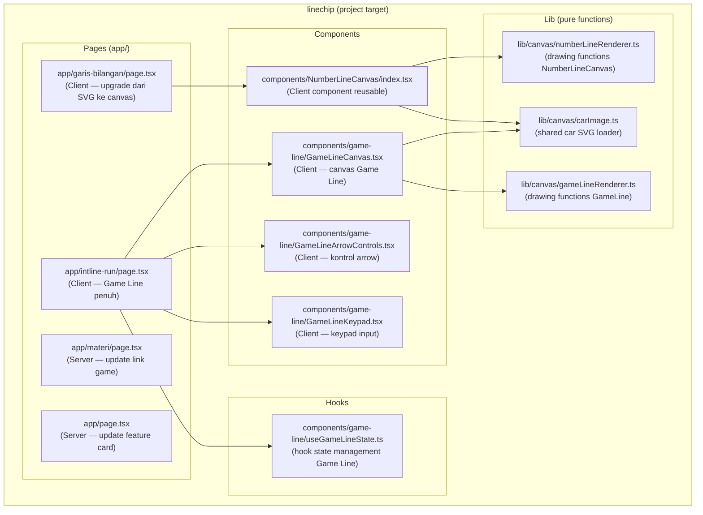

# Design Document — add-sub-game-integration

## Overview

Fitur ini mengintegrasikan tiga modul dari project referensi `add-sub-int` ke dalam `linechip` secara native:

1. **NumberLine_Canvas** — komponen canvas HTML5 reusable untuk animasi dua fase garis bilangan, digunakan untuk upgrade halaman `/garis-bilangan`.
2. **Game Line** — game soal bilangan bulat berbasis garis bilangan interaktif di `/intline-run`, menggantikan placeholder yang ada.
3. **Navigasi** — update link di `/materi` dan `/` agar mencerminkan konten yang sudah diimplementasi.

Semua kode ditulis ulang mengikuti arsitektur, design system (token warna intblue/intpink, Tailwind, font), konvensi file, dan pola komponen `linechip`. Tidak ada dependency baru yang ditambahkan — proyek hanya menggunakan Next.js 16 dan React 19 yang sudah tersedia.

### Batasan Penting

- `add-sub-int` hanya berfungsi sebagai **referensi logika dan flow**, bukan sebagai kode yang di-copy-paste.
- `/game-virus`, `/model-chip`, dan `/leaderboard` tidak dimodifikasi sama sekali.
- `AppShell` sudah mendaftarkan `/garis-bilangan` dan `/intline-run` di `MAIN_ROUTES` — tidak perlu perubahan.
- Asset `/car.svg` dari `add-sub-int/public/` perlu dicopy ke `linechip/public/car.svg`.

---

## Architecture

### Diagram Arsitektur Keseluruhan



### Prinsip Arsitektur

- **Separation of concerns**: logika drawing (pure functions di `lib/canvas/`) dipisah dari logika state (hook) dan presentasi (komponen React).
- **Pure renderer functions**: semua fungsi di `lib/canvas/` menerima `CanvasRenderingContext2D` dan data, tidak memiliki side effect di luar canvas — memudahkan testing.
- **Single source of truth state**: `useGameLineState` mengelola seluruh state game; komponen hanya membaca dan memanggil actions.
- **`"use client"` eksplisit**: semua komponen yang menggunakan `canvas`, `requestAnimationFrame`, atau pointer events diberi direktif `"use client"`.
- **No new dependencies**: semua kode hanya menggunakan Web API standar, React, dan Next.js.

---

## Components and Interfaces

### 1. `components/NumberLineCanvas/index.tsx`

Komponen React reusable untuk animasi dua fase garis bilangan.

```typescript
// Props
interface NumberLineCanvasProps {
  num1: number;           // Operan pertama (fase 1: 0 → num1)
  num2: number;           // Operan kedua   (fase 2: num1 → hasil)
  operation: '+' | '-';  // Jenis operasi
  runKey?: number;        // Increment untuk re-trigger animasi; bila tidak berubah, tidak restart
  onResult?: (result: number) => void; // Dipanggil saat animasi selesai
}
```

**Behavior internal:**
- Menyimpan `prevRunKeyRef` untuk membandingkan dengan `runKey` prop saat ini.
- Bila `runKey` berubah DAN `num1 !== 0 || num2 !== 0` → jalankan `startAnimation()`.
- Bila `num1 === 0 && num2 === 0` → tampilkan garis statis idle (−5 hingga +5).
- Membersihkan `requestAnimationFrame` dan `resize` event listener di `useEffect` cleanup.

**Struktur file:**
```
components/NumberLineCanvas/
  index.tsx      ← komponen utama (export default)
```

---

### 2. `components/game-line/useGameLineState.ts`

Hook React untuk semua state dan actions di Game Line.

```typescript
// Tipe yang diekspor
export interface GameQuestion {
  a: number;            // Operan pertama, rentang [-99, 99]
  b: number;            // Operan kedua,   rentang [-99, 99]
  op: '+' | '-';        // Operator
  answer: number;       // Jawaban benar: a op b
}

export interface GameArrow {
  start: number;        // Posisi awal arrow pada garis bilangan
  length: number;       // Panjang / jarak (bisa negatif untuk ke kiri)
  target?: number;      // Target akhir untuk animasi (sama dengan length setelah commit)
  visualLength?: number; // Transient value selama animasi (tidak boleh diekspos ke UI sebagai nilai final)
}

// Return type hook
interface UseGameLineStateReturn {
  currentQuestion: GameQuestion;
  newQuestion: () => void;           // Generate soal baru + reset semua state
  arrows: Record<1 | 2, GameArrow>;
  changeArrow: (num: 1 | 2, property: 'start' | 'length', delta: number) => void;
  setArrowValue: (num: 1 | 2, property: 'start' | 'length', value: number) => void;
  resetArrows: () => void;
  playArrows: () => void;            // Animasi sekuensial arrow 1 → arrow 2
  isAnimating: boolean;
  userAnswer: string;
  addDigit: (digit: string) => void; // '0'-'9', '-', '←'
  clearAnswer: () => void;
  checkAnswer: () => boolean;        // Validasi dan set feedback
  feedback: { type: 'success' | 'error'; message: string } | null;
  spacing: number;                   // Jarak antar tik [20, 80]
  changeSpacing: (delta: number) => void;
  offsetX: number;                   // Offset horizontal viewport garis bilangan
  handleCanvasDrag: (deltaX: number) => void;
}
```

**Perbedaan dari `add-sub-int/hooks/useGameState.ts`:**
- Tipe `Arrow` diganti menjadi `GameArrow` untuk menghindari potensi konflik naming.
- Tipe `Question` diganti menjadi `GameQuestion`.
- Nama file: `useGameLineState.ts` (bukan `useGameState.ts`).
- `handleCanvasDrag` tidak mengalikan dengan 0.05 di dalam hook; kalkulasi sensitivitas dilakukan di GameLineCanvas.

---

### 3. `components/game-line/GameLineCanvas.tsx`

Komponen canvas untuk merender garis bilangan interaktif Game Line.

```typescript
interface GameLineCanvasProps {
  arrows: Record<1 | 2, GameArrow>;
  spacing: number;
  offsetX: number;
  operation: '+' | '-';
  onDrag: (deltaX: number) => void;  // Dipanggil dengan raw pixel delta
}
```

**Behavior:**
- `useEffect` menjalankan animation loop (`requestAnimationFrame`) yang memanggil `drawGameGrid` + `drawGameArrow` setiap frame.
- Pointer events (`onPointerDown`, `onPointerMove`, `onPointerUp`, `onPointerCancel`) untuk pan horizontal; `setPointerCapture` memastikan konsistensi drag touch dan mouse.
- Resize handler memperbarui `canvas.width` dan `canvas.height` sesuai container.

---

### 4. `components/game-line/GameLineArrowControls.tsx`

Kontrol input untuk mengatur start dan length dua Arrow.

```typescript
interface GameLineArrowControlsProps {
  arrows: Record<1 | 2, GameArrow>;
  onChangeArrow: (num: 1 | 2, property: 'start' | 'length', delta: number) => void;
  onSetArrowValue: (num: 1 | 2, property: 'start' | 'length', value: number) => void;
}
```

**Behavior:**
- Local state `string` untuk setiap input field, mencegah external update saat user sedang mengetik (`editingXxx` flags).
- `commit()` dipanggil saat `onBlur` atau Enter — parse integer dan set ke state global.
- Validasi keyboard: blok karakter non-numerik (huruf, `e`, `E`); izinkan satu tanda `−`/`+` di posisi 0.
- Styling: Arrow 1 → `bg-intblue-light border-intblue/20 text-intblue`; Arrow 2 → `bg-intpink-light border-intpink/20 text-intpink`.

---

### 5. `components/game-line/GameLineKeypad.tsx`

Keypad angka untuk input jawaban.

```typescript
interface GameLineKeypadProps {
  onAddDigit: (digit: string) => void; // '0'-'9', '-', '←'
}
```

**Layout keypad** (grid 4-kolom):
```
[ 7 ][ 8 ][ 9 ][ ← ]
[ 4 ][ 5 ][ 6 ][ − ]
[ 1 ][ 2 ][ 3 ]
[     0         ]
```

**Styling:**
- Digit: `bg-white border border-border rounded-xl font-mono font-bold hover:bg-surface`
- Tombol `←`: `bg-error/10 text-error border border-error/20 rounded-xl`
- Tombol `−`: `bg-intpink-light text-intpink border border-intpink/20 rounded-xl`

---

### 6. `lib/canvas/numberLineRenderer.ts`

Pure functions untuk rendering NumberLineCanvas.

```typescript
// Warna yang digunakan (konstanta lokal, tidak ada import dari add-sub-int)
const COLORS = {
  intblue: '#2F6FED',
  intblueDark: '#1E4FC4',
  intblueLight: '#EAF1FF',
  intpink: '#EC4899',
  success: '#22C55E',
  tick: '#CBD5E1',
  tickZero: '#0f172a',
  lineGradientMid: '#2F6FED',
} as const;

const LAYOUT = {
  padding: 60,       // px kiri & kanan
  lineY: 100,        // y garis bilangan (dari atas canvas)
  carY: 65,          // y car/marker animasi (di atas garis)
  canvasHeight: 280, // px height canvas
} as const;

// Fungsi-fungsi yang diekspor:

/**
 * Menghitung unique ticks dan posisi pixel-nya.
 * Saat idle (num1=0, num2=0, result=0): returns [-5..+5].
 * Saat aktif: mencakup 0, num1, result, dan ticks rapat di sekitar result.
 */
export function computeTickLayout(
  canvas: HTMLCanvasElement,
  num1: number,
  num2: number,
  result: number,
): { tickPositions: Map<number, number>; uniqueTicks: number[] }

/**
 * Menggambar garis bilangan (garis, arrowhead, ticks, label).
 * Menggunakan token warna intblue untuk garis dan ticks positif,
 * intpink untuk ticks negatif, slate-900 untuk nol.
 */
export function drawNumberLineGrid(
  ctx: CanvasRenderingContext2D,
  canvas: HTMLCanvasElement,
  tickPositions: Map<number, number>,
  uniqueTicks: number[],
  num1: number,
  result: number,
  isIdle: boolean,
): void

/**
 * Menggambar trail (jalur berwarna) antara dua posisi.
 * color: '#2F6FED' (intblue) atau '#EC4899' (intpink)
 */
export function drawCarTrail(
  ctx: CanvasRenderingContext2D,
  startX: number,
  endX: number,
  y: number,
  color: string,
): void

/**
 * Menggambar car SVG atau fallback circle jika gambar belum load.
 */
export function drawCar(
  ctx: CanvasRenderingContext2D,
  x: number,
  y: number,
  direction: 'left' | 'right',
  isSilhouette?: boolean,
): void

/**
 * Menggambar label pill (rounded rect + teks) di atas trail.
 */
export function drawSegmentPill(
  ctx: CanvasRenderingContext2D,
  centerX: number,
  y: number,
  text: string,
  color: string,
): void

/**
 * Menggambar partikel debu di belakang car.
 */
export function drawDustParticles(
  ctx: CanvasRenderingContext2D,
  x: number,
  y: number,
  direction: 'left' | 'right',
  progress: number,
): void

/**
 * Menggambar result marker (dot berwarna intblue-dark dengan glow).
 */
export function drawResultDot(
  ctx: CanvasRenderingContext2D,
  x: number,
  y: number,
): void
```

---

### 7. `lib/canvas/gameLineRenderer.ts`

Pure functions untuk rendering GameLineCanvas.

```typescript
/**
 * Menggambar garis bilangan game (gradient intblue, ticks, label angka,
 * arrowhead kiri-kanan).
 */
export function drawGameGrid(
  ctx: CanvasRenderingContext2D,
  canvas: HTMLCanvasElement,
  spacing: number,
  offsetX: number,
): void

/**
 * Data untuk satu arrow.
 */
export interface ArrowDrawData {
  start: number;        // Posisi awal (unit garis bilangan)
  length: number;       // Panjang (bisa negatif)
  color: string;        // Hex color
  carY: number;         // y canvas untuk car
  target?: number;      // Dipakai untuk label saat animasi
}

/**
 * Menggambar satu arrow: trail gradient + car SVG + label pill.
 * carDirection: ditentukan oleh (arrowIndex, operation, length).
 */
export function drawGameArrow(
  ctx: CanvasRenderingContext2D,
  canvas: HTMLCanvasElement,
  spacing: number,
  offsetX: number,
  arrow: ArrowDrawData,
  carY: number,
  operation: '+' | '-',
  arrowIndex: 1 | 2,
): void

/**
 * Menggambar arrowhead di ujung garis bilangan.
 */
export function drawGameArrowhead(
  ctx: CanvasRenderingContext2D,
  x: number,
  y: number,
  direction: 'left' | 'right',
  color: string,
): void
```

---

### 8. `lib/canvas/carImage.ts`

Shared car SVG loader (dipakai oleh NumberLineCanvas dan GameLineCanvas).

```typescript
/**
 * Load /car.svg secara async. Memakai cache modul-level sehingga
 * hanya satu fetch per session.
 */
export function loadCarImage(): Promise<HTMLImageElement>

/**
 * Mengembalikan gambar yang sudah di-cache, atau null jika belum siap.
 * Memulai loading di background jika belum dimulai.
 */
export function getCarImageSync(): HTMLImageElement | null
```

---

## Data Models

### State: Halaman `/garis-bilangan`

```typescript
// State lokal di GarisBilanganPage (client component)
interface GarisBilanganState {
  a: number;              // num1, range [-99, 99]
  b: number;              // num2, range [-99, 99]
  op: '+' | '-';          // operator
  runKey: number;         // increment saat user klik "Hitung" → re-trigger animasi
  result: number | null;  // null = belum dihitung / di-reset
  isDone: boolean;        // true setelah onResult dipanggil
}
```

**Perubahan dari implementasi saat ini:**
- SVG renderer diganti dengan `NumberLineCanvas` (canvas HTML5).
- `stepIndex` dan `playing` dihapus; animasi dikendalikan oleh `runKey`.
- Rentang input diperluas dari [-10, 10] ke [-99, 99].
- Panel penjelasan teks dipertahankan dengan tambahan kalimat naratif yang lebih kaya.

---

### State: Halaman `/intline-run` (Game Line)

Dikelola oleh `useGameLineState`. Lihat interface `UseGameLineStateReturn` di atas.

```typescript
// Visualisasi alur data di halaman Game Line:

// useGameLineState (hook)
//   ↓ currentQuestion, arrows, feedback, isAnimating, spacing, offsetX, userAnswer
// ┌──────────────────────────────────────────────────────────┐
// │ intline-run/page.tsx (Client Component)                  │
// │  ┌─────────────────┐  ┌────────────────┐                │
// │  │ QuestionCard     │  │ Feedback Panel │                │
// │  └─────────────────┘  └────────────────┘                │
// │  ┌──────────────────────────────────────┐               │
// │  │ GameLineCanvas                        │               │
// │  │  (draws via gameLineRenderer.ts)      │               │
// │  └──────────────────────────────────────┘               │
// │  ┌──────────────────┐  ┌───────────────┐               │
// │  │ ArrowControls     │  │ GameLineKeypad│               │
// │  └──────────────────┘  └───────────────┘               │
// │  ┌──────────┐ ┌────────┐ ┌─────────────┐              │
// │  │ Cek Posisi│ │Periksa │ │ Soal Baru   │              │
// │  └──────────┘ └────────┘ └─────────────┘              │
// └──────────────────────────────────────────────────────────┘
```

---

### Aturan Warna

Aturan warna terpusat untuk konsistensi:

| Konteks | Kondisi | Warna |
|---------|---------|-------|
| Trail fase 1 (NumberLineCanvas) | `num1 >= 0` | `intblue` (#2F6FED) |
| Trail fase 1 (NumberLineCanvas) | `num1 < 0` | `intpink` (#EC4899) |
| Trail fase 2 — Penjumlahan | `num2 >= 0` | `intblue` |
| Trail fase 2 — Penjumlahan | `num2 < 0` | `intpink` |
| Trail fase 2 — Pengurangan | `num2 >= 0` (bergerak kiri) | `intpink` |
| Trail fase 2 — Pengurangan | `num2 < 0` (bergerak kanan) | `intblue` |
| Hasil panel | `result > 0` | `text-intblue` |
| Hasil panel | `result < 0` | `text-intpink` |
| Hasil panel | `result === 0` | `text-success` (#22C55E) |
| Arrow 1 (GameLine) | selalu | `intblue` |
| Arrow 2 (GameLine) | bergerak ke kanan | `intblue` |
| Arrow 2 (GameLine) | bergerak ke kiri | `intpink` |

Aturan arah gerak Arrow (operasi `+`):
- `length >= 0` → kanan → `intblue`
- `length < 0` → kiri → `intpink`

Aturan arah gerak Arrow 2 (operasi `−`):
- `length >= 0` → kiri → `intpink`  (kurang positif = gerak kiri)
- `length < 0` → kanan → `intblue` (kurang negatif = gerak kanan)

---

## Canvas Drawing Architecture

### NumberLineCanvas: Animation State Machine

```
IDLE
  └─ (runKey berubah & num1/num2 ≠ 0) ──→ PHASE_1
       │
       ├─ setiap frame: drawTrail(0→currentX, intblue/intpink)
       │                 drawCar(currentX)
       │                 drawDustParticles()
       │
       └─ (progress >= 1) ─────────────────→ PHASE_2
            │
            ├─ setiap frame: drawTrail(0→num1, color1, silhouette car)
            │                 drawTrail(num1→currentX, color2)
            │                 drawCar(currentX)
            │                 drawSegmentPill(midX, text)
            │
            └─ (progress >= 1) ─────────────→ DONE
                 │
                 ├─ drawResultDot(resultX)
                 └─ onResult(hasil) dipanggil
```

**Easing**: `easeOutCubic = (t) => 1 - (1 - t)³`
**Duration per fase**: 1200 ms (dari `add-sub-int` ANIMATION.duration)

### GameLineCanvas: Continuous Animation Loop

```
mount → loadCarImage() di background
      → requestAnimationFrame loop:
          clearRect()
          drawGameGrid(spacing, offsetX)
          untuk setiap arrow yang length ≠ 0:
            resolveLength = visualLength ?? length
            resolveColor = deriveArrowColor(arrow, operation, arrowIndex)
            drawGameArrow(...)
```

**Arrow colors** di `GameLineCanvas`:

```typescript
function deriveArrowColor(
  arrowNum: 1 | 2,
  length: number,
  operation: '+' | '-',
): string {
  if (arrowNum === 1) {
    // Arrow 1: selalu intblue
    return '#2F6FED';
  }
  // Arrow 2: bergantung pada direction yang dihasilkan
  const goesRight =
    operation === '+'
      ? length >= 0   // tambah positif = kanan
      : length < 0;   // kurang negatif = kanan
  return goesRight ? '#2F6FED' : '#EC4899';
}
```

### Layout Canvas (NumberLineCanvas)

```
canvas height: 280px
canvas width: container.offsetWidth - 40px

  y=65  (carY)   ──── car & trail animasi ────
  y=100 (lineY)  ──── garis bilangan utama ────
  y=126           ──── label angka ticks ─────

padding kiri/kanan: 60px
```

### Layout Canvas (GameLineCanvas)

```
canvas height: 300px
canvas width: container.offsetWidth - 40px

  y = height/2 - 50  ──── Arrow 1 (carY1) ────
  y = height/2       ──── garis bilangan ──────
  y = height/2 + 50  ──── Arrow 2 (carY2) ────
```

---

## Responsive Behavior

### NumberLineCanvas

- **Width**: `canvas.width = container.offsetWidth - 40`. Padding 20px kiri-kanan di container memberi total clearance 80px dari edge layar.
- **Height**: Fixed 280px.
- **Resize**: `window.addEventListener('resize', resizeCanvas)` di `useEffect`. Saat resize, bila animasi sedang berjalan: `cancelAnimationFrame(current)` lalu `startAnimation()` ulang dari phase yang sama dengan progress yang di-reset. Bila animasi sudah selesai (DONE state): gambar ulang kondisi akhir (result marker + trails) tanpa memulai ulang animasi.
- **Mobile**: Canvas responsif hingga lebar minimum ~320px; ticks berkurang secara otomatis karena `computeTickLayout` menyesuaikan berdasarkan `canvas.width`.

### GameLineCanvas

- **Width/Height**: sama dengan NumberLineCanvas (container − 40px, height 300px).
- **Pan**: `offsetX` dapat diubah via drag; `drawGameGrid` merender ulang berdasarkan `offsetX` sehingga viewport bergeser.
- **Zoom**: `spacing` dikontrol via `changeSpacing(delta)`, di-clamp [20, 80]. Spacing lebih kecil = lebih banyak ticks terlihat; spacing lebih besar = zoom in.

### Layout Halaman

- `max-w-3xl mx-auto px-4` untuk `/garis-bilangan` (konsisten dengan implementasi saat ini).
- `max-w-5xl mx-auto px-4 py-8` untuk `/intline-run` mengikuti pola `/game-virus` (lebih lebar karena ada 2-kolom layout).
- Breakpoint: di mobile (`< md`), layout Game Line beralih dari 2-kolom ke 1-kolom (canvas di atas, controls di bawah).

---

## Correctness Properties

*A property is a characteristic or behavior that should hold true across all valid executions of a system — essentially, a formal statement about what the system should do. Properties serve as the bridge between human-readable specifications and machine-verifiable correctness guarantees.*

### Property 1: Skala Garis Bilangan Mencakup Semua Titik Kunci

*For any* valid values of `num1`, `num2`, and their calculated `result`, the tick layout computed by `computeTickLayout` SHALL include values 0, `num1`, and `result` within its `uniqueTicks` array.

**Validates: Requirements 1.7**

---

### Property 2: Aturan Warna Trail Mengikuti Arah Pergerakan

*For any* value of `num2` dan `operation`, the trail color rule SHALL satisfy:
- Operation `+`, `num2 >= 0` → trail color = `intblue` (#2F6FED)
- Operation `+`, `num2 < 0` → trail color = `intpink` (#EC4899)
- Operation `−`, `num2 >= 0` → trail color = `intpink` (#EC4899) (bergerak ke kiri)
- Operation `−`, `num2 < 0` → trail color = `intblue` (#2F6FED) (bergerak ke kanan)

Dan untuk Arrow 2 di Game Line:
- Operation `+`, `length >= 0` → `intblue`; `length < 0` → `intpink`
- Operation `−`, `length >= 0` → `intpink`; `length < 0` → `intblue`

**Validates: Requirements 1.3, 4.2, 7.7**

---

### Property 3: generateQuestion Menghasilkan Soal Valid

*For any* invocation of `generateQuestion()`, the returned `GameQuestion` SHALL satisfy:
- `a ∈ [-99, 99]` (integer)
- `b ∈ [-99, 99]` (integer)
- `op ∈ {'+', '-'}`
- `answer === (op === '+' ? a + b : a - b)`

**Validates: Requirements 6.1, 6.2**

---

### Property 4: checkAnswer Menentukan Benar/Salah Secara Konsisten

*For any* `GameQuestion` dan *for any* integer `userInput`:
- Jika `userInput === question.answer`, maka `checkAnswer()` SHALL mengembalikan `true` dan `feedback.type === 'success'`.
- Jika `userInput !== question.answer`, maka `checkAnswer()` SHALL mengembalikan `false` dan `feedback.type === 'error'`.

**Validates: Requirements 6.4, 6.5**

---

### Property 5: newQuestion Mereset Seluruh State Game

*For any* game state (terlepas dari soal, jawaban, panah, atau feedback yang ada), memanggil `newQuestion()` SHALL menghasilkan state baru di mana:
- `userAnswer === ''`
- `feedback === null`
- `arrows[1].start === 0`, `arrows[1].length === 0`
- `arrows[2].start === 0`, `arrows[2].length === 0`
- `currentQuestion` adalah soal baru yang valid (memenuhi Property 3)

**Validates: Requirements 6.7**

---

### Property 6: changeSpacing Selalu Menghasilkan Nilai dalam Rentang Valid

*For any* current `spacing` value dan *for any* `delta`, memanggil `changeSpacing(delta)` SHALL menghasilkan `spacing' ∈ [20, 80]`.

Lebih formal: `spacing' = Math.max(20, Math.min(80, spacing + delta))`.

**Validates: Requirements 7.6**

---

## Error Handling

### Canvas Tidak Tersedia

**Kondisi:** `canvas.getContext('2d')` mengembalikan `null` (browser tidak support, atau canvas tidak ada di DOM).

**Handling:** Guard check di `useEffect`: `if (!ctx) return`. Komponen merender container div kosong tanpa error. Tidak ada crash.

---

### Car SVG Gagal Load

**Kondisi:** `/car.svg` tidak ditemukan (404) atau network error.

**Handling:** `loadCarImage()` mengembalikan rejected Promise. Di komponen, `setIsImageLoaded(true)` tetap dipanggil di `.catch()` agar rendering tetap berlanjut. `getCarImageSync()` mengembalikan `null`. Di `drawCar()`, bila gambar `null`, gambar fallback shape (lingkaran sederhana berwarna intblue) sebagai pengganti car SVG.

---

### runKey Tidak Berubah Antara Render

**Kondisi:** Parent me-render ulang `NumberLineCanvas` tapi `runKey` tidak diincrement.

**Handling:** Guard di `useEffect`: `if (runKey !== undefined && runKey === prevRunKeyRef.current) return` sebelum `startAnimation()`. Tidak ada animasi yang di-restart.

---

### Input Jawaban Tidak Valid (Game Line)

**Kondisi:** `userAnswer` adalah string kosong saat `checkAnswer()` dipanggil.

**Handling:** Set `feedback = { type: 'error', message: 'Jawaban tidak boleh kosong!' }` dan return `false`. Tidak ada kalkulasi lebih lanjut.

**Kondisi:** `parseInt(userAnswer, 10)` menghasilkan `NaN` (contoh: user input `'-'` saja).

**Handling:** `Number.isNaN(parsed)` dideteksi di `checkAnswer()` → diperlakukan sama seperti jawaban kosong: feedback error.

---

### Animasi Sedang Berjalan saat checkAnswer Dipanggil

**Kondisi:** `isAnimating === true` dan tombol "Periksa" ditekan.

**Handling:** Button "Periksa" di-disable (`disabled={isAnimating}`) di JSX halaman. Di `checkAnswer()` dalam hook, guard tambahan `if (isAnimating) return false` sebagai defense-in-depth.

---

### Resize saat Animasi Berjalan (NumberLineCanvas)

**Kondisi:** Window di-resize selagi animasi phase 1 atau phase 2 berlangsung.

**Handling:** `resizeCanvas()` memanggil `cancelAnimationFrame(animFrameRef.current)` lalu `startAnimation()` ulang. Animasi restart dari awal — ini trade-off yang acceptable karena resize interaktif saat animasi sedang berjalan jarang terjadi dan restart lebih aman daripada mencoba dilanjutkan dengan koordinat yang stale.

---

### Nilai Ekstrem (num1 = 99, num2 = −99, dst.)

**Kondisi:** num1 atau num2 mendekati batas ±99.

**Handling:** `computeTickLayout` selalu menyertakan 0, num1, dan result dalam `uniqueTicks`. Tick spacing dihitung secara dinamis dari canvas width; di layar sempit mungkin ada beberapa tick yang overlap, tapi titik kunci (0, num1, result) selalu dirender.

---

## Testing Strategy

### Pendekatan Dual Testing

Fitur ini menggabungkan:
1. **Unit tests** (example-based): untuk skenario spesifik, edge cases, integrasi antar komponen.
2. **Property tests** (generative): untuk universal properties yang harus berlaku di semua input valid.

Library yang dipilih untuk PBT: **`fast-check`** (TypeScript-native, mendukung arbitrary generators untuk integer, union types, dan product types).

> Catatan: `fast-check` adalah satu-satunya dependency baru yang boleh ditambahkan di `devDependencies` untuk keperluan testing saja, sehingga tidak melanggar constraint "tidak menambahkan dependency baru" pada production bundle.

### Unit Tests (Example-Based)

**`components/NumberLineCanvas`**:
- Render dengan num1=0, num2=0 → tidak memanggil startAnimation.
- Render dengan runKey=1 → `onResult` dipanggil dengan nilai `num1 + num2` (atau `num1 - num2`).
- Re-render dengan runKey tetap sama → `onResult` tidak dipanggil ulang.
- Cleanup: unmount → `cancelAnimationFrame` dipanggil.

**`lib/canvas/numberLineRenderer.ts`**:
- `computeTickLayout` dengan num1=0, num2=0, result=0 → `uniqueTicks` = [-5,-4,-3,-2,-1,0,1,2,3,4,5].
- `computeTickLayout` dengan num1=5, num2=3, result=8 → `uniqueTicks` mengandung 0, 5, 8.

**`components/game-line/useGameLineState.ts`**:
- Input kosong → feedback error "tidak boleh kosong".
- addDigit('-') saat kosong → userAnswer = '-'.
- addDigit('←') saat 'abc' → userAnswer = 'ab'.
- isAnimating true → checkAnswer() mengembalikan false tanpa mengubah feedback.

**`app/garis-bilangan/page.tsx`**:
- Klik reset → runKey tidak diincrement, result = null.
- Ganti bilangan 1 setelah animasi selesai → result direset ke null.

### Property Tests (PBT dengan fast-check)

Setiap property test dikonfigurasi minimum 100 iterasi (`numRuns: 100`). Setiap test diberi komentar tag:
`// Feature: add-sub-game-integration, Property N: <property_text>`

---

**Property 1: Skala garis bilangan mencakup semua titik kunci**
```typescript
// Feature: add-sub-game-integration, Property 1: computeTickLayout mencakup 0, num1, result
fc.assert(fc.property(
  fc.integer({ min: -99, max: 99 }),  // num1
  fc.integer({ min: -99, max: 99 }),  // num2
  fc.constantFrom('+', '-') as fc.Arbitrary<'+' | '-'>,
  (num1, num2, op) => {
    const result = op === '+' ? num1 + num2 : num1 - num2;
    const { uniqueTicks } = computeTickLayout(mockCanvas, num1, num2, result);
    if (num1 === 0 && num2 === 0) return true; // idle state
    return (
      uniqueTicks.includes(0) &&
      uniqueTicks.includes(num1) &&
      uniqueTicks.includes(result)
    );
  }
), { numRuns: 100 });
```

---

**Property 2: Aturan warna trail mengikuti arah pergerakan**
```typescript
// Feature: add-sub-game-integration, Property 2: warna trail sesuai arah gerak
fc.assert(fc.property(
  fc.integer({ min: -99, max: 99 }),  // num2
  fc.constantFrom('+', '-') as fc.Arbitrary<'+' | '-'>,
  (num2, op) => {
    const color = derivePhase2Color(num2, op);
    if (op === '+') {
      return num2 >= 0
        ? color === '#2F6FED'   // intblue
        : color === '#EC4899';  // intpink
    } else {
      return num2 >= 0
        ? color === '#EC4899'   // intpink (bergerak kiri)
        : color === '#2F6FED';  // intblue (bergerak kanan)
    }
  }
), { numRuns: 100 });
```

---

**Property 3: generateQuestion menghasilkan soal valid**
```typescript
// Feature: add-sub-game-integration, Property 3: generateQuestion invariant
fc.assert(fc.property(
  fc.constant(null),  // no input needed, pure random
  () => {
    const q = generateQuestion();
    return (
      Number.isInteger(q.a) &&
      q.a >= -99 && q.a <= 99 &&
      Number.isInteger(q.b) &&
      q.b >= -99 && q.b <= 99 &&
      (q.op === '+' || q.op === '-') &&
      q.answer === (q.op === '+' ? q.a + q.b : q.a - q.b)
    );
  }
), { numRuns: 100 });
```

---

**Property 4: checkAnswer benar/salah secara konsisten**
```typescript
// Feature: add-sub-game-integration, Property 4: checkAnswer correctness
fc.assert(fc.property(
  fc.integer({ min: -99, max: 99 }),  // a
  fc.integer({ min: -99, max: 99 }),  // b
  fc.constantFrom('+', '-') as fc.Arbitrary<'+' | '-'>,
  fc.boolean(),  // isCorrect
  (a, b, op, isCorrect) => {
    const answer = op === '+' ? a + b : a - b;
    const userInput = isCorrect ? answer : answer + 1;
    const { result, feedback } = simulateCheckAnswer({ a, b, op, answer }, String(userInput));
    if (isCorrect) {
      return result === true && feedback?.type === 'success';
    } else {
      return result === false && feedback?.type === 'error';
    }
  }
), { numRuns: 100 });
```

---

**Property 5: newQuestion mereset seluruh state game**
```typescript
// Feature: add-sub-game-integration, Property 5: newQuestion reset state
fc.assert(fc.property(
  fc.integer({ min: -99, max: 99 }),
  fc.integer({ min: -99, max: 99 }),
  fc.string(),  // arbitrary user answer
  (a1Start, a2Start, prevAnswer) => {
    const state = createInitialState();
    // Manipulasi state
    state.setArrowValue(1, 'start', a1Start);
    state.setArrowValue(2, 'start', a2Start);
    state.setUserAnswer(prevAnswer);
    // Reset
    state.newQuestion();
    return (
      state.userAnswer === '' &&
      state.feedback === null &&
      state.arrows[1].start === 0 &&
      state.arrows[1].length === 0 &&
      state.arrows[2].start === 0 &&
      state.arrows[2].length === 0
    );
  }
), { numRuns: 100 });
```

---

**Property 6: changeSpacing selalu dalam rentang valid**
```typescript
// Feature: add-sub-game-integration, Property 6: changeSpacing clamp [20,80]
fc.assert(fc.property(
  fc.integer({ min: 20, max: 80 }),   // initial spacing (valid range)
  fc.integer({ min: -200, max: 200 }), // arbitrary delta
  (initialSpacing, delta) => {
    const result = clampSpacing(initialSpacing, delta);
    return result >= 20 && result <= 80;
  }
), { numRuns: 100 });
```

### Integration Tests

- Halaman `/garis-bilangan` me-render tanpa error setelah integrasi NumberLineCanvas.
- Halaman `/intline-run` me-render dengan soal pertama yang sudah ter-generate saat mount.
- Navigasi `/materi` → `/intline-run` berfungsi (link ada dan dapat diklik).
- Navigasi `/garis-bilangan` → `/intline-run` berfungsi (link ada di bottom nav).
- `/game-virus` tetap merender identik sebelum dan sesudah integrasi (snapshot test).

### Smoke Tests

- Build produksi Next.js (`next build`) berhasil tanpa error TypeScript atau lint.
- `/car.svg` dapat diakses di `linechip/public/car.svg` (HTTP 200).
- AppShell menampilkan Navbar dan Footer di `/intline-run` dan `/garis-bilangan`.
