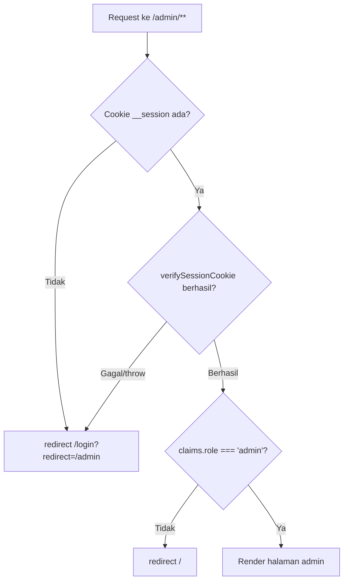
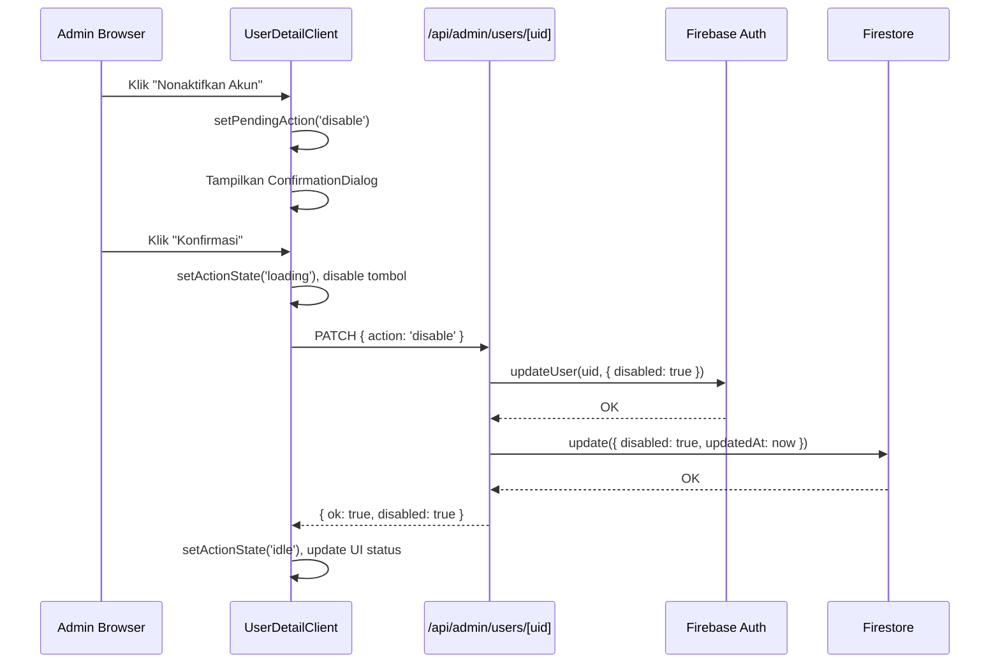
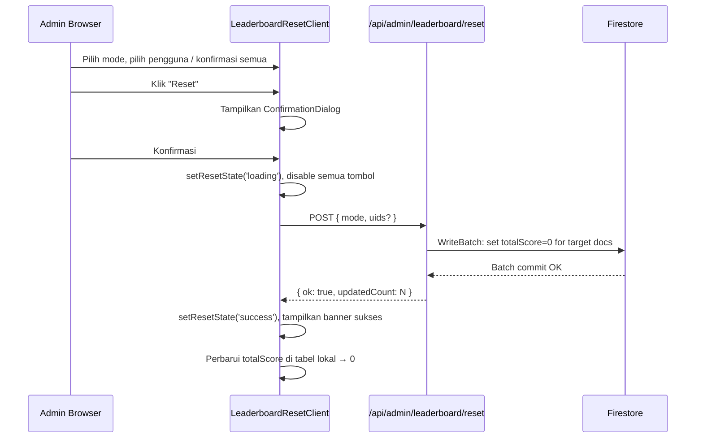

# Design Document — Admin Dashboard

## Overview

Admin Dashboard adalah modul back-office berbasis Next.js App Router yang hanya dapat diakses oleh pengguna dengan `role: "admin"`. Modul ini mencakup tiga area fungsional utama:

1. **Overview** — ringkasan statistik platform (4 stat card + tabel top-10).
2. **Manajemen Pengguna** — tabel paginated seluruh pengguna, halaman detail, serta tindakan disable/enable/hapus akun.
3. **Reset Leaderboard** — reset `totalScore` untuk pengguna terpilih atau semua pengguna sekaligus.

Seluruh halaman `/admin/*` dilindungi oleh Route Guard berbasis server yang memverifikasi session cookie sebelum konten apapun dikirim ke klien. Semua mutasi data dilakukan melalui API routes yang menggunakan `withAdminAuth` yang sudah ada.

---

## Architecture

### Pola Umum

```
Browser
  └── Next.js App Router (Server Components default)
        ├── app/admin/layout.tsx          ← Server Component: Route Guard
        ├── app/admin/page.tsx            ← Server Component: fetch & pass data
        ├── app/admin/users/page.tsx      ← Server Component: initial data fetch
        ├── app/admin/users/[uid]/page.tsx← Server Component: single user fetch
        └── app/admin/leaderboard-reset/page.tsx ← Server Component
              └── *Client.tsx            ← Client Components: interactive state

API Routes (semua di bawah /api/admin/*)
  └── Menggunakan withAdminAuth → Firebase Admin SDK (getAdminAuth, getAdminDb)
```

### Server vs Client Component

| File | Jenis | Alasan |
|---|---|---|
| `app/admin/layout.tsx` | Server | `verifySessionCookie` hanya berjalan di server |
| `app/admin/page.tsx` | Server | Fetch awal stats + top-10 di server |
| `app/admin/users/page.tsx` | Server | Fetch halaman pertama pengguna di server |
| `app/admin/users/[uid]/page.tsx` | Server | Fetch profil pengguna di server |
| `app/admin/leaderboard-reset/page.tsx` | Server | Fetch daftar pengguna di server |
| `components/admin/OverviewClient.tsx` | Client | Retry button state |
| `components/admin/UsersClient.tsx` | Client | Search, pagination, navigasi |
| `components/admin/UserDetailClient.tsx` | Client | Dialog, action loading state |
| `components/admin/LeaderboardResetClient.tsx` | Client | Checkbox selection, reset flow |
| `components/admin/AdminSidebar.tsx` | Client | Active route highlighting (`usePathname`) |
| `components/admin/ConfirmationDialog.tsx` | Client | Focus trap, portal rendering |

### Data Flow per Halaman

```
app/admin/page.tsx (Server)
  → fetch /api/admin/stats (Server Action atau API Route)
  → <OverviewClient initialData={stats} />

app/admin/users/page.tsx (Server)
  → fetch /api/admin/users?limit=20 (Server Action atau API Route)
  → <UsersClient initialData={page} />
        → search/pagination: fetch /api/admin/users?search=...&cursor=...

app/admin/users/[uid]/page.tsx (Server)
  → fetch /api/admin/users/[uid]
  → <UserDetailClient profile={profile} isDisabled={disabled} />
        → PATCH /api/admin/users/[uid] (disable/enable)
        → DELETE /api/admin/users/[uid] (hapus)

app/admin/leaderboard-reset/page.tsx (Server)
  → fetch /api/admin/users?limit=all (untuk tabel reset, tanpa pagination)
  → <LeaderboardResetClient users={users} />
        → POST /api/admin/leaderboard/reset
```

---

## Components and Interfaces

### Admin Layout (`app/admin/layout.tsx`)

```tsx
// Server Component
import { cookies } from 'next/headers';
import { redirect } from 'next/navigation';
import { verifySessionCookie } from '@/features/auth/services/firebase.admin';
import AdminSidebar from '@/components/admin/AdminSidebar';

export default async function AdminLayout({ children }) {
  const cookieStore = await cookies();
  const session = cookieStore.get('__session')?.value;

  if (!session) {
    redirect('/login?redirect=/admin');
  }

  try {
    const claims = await verifySessionCookie(session);
    if (claims.role !== 'admin') {
      redirect('/');
    }
  } catch {
    redirect('/login?redirect=/admin');
  }

  return (
    <div className="flex min-h-screen">
      <AdminSidebar />
      <main className="flex-1 overflow-auto">{children}</main>
    </div>
  );
}
```

### AdminSidebar (`components/admin/AdminSidebar.tsx`)

Client Component. Menggunakan `usePathname()` untuk menandai item aktif.

```
Props: none
State: none (pathname dari Next.js)

Nav Items:
  - /admin          → "Overview"       (ikon: dashboard)
  - /admin/users    → "Pengguna"       (ikon: group)
  - /admin/leaderboard-reset → "Reset Leaderboard" (ikon: leaderboard)

Aksesibilitas:
  - <nav> dengan aria-label="Navigasi Admin"
  - Link aktif: aria-current="page"
  - Tombol tersedia via Tab; Enter/Space mengaktifkan
```

### ConfirmationDialog (`components/admin/ConfirmationDialog.tsx`)

Reusable, accessible dialog dengan focus trap dan portal rendering.

```tsx
interface ConfirmationDialogProps {
  isOpen: boolean;
  title: string;
  description: string;        // Teks deskriptif tindakan
  confirmLabel: string;       // Teks tombol konfirmasi
  confirmVariant: 'danger' | 'warning'; // Warna tombol konfirmasi
  onConfirm: () => void;
  onCancel: () => void;
  isLoading?: boolean;        // Nonaktifkan tombol saat proses berjalan
}
```

**Implementasi Focus Trap:**
- Dialog dirender sebagai `<dialog>` HTML native atau via `ReactDOM.createPortal` ke `document.body`.
- Saat `isOpen` berubah dari `false` ke `true`: fokus dikirim ke tombol pertama dalam dialog (< 100 ms, lewat `useEffect` + `ref.focus()`).
- Saat dialog ditutup: fokus dikembalikan ke elemen yang memicu (`triggerRef.current?.focus()`).
- Tombol `Escape` menutup dialog (memanggil `onCancel`).
- `Tab` dan `Shift+Tab` tetap dalam scope dialog (trapped via keyboard event handler atau `inert` attribute di luar dialog).

**ARIA Attributes:**
```html
<div
  role="dialog"
  aria-modal="true"
  aria-labelledby="dialog-title"
  aria-describedby="dialog-desc"
>
  <h2 id="dialog-title">{title}</h2>
  <p id="dialog-desc">{description}</p>
  ...
</div>
```

### StatCard (`components/admin/StatCard.tsx`)

```tsx
interface StatCardProps {
  label: string;
  value: number | null;    // null = loading state
  icon: string;            // Material Symbols name
  colorScheme: 'blue' | 'green' | 'orange' | 'red';
}
```

Saat `value === null`, tampilkan skeleton pulse `h-8 w-20 bg-slate-200 animate-pulse rounded`.

### AdminTableSkeleton (`components/admin/AdminTableSkeleton.tsx`)

```tsx
interface AdminTableSkeletonProps {
  rows?: number;        // default: 20
  columns?: number;     // default: 7
}
```

Setiap sel skeleton: `h-4 bg-slate-200 animate-pulse rounded`. Lebar sel bervariasi (w-8, w-24, w-32, dll.) sesuai kolom yang direpresentasikan.

### UsersClient (`components/admin/UsersClient.tsx`)

```tsx
interface UsersClientProps {
  initialData: PaginatedUsersResponse;
}

interface PaginatedUsersResponse {
  users: AdminUserRow[];
  nextCursor: string | null;   // Firestore document ID untuk cursor-based pagination
  prevCursor: string | null;
  total: number;
}

interface AdminUserRow {
  uid: string;
  name: string;
  email: string;
  school: string;
  totalScore: number;
  disabled: boolean;
  createdAt: string;   // ISO string, diformat client-side ke DD/MM/YYYY
}
```

**Search Debounce:** `useEffect` dengan `setTimeout(500ms)` — cancel via `clearTimeout` pada cleanup.

**Pagination State:**
```ts
const [cursors, setCursors] = useState<string[]>([]); // stack cursor sebelumnya
const [currentCursor, setCurrentCursor] = useState<string | null>(null);
```

### UserDetailClient (`components/admin/UserDetailClient.tsx`)

```tsx
interface UserDetailClientProps {
  profile: AdminUserDetail;
  isDisabled: boolean;
}

interface AdminUserDetail extends AdminUserRow {
  photoURL: string | null;
  role: 'user' | 'admin';
  updatedAt: string;           // ISO string
}
```

**Action State:**
```ts
type ActionState = 'idle' | 'loading' | 'error';
const [actionState, setActionState] = useState<ActionState>('idle');
const [actionError, setActionError] = useState<string | null>(null);
const [pendingAction, setPendingAction] = useState<'disable' | 'enable' | 'delete' | null>(null);
```

### LeaderboardResetClient (`components/admin/LeaderboardResetClient.tsx`)

```tsx
interface LeaderboardResetClientProps {
  users: AdminUserRow[];
}

type ResetMode = 'selected' | 'all';
```

**Selection State:**
```ts
const [mode, setMode] = useState<ResetMode>('selected');
const [selectedUids, setSelectedUids] = useState<Set<string>>(new Set());
const [resetState, setResetState] = useState<'idle' | 'loading' | 'success' | 'error'>('idle');
```

---

## Data Models

### API Request/Response Shapes

#### `GET /api/admin/stats`

```ts
// Response 200
interface AdminStatsResponse {
  totalUsers: number;
  activeUsers: number;          // totalScore > 0
  topScore: number;
  disabledAccounts: number;
  top10: AdminTop10Entry[];
}

interface AdminTop10Entry {
  uid: string;
  name: string;
  school: string;
  totalScore: number;
}
```

Implementasi menggunakan `getCountFromServer` untuk 4 metrik (tanpa membaca field dokumen individual):
```ts
const [totalSnap, activeSnap, disabledSnap] = await Promise.all([
  getCountFromServer(collection(db, 'users')),
  getCountFromServer(query(collection(db, 'users'), where('totalScore', '>', 0))),
  getCountFromServer(query(collection(db, 'users'), where('disabled', '==', true))),
]);
// topScore: ambil 1 dokumen teratas berdasarkan totalScore
```

**Catatan:** Flag `disabled` di Firestore harus disinkronkan saat admin menonaktifkan/mengaktifkan akun via `PATCH /api/admin/users/[uid]`. Firebase Auth `disabled` adalah sumber kebenaran, namun Firestore field `disabled: boolean` diperlukan untuk `getCountFromServer`.

#### `GET /api/admin/users`

```ts
// Query params
interface UsersQueryParams {
  limit?: number;          // default: 20, max: 20; 'all' untuk leaderboard-reset
  cursor?: string;         // Firestore doc ID (last doc of previous page)
  search?: string;         // minimal 2 karakter
}

// Response 200
interface AdminUsersResponse {
  users: AdminUserRow[];
  nextCursor: string | null;
}
```

**Implementasi Search:** Firestore tidak mendukung full-text search. Untuk MVP, search dilakukan client-side pada data yang sudah diambil. Alternatif server-side: query `name >= search && name < search + '\uf8ff'` untuk prefix match (hanya nama, case-sensitive). Karena requirement menyebutkan case-insensitive dan keduanya nama/email, implementasi yang direkomendasikan adalah **client-side filter** pada data yang sudah diambil (semua pengguna di-load untuk keperluan search).

**Cursor Pagination:** Menggunakan `startAfter(lastDocSnapshot)` dari Firestore.

#### `GET /api/admin/users/[uid]`

```ts
// Response 200
interface AdminUserDetailResponse {
  uid: string;
  name: string;
  email: string;
  school: string;
  photoURL: string | null;
  role: 'user' | 'admin';
  totalScore: number;
  disabled: boolean;
  createdAt: string;    // ISO 8601
  updatedAt: string;    // ISO 8601
}

// Response 404
{ error: 'Pengguna tidak ditemukan.' }
```

Sumber data: Firestore dokumen + Firebase Auth `getUser(uid)` untuk membaca flag `disabled`.

#### `PATCH /api/admin/users/[uid]`

```ts
// Request body
interface PatchUserRequest {
  action: 'disable' | 'enable';
}

// Response 200
{ ok: true; disabled: boolean }

// Response 403
{ error: 'Akun admin tidak dapat dimodifikasi melalui panel ini.' }

// Response 404
{ error: 'Pengguna tidak ditemukan.' }
```

Implementasi:
1. `getAdminAuth().updateUser(uid, { disabled: action === 'disable' })`
2. `getAdminDb().collection('users').doc(uid).update({ disabled: ..., updatedAt: FieldValue.serverTimestamp() })`

#### `DELETE /api/admin/users/[uid]`

```ts
// Response 200
{ ok: true }

// Response 403 — target adalah admin
{ error: 'Akun admin tidak dapat dimodifikasi melalui panel ini.' }

// Response 500 — Firestore delete gagal setelah Auth delete berhasil
{ error: 'Akun telah dihapus dari autentikasi namun data profil gagal dihapus. Hubungi dukungan teknis.', partial: true }
```

Urutan operasi (critical):
1. Verifikasi role target bukan `"admin"` (dari Firestore atau Auth custom claims).
2. `getAdminAuth().deleteUser(uid)`
3. `getAdminDb().collection('users').doc(uid).delete()`
4. Jika langkah 3 gagal → return 500 dengan `partial: true`.

#### `POST /api/admin/leaderboard/reset`

```ts
// Request body
interface LeaderboardResetRequest {
  mode: 'selected' | 'all';
  uids?: string[];        // wajib ada jika mode === 'selected', max 500 UIDs
}

// Response 200
{ ok: true; updatedCount: number }

// Response 400
{ error: 'uids wajib disertakan untuk mode selected.' }
```

Implementasi (batch writes):
```ts
// Firestore WriteBatch maksimum 500 operasi per batch
// Untuk 'all': getDocs semua pengguna, batch update totalScore = 0
// Untuk 'selected': batch update hanya uid yang dikirim
```

### Firestore Data Shape Tambahan

Field `disabled: boolean` ditambahkan ke dokumen `users/{uid}`. Field ini disinkronkan oleh `PATCH /api/admin/users/[uid]` agar `getCountFromServer` untuk `disabledAccounts` dapat bekerja. Nilai awal saat pembuatan akun: `disabled: false`.

---

## Correctness Properties

*A property is a characteristic or behavior that should hold true across all valid executions of a system — essentially, a formal statement about what the system should do. Properties serve as the bridge between human-readable specifications and machine-verifiable correctness guarantees.*

### Property 1: Top-N user selection respects score ordering and limit

*For any* list of users with varying `totalScore` values, the function that extracts the top entries SHALL return a list where (a) every entry has `totalScore > 0`, (b) the list is sorted in descending order of `totalScore`, and (c) the list length is at most 10.

**Validates: Requirements 2.5, 2.6**

---

### Property 2: Pagination invariant — page size bound

*For any* list of N users paginated with `pageSize = 20`, every page SHALL contain at most 20 entries, and the sum of entries across all pages SHALL equal N.

**Validates: Requirements 3.2**

---

### Property 3: Search filter correctness

*For any* search query string Q with `length >= 2` and any list of users, the search filter result SHALL contain only users where `name.toLowerCase().includes(Q.toLowerCase())` OR `email.toLowerCase().includes(Q.toLowerCase())` holds true, and SHALL not omit any user for whom this condition holds.

**Validates: Requirements 3.3, 3.4**

---

### Property 4: Selected-user reset isolation

*For any* non-empty set of selected UIDs S and any list of users U where S ⊆ UIDs(U), after executing the selected reset operation, every user in U whose UID is in S SHALL have `totalScore = 0`, and every user in U whose UID is NOT in S SHALL have an unchanged `totalScore`.

**Validates: Requirements 5.4**

---

### Property 5: UID input validation boundary

*For any* string input for `uid`, the validation function SHALL accept the input (return valid) if and only if the string has length between 1 and 128 characters inclusive, and SHALL reject the input (return invalid) for any string with length 0 or greater than 128.

**Validates: Requirements 6.3**

---

## Error Handling

### Route Guard Failures

| Kondisi | Tindakan | Kode Status |
|---|---|---|
| Cookie tidak ada | `redirect('/login?redirect=/admin')` | — (redirect) |
| Cookie tidak valid / kedaluwarsa | `redirect('/login?redirect=/admin')` | — (redirect) |
| Role bukan `"admin"` | `redirect('/')` | — (redirect) |
| `verifySessionCookie` throw (layanan down) | `redirect('/login?redirect=/admin')` | — (redirect) |

### API Route Errors

Semua API routes menggunakan envelope error yang konsisten:
```ts
// Error response shape
interface ApiError {
  error: string;   // Pesan user-friendly, tidak mengekspos stack trace
  code?: string;   // Opsional untuk debugging klien
  partial?: boolean; // Hanya untuk kasus partial delete
}
```

**Timeout handling (5000 ms):** Client Component mengatur `AbortController` dengan `setTimeout(5000)` yang memicu `controller.abort()`. Jika signal abort diterima, tampilkan pesan error dan kembalikan state ke kondisi sebelum tindakan.

### Partial Delete Recovery

Jika `deleteUser` Firebase Auth berhasil tetapi delete Firestore gagal:
- API mengembalikan `{ error: '...', partial: true }` dengan status 500.
- `UserDetailClient` menampilkan pesan yang menyarankan admin menghubungi dukungan teknis.
- Admin dapat menggunakan Firebase Console untuk membersihkan dokumen Firestore yang tersisa secara manual.

### Batch Reset Atomicity

Operasi reset menggunakan Firestore `WriteBatch`. Jika batch commit gagal, tidak ada dokumen yang termodifikasi (Firestore batch adalah atomic). API mengembalikan 500 dan klien menampilkan pesan error.

---

## Testing Strategy

### Unit Tests (Jest + Testing Library)

**Fokus:** Logika murni (pure functions), validasi input, rendering kondisional.

- `mapDocsToEntries` equivalent untuk admin — mapDocsToAdminRows: verifikasi transformasi field.
- `validateUid(uid: string): boolean` — boundary tests: `""`, `"a"`, `"a".repeat(128)`, `"a".repeat(129)`.
- `filterUsers(users, query)` — example tests: query kosong, query 1 karakter, query valid dengan mixed case.
- `paginateUsers(users, pageSize, cursor)` — example tests: last page, empty list, single element.
- `ConfirmationDialog` — render test: dialog closed → tidak ada role=dialog; dialog open → role=dialog hadir, aria-labelledby/aria-describedby set.
- `StatCard` — render test: `value=null` → skeleton present; `value=42` → "42" ditampilkan.
- `UserDetailClient` — render test: `isDisabled=false` → tombol "Nonaktifkan" hadir; `isDisabled=true` → tombol "Aktifkan" hadir.

### Property-Based Tests (fast-check)

Library: `fast-check` (sudah ada di `devDependencies`).
Setiap property test minimum **100 iterasi** (default fast-check).
Tag komentar: `// Feature: admin-dashboard, Property {N}: {property_text}`

**Property 1 — Top-N score ordering:**
```ts
// Feature: admin-dashboard, Property 1: top-N respects score ordering and limit
fc.assert(fc.property(
  fc.array(fc.record({ uid: fc.string(), totalScore: fc.integer({ min: 0 }) }), { maxLength: 50 }),
  (users) => {
    const result = selectTopN(users, 10);
    return (
      result.length <= 10 &&
      result.every(u => u.totalScore > 0) &&
      result.every((u, i) => i === 0 || result[i-1].totalScore >= u.totalScore)
    );
  }
));
```

**Property 2 — Pagination page size bound:**
```ts
// Feature: admin-dashboard, Property 2: pagination invariant — page size bound
fc.assert(fc.property(
  fc.array(fc.record({ uid: fc.string() }), { maxLength: 200 }),
  (users) => {
    const pages = paginateAll(users, 20);
    return (
      pages.every(page => page.length <= 20) &&
      pages.flat().length === users.length
    );
  }
));
```

**Property 3 — Search filter correctness:**
```ts
// Feature: admin-dashboard, Property 3: search filter correctness
fc.assert(fc.property(
  fc.array(fc.record({ uid: fc.string(), name: fc.string(), email: fc.string() }), { maxLength: 100 }),
  fc.string({ minLength: 2, maxLength: 50 }),
  (users, query) => {
    const result = filterUsers(users, query);
    const q = query.toLowerCase();
    // All results must match
    const allMatch = result.every(u =>
      u.name.toLowerCase().includes(q) || u.email.toLowerCase().includes(q)
    );
    // No matching user is excluded
    const noneExcluded = users
      .filter(u => u.name.toLowerCase().includes(q) || u.email.toLowerCase().includes(q))
      .every(u => result.some(r => r.uid === u.uid));
    return allMatch && noneExcluded;
  }
));
```

**Property 4 — Selected-user reset isolation:**
```ts
// Feature: admin-dashboard, Property 4: selected-user reset isolation
fc.assert(fc.property(
  fc.array(fc.record({ uid: fc.uuid(), totalScore: fc.integer({ min: 1 }) }), { minLength: 1, maxLength: 50 }),
  fc.array(fc.nat({ max: 49 }), { minLength: 1, maxLength: 10 }),
  (users, indices) => {
    const uniqueIndices = [...new Set(indices)].filter(i => i < users.length);
    const selectedUids = new Set(uniqueIndices.map(i => users[i].uid));
    const result = applySelectedReset(users, selectedUids);
    return (
      result.every(u => selectedUids.has(u.uid) ? u.totalScore === 0 : u.totalScore === users.find(o => o.uid === u.uid)!.totalScore)
    );
  }
));
```

**Property 5 — UID validation boundary:**
```ts
// Feature: admin-dashboard, Property 5: UID input validation boundary
fc.assert(fc.property(
  fc.oneof(
    fc.constant(''),
    fc.string({ maxLength: 200 }),
  ),
  (uid) => {
    const isValid = validateUid(uid);
    const expectedValid = uid.length >= 1 && uid.length <= 128;
    return isValid === expectedValid;
  }
));
```

### Integration Tests

- `GET /api/admin/stats` dengan valid admin session cookie → response 200 dengan 4 numerik + array top10.
- `PATCH /api/admin/users/[uid]` dengan `action: 'disable'` pada akun non-admin → Firebase Auth `disabled` flag berubah.
- `DELETE /api/admin/users/[uid]` pada akun admin → response 403.
- `POST /api/admin/leaderboard/reset` dengan `mode: 'all'` → semua pengguna memiliki `totalScore: 0`.
- Semua endpoints tanpa session cookie → 401.
- Semua endpoints dengan non-admin session → 403.

### Accessibility Tests (Manual + Automated)

- Dialog focus trap: menggunakan `@testing-library/user-event` — tab di dalam dialog tidak keluar dari scope.
- Setelah dialog ditutup: `document.activeElement` harus sama dengan trigger button.
- Screen reader: label pada semua tombol aksi, `aria-live` region untuk error dan sukses messages.

---

## Seed Script (`scripts/seed-admin.ts`)

### Diagram Alur

```
START
  ↓
Load .env.local (dotenv)
  ↓
Read ADMIN_EMAIL, ADMIN_PASSWORD, ADMIN_NAME, ADMIN_SCHOOL
  ↓
Validate: semua field ada & non-empty?
  NO → print error, exit 1
  YES ↓
createUser({ email, password, displayName: name })
  ERROR (auth/email-already-in-use) → print error, exit 1
  OK ↓
setCustomUserClaims(uid, { role: 'admin' })
  ↓
db.collection('users').doc(uid).set({
  uid, name, email, school,
  role: 'admin', totalScore: 0,
  disabled: false,
  createdAt: serverTimestamp(), updatedAt: serverTimestamp()
}, { merge: false })
  ↓
Print: uid, email, "Custom claim dan dokumen Firestore berhasil dibuat."
  ↓
process.exit(0)
```

### Implementasi

```ts
// scripts/seed-admin.ts
import dotenv from 'dotenv';
import path from 'path';
dotenv.config({ path: path.resolve(__dirname, '../.env.local') });

import { getAdminAuth, getAdminDb } from '../features/auth/services/firebase.admin';
import { FieldValue } from 'firebase-admin/firestore';

async function main() {
  const email = process.env.ADMIN_EMAIL?.trim();
  const password = process.env.ADMIN_PASSWORD?.trim();
  const name = process.env.ADMIN_NAME?.trim();
  const school = process.env.ADMIN_SCHOOL?.trim();

  if (!email || !password || !name || !school) {
    console.error('Error: ADMIN_EMAIL, ADMIN_PASSWORD, ADMIN_NAME, ADMIN_SCHOOL wajib diisi.');
    process.exit(1);
  }

  const auth = getAdminAuth();
  const db = getAdminDb();

  let uid: string;
  try {
    const userRecord = await auth.createUser({ email, password, displayName: name });
    uid = userRecord.uid;
  } catch (err: unknown) {
    const code = (err as { code?: string }).code;
    if (code === 'auth/email-already-in-use') {
      console.error(`Error: Email "${email}" sudah terdaftar di Firebase Auth.`);
    } else {
      console.error('Error saat membuat akun Firebase Auth:', err);
    }
    process.exit(1);
  }

  await auth.setCustomUserClaims(uid, { role: 'admin' });

  await db.collection('users').doc(uid).set({
    uid,
    name,
    email,
    school,
    role: 'admin',
    totalScore: 0,
    disabled: false,
    createdAt: FieldValue.serverTimestamp(),
    updatedAt: FieldValue.serverTimestamp(),
  }, { merge: false });

  console.log(`✓ Admin berhasil dibuat.`);
  console.log(`  uid   : ${uid}`);
  console.log(`  email : ${email}`);
  console.log(`  Custom claim "role: admin" dan dokumen Firestore users/${uid} telah dibuat.`);
  process.exit(0);
}

main().catch((err) => {
  console.error('Unexpected error:', err);
  process.exit(1);
});
```

---

## Component Tree per Halaman

### `/admin` (Overview)

```
AdminLayout (Server)
  AdminSidebar (Client)
  OverviewPage (Server)
    OverviewClient (Client)
      StatCard × 4
      AdminTableSkeleton (saat loading)
      Top10Table (static, no interaction)
      ErrorBanner + RetryButton (saat error)
```

### `/admin/users`

```
AdminLayout (Server)
  AdminSidebar (Client)
  UsersPage (Server)
    UsersClient (Client)
      SearchInput (dengan debounce)
      AdminTableSkeleton (saat loading)
      UsersTable (rows dengan link ke /admin/users/[uid])
      PaginationControls (prev/next)
      EmptyState (saat kosong atau no results)
      ErrorBanner + RetryButton (saat error)
```

### `/admin/users/[uid]`

```
AdminLayout (Server)
  AdminSidebar (Client)
  UserDetailPage (Server)
    UserDetailClient (Client)
      UserProfileCard
        Avatar, nama, email, sekolah, role, skor, status, tanggal
      ActionButtons
        "Nonaktifkan Akun" | "Aktifkan Akun" (mutual exclusive)
        "Hapus Pengguna" (selalu tampil kecuali target = admin)
      ConfirmationDialog (portal, conditional)
      ErrorBanner (saat action gagal)
      BackLink → /admin/users
```

### `/admin/leaderboard-reset`

```
AdminLayout (Server)
  AdminSidebar (Client)
  LeaderboardResetPage (Server)
    LeaderboardResetClient (Client)
      ModeSelector (tab: "Reset Pengguna Tertentu" | "Reset Semua")
      [mode = selected]
        SelectableUsersTable
          CheckboxRow × N
          SelectAllCheckbox
        ResetSelectedButton (disabled saat selectedUids kosong)
      [mode = all]
        FullResetWarning
        ResetAllButton
      ConfirmationDialog (portal, conditional)
      LoadingOverlay (saat proses reset)
      SuccessBanner (setelah reset berhasil)
      ErrorBanner (saat reset gagal)
```

---

## Mermaid Diagrams

### Route Guard Flow



### Alur Tindakan User (Disable/Enable/Delete)



### Alur Reset Leaderboard


