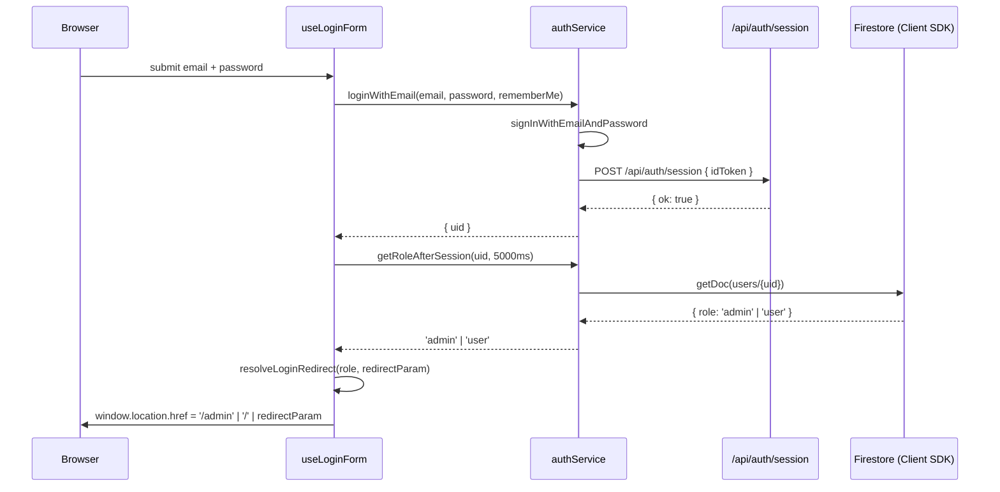

# Design Document — Admin User Management

## Overview

Fitur **Admin User Management** menambahkan dua kemampuan utama ke dashboard admin yang sudah ada:

1. **Admin-Created User Registration** — admin dapat membuat akun pengguna baru langsung dari `/admin/users/new` tanpa pengguna perlu mendaftar sendiri. Endpoint `POST /api/admin/users` menangani pembuatan akun Firebase Auth + dokumen Firestore dengan rollback otomatis jika Firestore gagal.

2. **Role-Based Login Redirect** — setelah login berhasil (email/password maupun Google OAuth), sistem membaca `role` dari Firestore dan mengarahkan admin ke `/admin`, bukan ke `/`.

Kedua fitur ini mengikuti pola arsitektur yang sudah ada: Next.js App Router, Server Components untuk data-fetching, Client Components untuk form interaktif, `withAdminAuth` untuk proteksi API, dan `sanitizeInput`/`validateUid` dari modul yang sudah ada.

---

## Architecture

### Komponen Baru vs Modifikasi

| Komponen | Jenis | Status |
|---|---|---|
| `app/admin/users/new/page.tsx` | Server Component | **Baru** |
| `components/admin/CreateUserForm.tsx` | Client Component | **Baru** |
| `app/api/admin/users/route.ts` | API Route (POST handler) | **Modifikasi** — tambah `POST` handler |
| `lib/admin/utils.ts` | Pure utilities | **Modifikasi** — tambah `validateCreateUserInput`, `resolveLoginRedirect` |
| `components/admin/UsersClient.tsx` | Client Component | **Modifikasi** — tambah tombol "Buat Pengguna Baru" |
| `features/auth/hooks/useLoginForm.ts` | Hook | **Modifikasi** — baca role, redirect ke `/admin` jika admin |
| `features/auth/services/authService.ts` | Service | **Modifikasi** — tambah `getRoleAfterSession`, gunakan `resolveLoginRedirect` |

### Data Flow

```
/admin/users/new
  app/admin/users/new/page.tsx (Server Component — trivial, hanya render)
    → <CreateUserForm /> (Client Component)
          ↓ submit
      POST /api/admin/users
          ↓ withAdminAuth
        validateCreateUserInput()
        sanitizeInput(name), sanitizeInput(school)
        getAdminAuth().createUser(...)
        getAdminAuth().setCustomUserClaims(uid, { role: 'user' })
        getAdminDb().collection('users').doc(uid).set(...)
          ↓ error: Firestore gagal
        getAdminAuth().deleteUser(uid)  ← rollback
          ↓ sukses
        201 { ok: true, uid, email }
          ↓
      Navigate → /admin/users (setelah 2000 ms)

/login (modifikasi role-based redirect)
  useLoginForm.onSubmit / onGoogleSubmit
    AuthService.loginWithEmail / loginWithGoogle
      → /api/auth/session (sudah ada)
      → getRoleAfterSession(uid)  ← baca Firestore
          ↓ role
      resolveLoginRedirect(role, redirectParam) → URL
    window.location.href = URL
```

---

## Components and Interfaces

### `app/admin/users/new/page.tsx` (Server Component)

Server Component tipis — tidak ada data-fetching, hanya merender `CreateUserForm`. Dilindungi oleh `AdminLayout` yang sudah ada (`app/admin/layout.tsx`).

```tsx
// app/admin/users/new/page.tsx
import CreateUserForm from '@/components/admin/CreateUserForm';

export default function CreateUserPage() {
  return <CreateUserForm />;
}
```

### `components/admin/CreateUserForm.tsx` (Client Component)

Form utama untuk admin membuat pengguna baru. Menggunakan `FloatingInput` dari `components/auth/AuthShared.tsx` untuk konsistensi visual.

```tsx
interface FormState {
  email: string;
  password: string;
  name: string;
  school: string;
}

type SubmitState = 'idle' | 'loading' | 'success' | 'error';

interface FieldErrors {
  email?: string;
  password?: string;
  name?: string;
  school?: string;
}
```

**Layout form:**
- Banner informasi (password sementara, saran ubah password) — statis, selalu tampil di atas form.
- 4 field `FloatingInput`: Email, Password (dengan toggle visibility), Nama Lengkap, Sekolah.
- Error field spesifik di bawah masing-masing field (merah, ikon `error`, dalam `<p role="alert">`).
- Banner error/sukses global di atas tombol (`role="alert"`, `aria-live="polite"`).
- Tombol "Buat Akun" dengan spinner loading + teks "Membuat Akun..." saat `loading`.
- Link "Batal" → `/admin/users` (diaktifkan dengan Escape).

**State machine:**
```
idle → (submit valid) → loading → success (redirect 2000 ms)
                                → error-400  (field-level error, kembali ke idle)
                                → error-500  (banner error, kembali ke idle)
```

**Timeout:** `AbortController` dengan `setTimeout(10_000)` sesuai Requirement 1.7.

**Keyboard UX:**
- `Enter` pada field mana pun → submit form (native behavior `<form onSubmit>`).
- `Escape` di mana pun → `router.push('/admin/users')` (via `useEffect` + `keydown` listener).

**ARIA:**
```html
<form noValidate aria-label="Formulir buat pengguna baru">
  <!-- per field: -->
  <input aria-invalid="true" aria-describedby="email-error" />
  <p id="email-error" role="alert">...</p>
  <!-- banner sukses/error global: -->
  <div role="alert" aria-live="polite">...</div>
</form>
```

### `POST /api/admin/users` (tambahan handler di `app/api/admin/users/route.ts`)

File yang sudah ada hanya memiliki `GET`. Kita tambahkan `POST`:

```ts
export const POST = withAdminAuth(
  async (req: NextRequest, claims: DecodedSessionClaims): Promise<NextResponse> => {
    // 1. Parse body
    // 2. validateCreateUserInput → 400 jika gagal
    // 3. sanitizeInput(name), sanitizeInput(school)
    // 4. getAdminAuth().createUser({ email, password, displayName: name })
    // 5. getAdminAuth().setCustomUserClaims(uid, { role: 'user' })
    // 6. getAdminDb().collection('users').doc(uid).set({ ... })
    //    → error: deleteUser(uid) rollback, return 500
    // 7. log success: [POST /api/admin/users] Admin {claims.uid} created user {uid} with email {email}
    // 8. return 201 { ok: true, uid, email }
  }
);
```

**Urutan operasi (critical untuk konsistensi):**
1. Validasi input → jangan panggil Firebase sama sekali jika gagal.
2. `createUser` — jika error `auth/email-already-in-use` → 400 spesifik; error lain → 500.
3. `setCustomUserClaims` — best-effort; jika gagal, lanjut (klaim bisa di-set ulang nanti).
4. `db.collection('users').doc(uid).set(...)` — jika gagal → rollback `deleteUser(uid)` → 500.

**Request/Response shape:**

```ts
// Request body
interface CreateUserRequest {
  email: string;
  password: string;
  name: string;
  school: string;
}

// Response 201
interface CreateUserSuccess {
  ok: true;
  uid: string;
  email: string;
}

// Response 400
{ error: string }

// Response 401 (no session) / 403 (non-admin session)
{ error: string }

// Response 500
{ error: 'Gagal membuat akun pengguna. Silakan coba lagi.' }
```

### Modifikasi `components/admin/UsersClient.tsx`

Tambahkan tombol "Buat Pengguna Baru" di bagian heading, sejajar dengan search input:

```tsx
// Di dalam <div className="flex flex-col sm:flex-row sm:items-center sm:justify-between ...">
<Link
  href="/admin/users/new"
  className="inline-flex items-center gap-2 rounded-xl bg-intblue px-4 py-2 text-sm font-semibold text-white hover:bg-intblue/90 transition-colors focus-visible:outline-none focus-visible:ring-2 focus-visible:ring-intblue"
>
  <span className="material-symbols-outlined text-[18px]" aria-hidden="true">person_add</span>
  Buat Pengguna Baru
</Link>
```

Tidak ada perubahan state atau logic lain — tombol ini adalah link navigasi biasa.

### Modifikasi `features/auth/services/authService.ts`

Tambahkan fungsi `getRoleAfterSession` dan `resolveLoginRedirect`:

```ts
/**
 * Membaca role pengguna dari Firestore setelah session cookie dibuat.
 * Jika Firestore gagal atau timeout >5000ms, mengembalikan 'user' (fallback aman).
 * Requirements: 3.1, 3.6
 */
export async function getRoleAfterSession(
  uid: string,
  timeoutMs = 5000
): Promise<'user' | 'admin'> {
  try {
    const profilePromise = getUserProfile(uid);
    const timeoutPromise = new Promise<null>((_, reject) =>
      setTimeout(() => reject(new Error('timeout')), timeoutMs)
    );
    const profile = await Promise.race([profilePromise, timeoutPromise]);
    return profile?.role === 'admin' ? 'admin' : 'user';
  } catch {
    return 'user'; // fallback — Requirement 3.6
  }
}

/**
 * Menentukan URL redirect setelah login berhasil berdasarkan role dan parameter redirect.
 * Pure function — dapat diuji sebagai correctness property.
 * Requirements: 3.2, 3.3, 3.4, 3.5, 3.7
 */
export function resolveLoginRedirect(
  role: 'user' | 'admin',
  redirectParam: string | null
): string {
  const decoded = redirectParam ? decodeURIComponent(redirectParam) : null;
  const isAdminPath = decoded?.startsWith('/admin') ?? false;

  if (role === 'admin') {
    // Admin diarahkan ke redirect jika menunjuk ke /admin/*, atau ke /admin secara default
    return isAdminPath && decoded ? decoded : '/admin';
  } else {
    // Non-admin: ikuti redirect hanya jika BUKAN path /admin (security)
    return decoded && !isAdminPath ? decoded : '/';
  }
}
```

### Modifikasi `features/auth/hooks/useLoginForm.ts`

Setelah session berhasil dibuat, baca role dan gunakan `resolveLoginRedirect`:

```ts
// Dalam onSubmit dan onGoogleSubmit, ganti blok redirect:

// Sebelum (existing):
const redirect = searchParams.get('redirect');
const targetUrl = redirect ? decodeURIComponent(redirect) : '/';

// Sesudah (modified):
const uid = /* dari credential.user.uid yang di-pass dari authService */;
const role = await AuthService.getRoleAfterSession(uid);
const redirectParam = searchParams.get('redirect');
const targetUrl = AuthService.resolveLoginRedirect(role, redirectParam);
```

**Catatan implementasi:** `loginWithEmail` dan `loginWithGoogle` perlu mengembalikan `uid` pengguna agar `useLoginForm` dapat memanggil `getRoleAfterSession`. Ini memerlukan perubahan return type:

```ts
// Baru: loginWithEmail dan loginWithGoogle mengembalikan uid
export async function loginWithEmail(
  email: string,
  password: string,
  rememberMe: boolean
): Promise<{ uid: string }> { ... }

export async function loginWithGoogle(): Promise<{ uid: string } | null> { ... }
```

---

## Data Models

### Dokumen Firestore `users/{uid}` untuk Admin-Created Account

Field yang diset saat pembuatan via `POST /api/admin/users`:

```ts
interface AdminCreatedUserDoc {
  uid: string;            // sama dengan Firebase Auth UID
  name: string;           // setelah sanitizeInput + trim
  email: string;          // email murni dari Firebase Auth createUser
  school: string;         // setelah sanitizeInput + trim
  role: 'user';           // selalu 'user', tidak pernah 'admin'
  totalScore: 0;          // nilai awal
  disabled: false;        // nilai awal, sinkron dengan Firebase Auth
  createdAt: Timestamp;   // FieldValue.serverTimestamp()
  updatedAt: Timestamp;   // FieldValue.serverTimestamp()
}
```

Struktur ini identik dengan dokumen yang dibuat oleh `registerWithEmail` yang sudah ada, kecuali `photoURL` tidak disertakan (admin tidak mengupload foto pengguna).

### Fungsi Validasi Baru (`lib/admin/utils.ts`)

```ts
interface CreateUserInput {
  email: string;
  password: string;
  name: string;
  school: string;
}

interface ValidationResult {
  valid: boolean;
  errors: Partial<Record<keyof CreateUserInput, string>>;
}

/**
 * Memvalidasi input pembuatan pengguna baru.
 * Pure function — digunakan di sisi klien (form) dan sisi server (API route).
 * Requirements: 1.3, 2.2, 6.2, 6.3, 6.4
 */
export function validateCreateUserInput(input: CreateUserInput): ValidationResult {
  const errors: Partial<Record<keyof CreateUserInput, string>> = {};

  if (!/^[^\s@]+@[^\s@]+\.[^\s@]+$/.test(input.email)) {
    errors.email = 'Alamat email tidak valid.';
  }
  if (input.password.length < 6 || input.password.length > 256) {
    errors.password = 'Password harus minimal 6 karakter.';
  }
  if (input.name.trim().length === 0 || input.name.trim().length > 100) {
    errors.name = 'Nama lengkap tidak boleh kosong dan maksimal 100 karakter.';
  }
  if (input.school.trim().length === 0 || input.school.trim().length > 100) {
    errors.school = 'Sekolah tidak boleh kosong dan maksimal 100 karakter.';
  }

  return { valid: Object.keys(errors).length === 0, errors };
}
```

---

## Correctness Properties

*A property is a characteristic or behavior that should hold true across all valid executions of a system — essentially, a formal statement about what the system should do. Properties serve as the bridge between human-readable specifications and machine-verifiable correctness guarantees.*

### Property 1: Input validation correctness

*For any* create-user input object `{ email, password, name, school }`, `validateCreateUserInput` SHALL return `valid: true` if and only if all four conditions hold simultaneously: email matches `/^[^\s@]+@[^\s@]+\.[^\s@]+$/`, password length is between 6 and 256 (inclusive), name trimmed length is between 1 and 100 (inclusive), and school trimmed length is between 1 and 100 (inclusive). Conversely, if any single condition fails, `valid` SHALL be `false` and the corresponding field SHALL appear in `errors`.

**Validates: Requirements 1.3, 2.2, 6.2, 6.3, 6.4**

---

### Property 2: Role-based redirect security and correctness

*For any* combination of `role` (`"user"` or `"admin"`) and `redirectParam` (any string or null), `resolveLoginRedirect(role, redirectParam)` SHALL satisfy all of: (a) if `role === "admin"` and redirect points to a path starting with `/admin`, return that redirect path; (b) if `role === "admin"` and redirect does not start with `/admin` (or is null), return `/admin`; (c) if `role === "user"` and redirect is a non-null path that does NOT start with `/admin`, return that redirect path; (d) if `role === "user"` and redirect starts with `/admin` or is null, return `/`.

**Validates: Requirements 3.2, 3.3, 3.4, 3.5, 3.7**

---

### Property 3: sanitizeInput removes control characters and HTML tags

*For any* string `s`, `sanitizeInput(s)` SHALL produce a string that contains no control characters (Unicode range U+0000–U+001F and U+007F) and no HTML tag substrings (no `<...>` patterns), regardless of the content, length, or encoding of the input `s`.

**Validates: Requirements 6.1**

---

## Error Handling

### API Error Taxonomy

| Kondisi | Kode | Body |
|---|---|---|
| Tidak ada session cookie | 401 | `{ error: 'Tidak terautentikasi.' }` |
| Session valid, bukan admin | 403 | `{ error: 'Akses ditolak. Hanya admin...' }` |
| Validasi input gagal | 400 | `{ error: '<deskripsi field>' }` |
| Email sudah terdaftar | 400 | `{ error: 'Email sudah terdaftar. Gunakan email yang berbeda.' }` |
| Firebase Auth gagal (non-duplicate) | 500 | `{ error: 'Gagal membuat akun pengguna. Silakan coba lagi.' }` |
| Firestore gagal, rollback berhasil | 500 | `{ error: 'Gagal membuat akun pengguna. Silakan coba lagi.' }` |
| Firestore gagal, rollback gagal | 500 | `{ error: 'Gagal membuat akun pengguna. Silakan coba lagi.' }` (+ console log rollback failure) |
| Sukses | 201 | `{ ok: true, uid: string, email: string }` |

### Rollback Strategy

Urutan operasi dan rollback:

```
1. validateCreateUserInput → gagal? return 400 (tidak ada side effect)
2. createUser(email, password)
   → auth/email-already-in-use? return 400
   → error lain? return 500 (tidak ada side effect)
3. setCustomUserClaims(uid, { role: 'user' })
   → error? log warning, lanjut (klaim dapat di-set ulang; tidak block pembuatan akun)
4. db.doc(uid).set({ ... })
   → error?
     a. coba deleteUser(uid) — best-effort rollback
     b. log: "[POST /api/admin/users] Rollback deleteUser <succeeded|failed> for uid: {uid}"
     c. return 500
```

Jika rollback gagal (langkah 4b), akun Firebase Auth tanpa dokumen Firestore akan tetap ada. Ini adalah kondisi parsial yang sama dengan yang ditangani di `admin-dashboard` (partial delete). Admin dapat membersihkan via Firebase Console.

### Client-Side Error Handling (`CreateUserForm`)

```
HTTP 400 body.error → tampilkan di bawah field email (field-level error)
HTTP 500 / network error → tampilkan banner merah di atas tombol (generic error)
Timeout (10.000 ms) → abort request → tampilkan banner merah
```

Saat error terjadi, semua field dan tombol diaktifkan kembali dan nilai field dipertahankan (sesuai Requirement 1.6, 1.7).

### Role-Based Redirect Error Handling

Jika `getRoleAfterSession` gagal (Firestore error atau timeout 5000 ms), fungsi mengembalikan `'user'` sebagai fallback. Ini memastikan redirect selalu terjadi — worst case: admin diarahkan ke `/` dan perlu navigasi manual ke `/admin`. Perilaku ini sesuai Requirement 3.6.

---

## Testing Strategy

### Unit Tests (Jest + Testing Library)

**Pure functions (`lib/admin/utils.ts`):**
- `validateCreateUserInput` — example tests: semua valid, email kosong, password 5 karakter, name kosong, school terlalu panjang, kombinasi beberapa field gagal.
- `resolveLoginRedirect` — example tests: admin + no redirect → `/admin`; admin + `/admin/users` → `/admin/users`; user + `/` → `/`; user + `/admin` → `/`; null redirect → role default.
- `sanitizeInput` — sudah ada; tambah edge case: string dengan control chars + HTML tags.

**Component tests (`CreateUserForm`):**
- Render: 4 field + tombol + info banner ada.
- Submit blocked saat field kosong (validasi client-side).
- Loading state: field + tombol disabled, spinner tampil.
- Success: mock fetch 201 → pesan sukses → router.push dipanggil setelah 2000 ms.
- Error 400: mock fetch 400 → error di bawah field email.
- Error 500: mock fetch 500 → banner merah generik.
- Timeout (10 s): mock AbortError → banner merah.
- Escape key: router.push('/admin/users') dipanggil.
- ARIA: `aria-invalid` pada field error; `role="alert"` pada error message.

**Component tests (`UsersClient`):**
- Tombol "Buat Pengguna Baru" ada dan href-nya `/admin/users/new`.

**Hook tests (`useLoginForm`):**
- Mock `getRoleAfterSession` mengembalikan `'admin'` → `window.location.href` diset ke `/admin`.
- Mock `getRoleAfterSession` mengembalikan `'user'` → `window.location.href` diset ke `/`.
- Mock `getRoleAfterSession` throwing → redirect ke `/` (fallback).

### Property-Based Tests (fast-check)

Library: `fast-check` (sudah ada di `devDependencies`).
Minimum **100 iterasi** per property test.
Tag komentar: `// Feature: admin-user-management, Property {N}: {property_text}`

**Property 1 — Input validation correctness:**

```ts
// Feature: admin-user-management, Property 1: validateCreateUserInput correctness
fc.assert(fc.property(
  fc.record({
    email: fc.string(),
    password: fc.string(),
    name: fc.string(),
    school: fc.string(),
  }),
  ({ email, password, name, school }) => {
    const result = validateCreateUserInput({ email, password, name, school });

    const emailValid = /^[^\s@]+@[^\s@]+\.[^\s@]+$/.test(email);
    const passwordValid = password.length >= 6 && password.length <= 256;
    const nameValid = name.trim().length >= 1 && name.trim().length <= 100;
    const schoolValid = school.trim().length >= 1 && school.trim().length <= 100;

    const expectedValid = emailValid && passwordValid && nameValid && schoolValid;

    if (result.valid !== expectedValid) return false;
    if (!emailValid && !result.errors.email) return false;
    if (!passwordValid && !result.errors.password) return false;
    if (!nameValid && !result.errors.name) return false;
    if (!schoolValid && !result.errors.school) return false;

    return true;
  }
));
```

**Property 2 — Role-based redirect security and correctness:**

```ts
// Feature: admin-user-management, Property 2: resolveLoginRedirect security and correctness
fc.assert(fc.property(
  fc.constantFrom('user', 'admin') as fc.Arbitrary<'user' | 'admin'>,
  fc.option(fc.oneof(
    fc.constant('/'),
    fc.constant('/admin'),
    fc.constant('/admin/users'),
    fc.constant('/profile'),
    fc.stringOf(fc.char(), { minLength: 1, maxLength: 50 }),
  )),
  (role, redirectParam) => {
    const result = resolveLoginRedirect(role, redirectParam ?? null);
    const decoded = redirectParam ? decodeURIComponent(redirectParam) : null;
    const isAdminPath = decoded?.startsWith('/admin') ?? false;

    if (role === 'admin') {
      if (isAdminPath && decoded) return result === decoded;
      return result === '/admin';
    } else {
      if (decoded && !isAdminPath) return result === decoded;
      return result === '/';
    }
  }
));
```

**Property 3 — sanitizeInput purity:**

```ts
// Feature: admin-user-management, Property 3: sanitizeInput removes control chars and HTML
fc.assert(fc.property(
  fc.string({ unit: fc.fullUnicode() }),
  (s) => {
    const result = sanitizeInput(s);
    const hasControlChars = /[\x00-\x1F\x7F]/.test(result);
    const hasHtmlTags = /<[^>]*>/.test(result);
    return !hasControlChars && !hasHtmlTags;
  }
));
```

### Integration Tests

- `POST /api/admin/users` tanpa session cookie → 401.
- `POST /api/admin/users` dengan non-admin session → 403.
- `POST /api/admin/users` dengan body valid + admin session (mocked Firebase Admin) → 201, dokumen Firestore dibuat.
- `POST /api/admin/users` dengan email duplikat (mocked Firebase Admin) → 400.
- `POST /api/admin/users` dengan Firestore gagal (mock) → 500, `deleteUser` dipanggil sebagai rollback.
- `getRoleAfterSession` dengan mock Firestore gagal → mengembalikan `'user'` (fallback).

---

## Mermaid Diagrams

### Alur Pembuatan Pengguna Baru

```mermaid
flowchart TD
    A[Admin buka /admin/users/new] --> B[Isi form: email, password, nama, sekolah]
    B --> C{Validasi client-side}
    C -- Gagal --> D[Tampilkan error per field, tidak kirim request]
    C -- Lulus --> E[POST /api/admin/users]
    E --> F{withAdminAuth}
    F -- Tidak terotorisasi --> G[401 / 403]
    F -- Terotorisasi --> H{validateCreateUserInput server-side}
    H -- Gagal --> I[400 { error }]
    H -- Lulus --> J[createUser Firebase Auth]
    J -- auth/email-already-in-use --> K[400 Email sudah terdaftar]
    J -- Error lain --> L[500 Gagal membuat akun]
    J -- Sukses --> M[setCustomUserClaims role:user]
    M --> N[Firestore users/{uid}.set]
    N -- Gagal --> O[deleteUser rollback]
    O --> P[500 Gagal membuat akun]
    N -- Sukses --> Q[201 { ok: true, uid, email }]
    Q --> R[Tampilkan pesan sukses]
    R --> S[Navigasi ke /admin/users setelah 2000ms]
```

### Alur Role-Based Login Redirect



### Komponen Tree `/admin/users/new`

```
AdminLayout (Server)
  AdminSidebar (Client)
  CreateUserPage (Server)
    CreateUserForm (Client)
      InfoBanner — saran password sementara
      FloatingInput: Email
      FloatingInput: Password (toggle visibility)
      FloatingInput: Nama Lengkap
      FloatingInput: Sekolah
      ErrorBanner (global, role="alert", kondisional)
      ActionRow
        Link "Batal" → /admin/users
        Button "Buat Akun" (spinner + "Membuat Akun..." saat loading)
```
