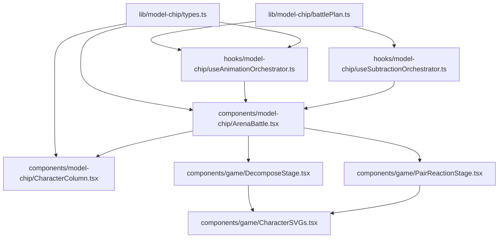
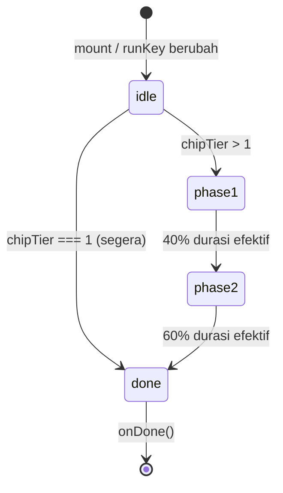
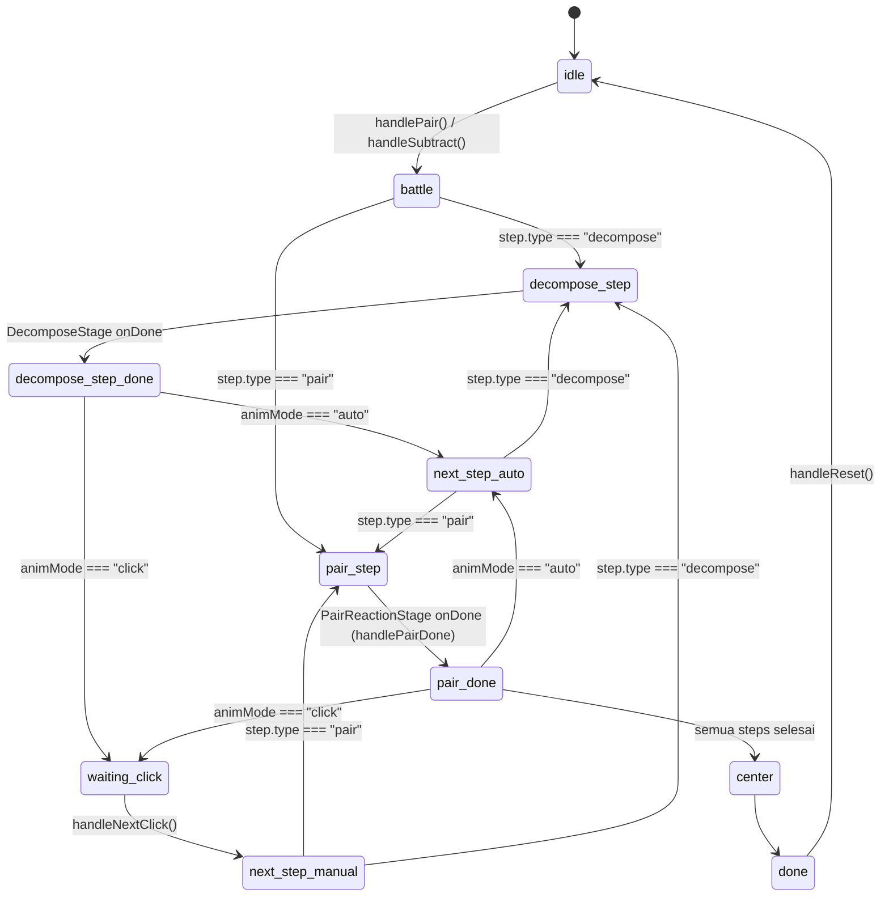

# Design Document: chip-tier-decompose-animation

## Overview

Fitur ini menambahkan fase **decompose** ke dalam flow animasi model-chip agar representasi bilangan menggunakan chip tier tertinggi yang tepat (misalnya +10 = 1 chip ×10, bukan 10 chip ×1). Ketika dua chip tier berbeda harus bereaksi, chip tier lebih tinggi **luruh** terlebih dahulu menjadi chip tier di bawahnya sebelum proses netralisasi terjadi.

Perubahan meliputi:
- **Data model baru**: `BattlePlan` + `BattleStep` menggantikan `TierGroup[]`
- **Komponen baru**: `DecomposeStage` — animasi satu chip luruh
- **Ekstensi tipe**: `StepPhase` tambah `"decompose"`
- **Perbaruan orchestrator**: `useAnimationOrchestrator` dan `useSubtractionOrchestrator` membaca `BattlePlan`
- **Perbaruan render**: `ArenaBattle` memilih `DecomposeStage` atau `PairReactionStage` berdasarkan fase
- **Perbaruan visual**: `CharacterColumn` merespons `activeDecomposeTier`

`PairReactionStage` **tidak diubah** sama sekali — kompatibilitas penuh dijaga.

---

## Architecture

### File Baru

| Path | Keterangan |
|------|-----------|
| `lib/model-chip/battlePlan.ts` | `buildBattlePlan(bil1, bil2)`, tipe `BattleStep`, `BattlePlan` |
| `components/game/DecomposeStage.tsx` | Komponen animasi luruh chip tunggal |

### File Dimodifikasi

| Path | Perubahan |
|------|----------|
| `lib/model-chip/types.ts` | `StepPhase` += `"decompose"` |
| `hooks/model-chip/useAnimationOrchestrator.ts` | Konsumsi `BattlePlan`, tangani step `"decompose"` |
| `hooks/model-chip/useSubtractionOrchestrator.ts` | Teruskan `BattlePlan` ke inner orchestrator |
| `components/model-chip/CharacterColumn.tsx` | Prop baru `activeDecomposeTier`, logika opacity baru |
| `components/model-chip/ArenaBattle.tsx` | Render `DecomposeStage` kondisional |

### File Tidak Berubah

| Path | Alasan |
|------|--------|
| `components/game/PairReactionStage.tsx` | Props interface tetap, tidak ada modifikasi |
| `lib/model-chip/tierUtils.ts` | Tetap ada untuk backward compat; `buildTierGroups` masih digunakan di luar scope ini |
| `lib/model-chip/stepMachine.ts` | Digantikan oleh logika index di orchestrator baru |

### Diagram Dependensi



---

## Components and Interfaces

### `buildBattlePlan(bil1, bil2): BattlePlan`

Pure function utama fitur ini. Menggantikan `buildTierGroups(totalPairs)`.

```typescript
// lib/model-chip/battlePlan.ts
export interface BattleStep {
  type: "decompose" | "pair";
  tier: 1 | 10 | 100 | 1000;
  side: "pos" | "neg";
}

export interface BattlePlan {
  steps: BattleStep[];
  /** Total pasangan yang akan bereaksi */
  totalPairs: number;
}

export function buildBattlePlan(bil1: number, bil2: number): BattlePlan;
```

### `DecomposeStage` Props

```typescript
// components/game/DecomposeStage.tsx
export interface DecomposeStageProps {
  chipTier: 1 | 10 | 100 | 1000;
  chipFaction: "ab" | "ku";
  speed: number;
  onDone: () => void;
  runKey: number;
}
```

### `CharacterColumn` Props (perbaruan)

Prop baru `activeDecomposeTier` ditambahkan:

```typescript
export interface CharacterColumnProps {
  // ...props yang sudah ada...
  activeDecomposeTier: 1 | 10 | 100 | 1000 | null; // prop baru
}
```

### `ArenaBattle` Props (perbaruan)

```typescript
// Prop baru yang ditambahkan:
stepIdx: number;           // indeks langkah aktif di BattlePlan
onDecomposeDone: () => void; // callback dari DecomposeStage
```

### Step Machine Baru

Orchestrator tidak lagi menggunakan `stepMachine.ts` tetapi cukup melakukan `stepIdx + 1` pada `BattlePlan.steps` array.

---

## Data Models

### `BattleStep`

```typescript
interface BattleStep {
  /** "decompose": chip tier tinggi luruh; "pair": dua chip bereaksi */
  type: "decompose" | "pair";
  /** Tier chip yang terlibat dalam langkah ini */
  tier: 1 | 10 | 100 | 1000;
  /** Sisi yang memiliki chip ini ("pos" = bilangan positif, "neg" = bilangan negatif) */
  side: "pos" | "neg";
}
```

### `BattlePlan`

```typescript
interface BattlePlan {
  steps: BattleStep[];
  totalPairs: number;
}
```

### `StepPhase` (extended)

```typescript
// lib/model-chip/types.ts — PERBARUAN
export type StepPhase = "approach" | "clash" | "clear" | "decompose";
```

### Contoh `BattlePlan`

**Input:** `bil1 = +10, bil2 = -1`
```
totalPos = 10, totalNeg = 1, pairs = 1
Sisi pos: [{ tier: 10, count: 1 }]
Sisi neg: [{ tier:  1, count: 1 }]
Tier 10 pos tidak punya pasangan tier 10 neg → insert decompose
```
```typescript
{
  steps: [
    { type: "decompose", tier: 10, side: "pos" },
    { type: "pair",      tier:  1, side: "pos" },
  ],
  totalPairs: 1
}
```

**Input:** `bil1 = +11, bil2 = -1`
```
pairs = 1
Sisi pos: [{ tier: 10, count: 1 }, { tier: 1, count: 1 }]
Sisi neg: [{ tier:  1, count: 1 }]
Tier 10 pos tidak match → decompose dulu, lalu pair di tier 1
```
```typescript
{
  steps: [
    { type: "decompose", tier: 10, side: "pos" },
    { type: "pair",      tier:  1, side: "pos" },
  ],
  totalPairs: 1
}
```

**Input:** `bil1 = +100, bil2 = -10`
```
pairs = 10
Sisi pos: [{ tier: 100, count: 1 }]
Sisi neg: [{ tier:  10, count: 1 }]
Tier 100 pos tidak match → decompose → 10 pair di tier 10
```
```typescript
{
  steps: [
    { type: "decompose", tier: 100, side: "pos" },
    { type: "pair",      tier:  10, side: "pos" }, // ×10
    ...9 pair steps lagi
  ],
  totalPairs: 10
}
```

**Input:** `bil1 = +10, bil2 = -10` (tier match, tidak perlu decompose)
```typescript
{
  steps: [
    { type: "pair", tier: 10, side: "pos" },
  ],
  totalPairs: 1
}
```

---

## Algoritma BattlePlanner

### Pseudocode `buildBattlePlan(bil1, bil2)`

```
function buildBattlePlan(bil1: number, bil2: number): BattlePlan:
  totalPos = max(0, bil1) + max(0, bil2)
  totalNeg = max(0, -bil1) + max(0, -bil2)

  if totalPos == 0 OR totalNeg == 0:
    return { steps: [], totalPairs: 0 }

  pairs = min(totalPos, totalNeg)

  // Dekomposisi masing-masing sisi ke tier groups
  posGroups = decomposeToTierGroups(totalPos)   // [{ tier:1000, count }, ...]
  negGroups = decomposeToTierGroups(totalNeg)

  // Buat map tier → count untuk lookup cepat
  posMap = Map dari posGroups
  negMap = Map dari negGroups

  steps: BattleStep[] = []
  remainingPairs = pairs
  allTiers = [1000, 100, 10, 1]

  // Proses tier dari besar ke kecil mengikuti sisi yang sedang dikonsumsi
  // Track berapa chip tersisa per tier di setiap sisi (mirip simulasi greedy)
  posAvail = Map<tier, count> dari posGroups
  negAvail = Map<tier, count> dari negGroups

  while remainingPairs > 0:
    // Temukan tier tertinggi yang tersedia di kedua sisi
    posTier = tier tertinggi dengan posAvail[tier] > 0
    negTier = tier tertinggi dengan negAvail[tier] > 0

    if posTier > negTier:
      // Sisi positif punya tier lebih tinggi → luruh dulu
      steps.push({ type: "decompose", tier: posTier, side: "pos" })
      // Ganti 1 chip posTier dengan 10 chip posTier/10
      posAvail[posTier] -= 1
      posAvail[posTier/10] += 10

    else if negTier > posTier:
      // Sisi negatif punya tier lebih tinggi → luruh dulu
      steps.push({ type: "decompose", tier: negTier, side: "neg" })
      negAvail[negTier] -= 1
      negAvail[negTier/10] += 10

    else:
      // Tier match → langsung pair
      pairCount = min(posAvail[posTier], negAvail[negTier], remainingPairs)
      for i = 0 to pairCount:
        steps.push({ type: "pair", tier: posTier, side: "pos" })
      posAvail[posTier] -= pairCount
      negAvail[negTier] -= pairCount
      remainingPairs -= pairCount

  return { steps, totalPairs: pairs }

function decomposeToTierGroups(value: number): TierGroup[]:
  result = []
  rem = value
  for tier in [1000, 100, 10, 1]:
    c = floor(rem / tier)
    if c > 0: result.push({ tier, count: c })
    rem = rem % tier
  return result
```

**Catatan desain:**
- Loop terminasi dijamin karena setiap iterasi yang tidak menghasilkan `pair` justru menambah ketersediaan tier bawah (decompose), yang pada akhirnya akan bertemu.
- Untuk tier minimum (tier = 1), tidak ada decompose yang mungkin — sisi neg juga harus punya tier 1 karena seluruh nilai sudah di-track.

---

## Animasi DecomposeStage

### State Machine Fase



**Fase 1 (40% durasi efektif):** Chip induk mengecil (`scale: 1 → 0`) dan memudar (`opacity: 1 → 0`), menggunakan CSS transition.

**Fase 2 (60% durasi efektif):** Sepuluh chip tier bawah muncul dan menyebar dari tengah ke posisi grid, menggunakan `requestAnimationFrame` atau CSS `@keyframes` per-chip dengan delay stagger.

### Stagger Layout (Fase 2)

10 chip tier bawah diposisikan dalam grid 5×2 (atau arc radial) dengan stagger delay per chip:

```
delay[i] = i * (0.6_durasi / 10)
```

### Durasi

```typescript
const BASE_DURATION = 600; // ms pada speed=1
const effectiveDuration = BASE_DURATION / speed;
const phase1Duration = effectiveDuration * 0.4;
const phase2Duration = effectiveDuration * 0.6;
```

---

## Flow Animasi Baru (State Machine)

### Diagram Keseluruhan



### State Orchestrator

```typescript
// State utama yang ditambahkan ke useAnimationOrchestrator
battlePlan: BattlePlan | null;   // plan aktif (dari handlePair/replay)
stepIdx: number;                   // indeks langkah aktif di battlePlan.steps
stepPhase: StepPhase;              // "decompose" | "approach" | "clash" | "clear"
```

### Transisi Step

```
handleDecomposeDone():
  if animMode === "auto":
    stepIdx += 1
    runCurrentStep()
  else:
    waitingForClick = true

handlePairDone(neu):
  neutralised = neu
  stepPhase = "clear"
  nextStepIdx = stepIdx + 1
  if nextStepIdx >= plan.steps.length:
    finishAll()
  elif animMode === "auto":
    stepIdx = nextStepIdx
    runCurrentStep()
  else:
    waitingForClick = true

handleNextClick():
  if !waitingForClick: return
  waitingForClick = false
  stepIdx = pendingStepIdx
  runCurrentStep()

runCurrentStep(idx):
  step = battlePlan.steps[idx]
  if step.type === "decompose":
    stepPhase = "decompose"
  else:
    stepPhase = "approach"
    setTierIdx / setPairInTier berdasarkan step
```

---

## Modifikasi `CharacterColumn`

### Prop Baru

```typescript
activeDecomposeTier: 1 | 10 | 100 | 1000 | null;
```

### Logika Opacity Per Chip

```
isDecomposeActive = stepPhase === "decompose"

for each chip di tier T:
  if isGone (sudah ternetralisasi):
    → opacity-0 scale-0
  elif isDecomposeActive AND T === activeDecomposeTier:
    → opacity-25 (chip yang sedang luruh, dimmed)
  elif isDimmed (approach dimming yang sudah ada):
    → opacity-25 scale-90
  elif isWaiting:
    → opacity-60
  else:
    → opacity-100
```

Chip dari tier yang bukan `activeDecomposeTier` tidak terpengaruh saat `stepPhase === "decompose"`.

---

## Modifikasi `ArenaBattle`

### Render Kondisional

```typescript
// Sebelum: selalu render PairReactionStage
<PairReactionStage ... />

// Sesudah: pilih berdasarkan stepPhase
{stepPhase === "decompose" ? (
  <DecomposeStage
    key={`dc-${stepIdx}`}
    chipTier={currentStep.tier}
    chipFaction={activeDecomposeSide === "pos" ? posFaction : negFaction}
    speed={animSpeed}
    runKey={stepIdx}
    onDone={onDecomposeDone}
  />
) : (
  <PairReactionStage
    key={`pr-${tierIdx}-${pairInTier}-${animSpeed}`}
    ...props yang sudah ada...
  />
)}
```

Props tambahan yang diterima `ArenaBattle`:
- `stepIdx: number`
- `currentStep: BattleStep | null`
- `onDecomposeDone: () => void`

---

## Strategi Migration / Backward Compat

### Fase 1 — Tambah Types (tidak breaking)
1. Tambah `"decompose"` ke `StepPhase` di `types.ts`
2. Buat `lib/model-chip/battlePlan.ts` (file baru)
3. `tierUtils.ts` tetap ada dan tidak diubah

### Fase 2 — Komponen Baru (tidak breaking)
4. Buat `components/game/DecomposeStage.tsx` (file baru)

### Fase 3 — Orchestrator (breaking internal, tidak breaking API)
5. Perbarui `useAnimationOrchestrator`: ganti `buildTierGroups` → `buildBattlePlan`, tambah `stepIdx`, tangani step `"decompose"`. Return interface tetap kompatibel (semua field yang ada tetap ada, ditambah `stepIdx` dan `currentDecomposeStep`).
6. Perbarui `useSubtractionOrchestrator`: teruskan field baru ke consumer.

### Fase 4 — UI (konsumsi field baru)
7. Perbarui `CharacterColumn`: tambah prop `activeDecomposeTier` (optional dengan default `null` untuk backward compat)
8. Perbarui `ArenaBattle`: tambah render `DecomposeStage`, konsumsi `stepIdx` dan `onDecomposeDone`
9. Perbarui halaman (`/model-chip`, `/model-chip/pengurangan`): teruskan prop baru

### Invariant yang Dipertahankan
- `handleReset()`, `replayAnimation()`, `handlePair()`, `handlePairDone()` signature tidak berubah
- `PairReactionStage` tidak diubah sama sekali
- `neutralised` Map tetap diperbarui per pasangan bereaksi
- `TierProgressDots` tetap bekerja (tier info masih ada di `BattlePlan` via tier dari pair steps)

---

## Error Handling

### Input Validation `buildBattlePlan`
- Input `bil1`, `bil2` di luar range [-9999, 9999]: clamp atau throw — gunakan clamp untuk keamanan UI
- Kedua bilangan nol: return `{ steps: [], totalPairs: 0 }`
- Kedua bilangan sama tanda: return `{ steps: [], totalPairs: 0 }`

### `DecomposeStage` `chipTier === 1`
- Panggil `onDone()` di `useEffect` pada mount pertama, tidak ada animasi — harus stabil dengan StrictMode React

### Cleanup Timer
- Semua `setTimeout` di orchestrator di-clear saat `handleReset()` atau `replayAnimation()` dipanggil
- `DecomposeStage` harus cleanup timer internal di `useEffect` return function

### `runKey` Change Mid-Animation
- `DecomposeStage` menggunakan `runKey` sebagai dependency `useEffect` — perubahan `runKey` memicu cleanup + restart otomatis
- Callback `onDone` dari run sebelumnya tidak dipanggil setelah cleanup

---

## Correctness Properties

*A property is a characteristic or behavior that should hold true across all valid executions of a system — essentially, a formal statement about what the system should do. Properties serve as the bridge between human-readable specifications and machine-verifiable correctness guarantees.*

### Property 1: Dekomposisi bilangan ke tier group mempertahankan nilai

*For any* bilangan `n` dalam rentang 0–9999, jumlah nilai total chip yang dihasilkan oleh dekomposisi (Σ tier × count) harus sama persis dengan `n`.

**Validates: Requirements 1.1**

---

### Property 2: Tier groups terurut menurun

*For any* bilangan `n` > 0, tier groups yang dihasilkan harus dalam urutan tier menurun strict (1000 ≥ 100 ≥ 10 ≥ 1) dan tidak ada tier dengan count = 0 yang disertakan.

**Validates: Requirements 1.2**

---

### Property 3: BattlePlan dengan input sama-tanda menghasilkan steps kosong

*For any* pasangan `(bil1, bil2)` di mana keduanya ≥ 0 atau keduanya ≤ 0, `buildBattlePlan(bil1, bil2).steps` harus berupa array kosong.

**Validates: Requirements 2.3**

---

### Property 4: Jumlah pair steps sama dengan Math.min(totalPos, totalNeg)

*For any* pasangan `(bil1, bil2)` berlawanan tanda, jumlah langkah bertipe `"pair"` dalam `BattlePlan.steps` harus sama dengan `Math.min(totalPos, totalNeg)`.

**Validates: Requirements 2.4, 2.8**

---

### Property 5: BattlePlan bersifat deterministik

*For any* pasangan input `(bil1, bil2)`, memanggil `buildBattlePlan(bil1, bil2)` dua kali harus menghasilkan objek yang identik secara struktural (JSON-serializable equal).

**Validates: Requirements 2.7, 7.3**

---

### Property 6: Setiap pair step didahului decompose jika tier tidak match

*For any* `BattlePlan`, untuk setiap langkah `"pair"` pada indeks `i`, jika tier chip sisi tersebut sebelum plan tidak cocok dengan tier sisi lawan pada langkah tersebut, maka harus ada setidaknya satu langkah `"decompose"` di antara pair step sebelumnya dan pair step `i`.

**Validates: Requirements 2.6**

---

### Property 7: Kompatibilitas mundur jumlah pasangan

*For any* pasangan `(bil1, bil2)` di mana `bil1 > 0` dan `bil2 < 0` (atau sebaliknya), jumlah langkah bertipe `"pair"` dalam `buildBattlePlan(bil1, bil2)` harus sama dengan total count dari `buildTierGroups(Math.min(Math.abs(bil1), Math.abs(bil2)))`.

**Validates: Requirements 7.4**

---

### Property 8: Durasi DecomposeStage terskala dengan speed

*For any* nilai `speed > 0`, fungsi `decomposeDuration(speed)` harus mengembalikan `Math.round(600 / speed)`.

**Validates: Requirements 4.5, 11.3**

---

### Property 9: onDone dipanggil tepat sekali per runKey

*For any* pasangan `(chipTier, speed)` dengan `chipTier > 1`, mounting `DecomposeStage` dengan suatu `runKey` harus menghasilkan tepat satu pemanggilan `onDone` setelah animasi selesai; mengubah `runKey` sebelum animasi selesai harus membatalkan run lama dan hanya memanggil `onDone` untuk run terbaru.

**Validates: Requirements 4.4, 4.8**

---

## Testing Strategy

### Unit Tests (Example-Based)

- `buildBattlePlan`: contoh konkret dari spec (bil1=+10/bil2=-1, bil1=+11/bil2=-1, bil1=+100/bil2=-10, tier match +10/-10)
- `buildBattlePlan` edge cases: kedua nol, sama tanda, salah satu nol
- `CharacterColumn`: snapshot test dengan berbagai kombinasi `stepPhase` dan `activeDecomposeTier`
- `DecomposeStage` dengan `chipTier === 1`: `onDone` dipanggil segera
- `ArenaBattle`: render `DecomposeStage` saat `stepPhase === "decompose"`, render `PairReactionStage` saat tidak
- Halaman: tombol "Next" enabled selama `stepPhase === "decompose"` pada mode click

### Property Tests

Menggunakan [fast-check](https://github.com/dubzzz/fast-check) (TypeScript/JavaScript PBT library).

Setiap property test dikonfigurasi minimum 100 iterasi.

Tag format: **Feature: chip-tier-decompose-animation, Property {N}: {property_text}**

#### Property 1 — `battlePlan.property.test.ts`
```
// Feature: chip-tier-decompose-animation, Property 1: dekomposisi mempertahankan nilai
fc.assert(fc.property(
  fc.integer({ min: 0, max: 9999 }),
  (n) => {
    const groups = decomposeToTierGroups(n);
    const total = groups.reduce((s, g) => s + g.tier * g.count, 0);
    return total === n;
  }
), { numRuns: 200 });
```

#### Property 2 — `battlePlan.property.test.ts`
```
// Feature: chip-tier-decompose-animation, Property 2: tier groups terurut menurun
fc.assert(fc.property(
  fc.integer({ min: 1, max: 9999 }),
  (n) => {
    const groups = decomposeToTierGroups(n);
    for (let i = 1; i < groups.length; i++) {
      if (groups[i].tier >= groups[i - 1].tier) return false;
      if (groups[i].count === 0) return false;
    }
    return true;
  }
), { numRuns: 200 });
```

#### Property 3 — `battlePlan.property.test.ts`
```
// Feature: chip-tier-decompose-animation, Property 3: sama-tanda menghasilkan steps kosong
fc.assert(fc.property(
  fc.integer({ min: 0, max: 9999 }),
  fc.integer({ min: 0, max: 9999 }),
  (a, b) => buildBattlePlan(a, b).steps.length === 0
), { numRuns: 200 });
```

#### Property 4 — `battlePlan.property.test.ts`
```
// Feature: chip-tier-decompose-animation, Property 4: jumlah pair steps = min(totalPos, totalNeg)
fc.assert(fc.property(
  fc.integer({ min: 1, max: 9999 }),
  fc.integer({ min: 1, max: 9999 }),
  (pos, neg) => {
    const plan = buildBattlePlan(pos, -neg);
    const pairCount = plan.steps.filter(s => s.type === "pair").length;
    return pairCount === Math.min(pos, neg);
  }
), { numRuns: 200 });
```

#### Property 5 — `battlePlan.property.test.ts`
```
// Feature: chip-tier-decompose-animation, Property 5: BattlePlan deterministik
fc.assert(fc.property(
  fc.integer({ min: -9999, max: 9999 }),
  fc.integer({ min: -9999, max: 9999 }),
  (bil1, bil2) => {
    const p1 = buildBattlePlan(bil1, bil2);
    const p2 = buildBattlePlan(bil1, bil2);
    return JSON.stringify(p1) === JSON.stringify(p2);
  }
), { numRuns: 200 });
```

#### Property 7 — `battlePlan.property.test.ts`
```
// Feature: chip-tier-decompose-animation, Property 7: kompatibilitas mundur jumlah pasangan
fc.assert(fc.property(
  fc.integer({ min: 1, max: 9999 }),
  fc.integer({ min: 1, max: 9999 }),
  (pos, neg) => {
    const plan = buildBattlePlan(pos, -neg);
    const newCount = plan.steps.filter(s => s.type === "pair").length;
    const oldGroups = buildTierGroups(Math.min(pos, neg));
    const oldCount = oldGroups.reduce((s, g) => s + g.count, 0);
    return newCount === oldCount;
  }
), { numRuns: 200 });
```

#### Property 8 — `decomposeStage.property.test.ts`
```
// Feature: chip-tier-decompose-animation, Property 8: durasi terskala dengan speed
fc.assert(fc.property(
  fc.float({ min: 0.1, max: 10, noNaN: true }),
  (speed) => decomposeDuration(speed) === Math.round(600 / speed)
), { numRuns: 200 });
```

### Integration Tests

- Mounting `DecomposeStage` dengan tier > 1: `onDone` dipanggil setelah ~600ms (mock timers)
- Alur orchestrator end-to-end: `handlePair(10, -1)` → decompose step → pair step → done
- Halaman `/model-chip` dan `/model-chip/pengurangan`: render tidak crash dengan input berlawanan tanda

### Library PBT

**[fast-check](https://fast-check.dev/)** — digunakan di project ini (lihat test files yang ada seperti `__tests__/model-chip/subtractionState.property.test.ts`).
