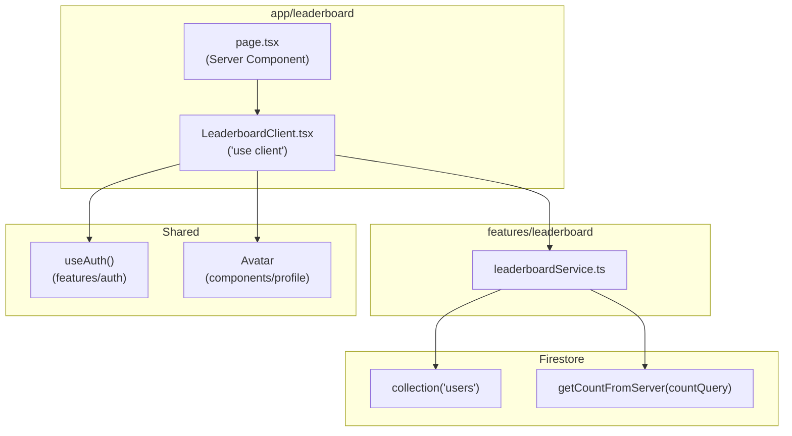

# Design Document — Game Leaderboard

## Overview

Fitur ini menggantikan halaman `/leaderboard` yang saat ini menggunakan data statis dengan implementasi nyata berbasis Firestore. Desain mengikuti arsitektur Next.js Server Component + Client Component: `page.tsx` tetap berupa Server Component murni, sementara seluruh interaktivitas dan Firestore live-data ditangani oleh `LeaderboardClient` (`'use client'`).

Dua query Firestore berjalan secara paralel saat komponen pertama kali di-mount:

1. **Top-10 query** — membaca koleksi `users` terurut `totalScore` descending, limit 10.
2. **Current-user rank query** — menghitung dokumen dengan `totalScore > userScore` lalu menambah 1 untuk mendapatkan peringkat pengguna yang sedang login.

Hasil keduanya divisualisasikan dalam tiga zona: **Podium** (top 3), **tabel peringkat** (1–10 dengan highlight baris pengguna), dan **OwnRankCard** (baris terpisah jika peringkat > 10).

---

## Architecture



**Pola data-flow:**

1. `LeaderboardClient` memanggil `useAuth()` → mendapat `user` (nullable).
2. Dua `useEffect` / `Promise.all` call berjalan paralel:
   - `fetchTop10()` — query Firestore untuk top 10.
   - `fetchCurrentUserRank(uid)` — hanya dijalankan jika `user` tidak null dan `profile.totalScore > 0`.
3. State `top10`, `currentEntry`, `loading`, dan `error` dikontrol terpisah sehingga hanya bagian yang berubah yang di-render ulang.

---

## Components and Interfaces

### `features/leaderboard/leaderboardService.ts`

Modul pure-function tanpa state. Tidak mengimpor `firebase-admin`.

```ts
import type { LeaderboardEntry } from './types';

/** Mengambil top-10 entri dari Firestore. */
export async function fetchTop10(): Promise<LeaderboardEntry[]>

/** Mengambil entri + peringkat pengguna saat ini.
 *  Mengembalikan null jika uid null atau totalScore = 0. */
export async function fetchCurrentUserEntry(uid: string, userScore: number): Promise<LeaderboardEntry | null>
```

Dependensi: `getFirebaseClient()` dari `features/auth/services/firebase.client.ts`.

---

### `features/leaderboard/types.ts`

```ts
export interface LeaderboardEntry {
  uid: string;
  rank: number;          // 1-indexed
  name: string;
  school: string;
  photoURL?: string | null;
  totalScore: number;    // undefined/missing Firestore value → 0
}
```

---

### `app/leaderboard/page.tsx` (Server Component)

```tsx
import type { Metadata } from 'next';
import LeaderboardClient from './LeaderboardClient';

export const metadata: Metadata = {
  title: 'Leaderboard',
  description: 'Lihat papan peringkat LineChip dan kejar posisi teratas!',
};

export default function LeaderboardPage() {
  return <LeaderboardClient />;
}
```

`page.tsx` tidak memiliki `'use client'`, tidak mengimpor Firestore, dan tidak memiliki state. Metadata sudah ada di `layout.tsx` yang perlu diverifikasi tidak duplikat — jika metadata sudah ada di `layout.tsx`, cukup export dari `page.tsx` saja.

---

### `app/leaderboard/LeaderboardClient.tsx` (Client Component)

State shape:

```ts
type LeaderboardState = {
  top10: LeaderboardEntry[];
  currentEntry: LeaderboardEntry | null;
  loadingTop10: boolean;
  loadingCurrentUser: boolean;
  error: string | null;
};
```

Sub-komponen yang di-render oleh `LeaderboardClient`:

| Komponen | Lokasi | Keterangan |
|---|---|---|
| `Podium` | `app/leaderboard/Podium.tsx` | Visualisasi hierarki 3 besar |
| `LeaderboardTable` | `app/leaderboard/LeaderboardTable.tsx` | Tabel rank 1–10 dengan highlight row |
| `OwnRankCard` | `app/leaderboard/OwnRankCard.tsx` | Kartu posisi pengguna jika rank > 10 |
| `PlayCTACard` | `app/leaderboard/PlayCTACard.tsx` | Ajakan bermain jika tidak login / skor = 0 |
| `LeaderboardSkeleton` | `app/leaderboard/LeaderboardSkeleton.tsx` | Skeleton saat loading |
| `Avatar` | `components/profile/Avatar.tsx` | Dipakai ulang dari profil |

---

### `Podium`

```tsx
interface PodiumProps {
  entries: LeaderboardEntry[]; // 0–3 items; slot kosong tidak dirender
}
```

Tata letak:

```
     [1]          ← tengah, ketinggian paling tinggi (h-36), Avatar size="lg"
 [2]     [3]      ← kiri medium (h-24), kanan pendek (h-20), Avatar size="md"
```

Implementasi dengan `flex items-end justify-center`. Posisi di-map dari array index ke kolom CSS `order`:

| `entry.rank` | `order` CSS | Tinggi blok |
|---|---|---|
| 1 | 2 | `h-36` |
| 2 | 1 | `h-24` |
| 3 | 3 | `h-20` |

Ikon mahkota 👑 hanya muncul di atas slot rank 1. Jika array memiliki < 3 entri, hanya slot yang memiliki data yang dirender — tidak ada placeholder kosong.

---

### `LeaderboardTable`

```tsx
interface LeaderboardTableProps {
  entries: LeaderboardEntry[];   // ≤ 10 items
  currentUid: string | null;
}
```

Menggunakan elemen tabel HTML semantik (`<table>`, `<thead>`, `<tbody>`, `<tr>`, `<th>`, `<td>`). Baris pengguna saat ini (`entry.uid === currentUid`) mendapat:

- `className="bg-intblue-light border-intblue"`
- `aria-label="Peringkatmu"`
- Label **"Kamu"** inline di samping nama.

`Rank_Badge` untuk rank 1–3 menggunakan warna emas/perak/perunggu; rank 4–10 menggunakan `bg-slate-100 text-slate-500`.

Skor diformat dengan `toLocaleString('id-ID')`.

---

### `OwnRankCard`

```tsx
interface OwnRankCardProps {
  entry: LeaderboardEntry; // rank > 10
}
```

Hanya dirender ketika `currentEntry !== null && currentEntry.rank > 10`.

`aria-label` dinamis: `"Peringkatmu saat ini: ke-${entry.rank}"`.

---

### `PlayCTACard`

Dirender ketika pengguna tidak login (`user === null`) atau `profile?.totalScore` falsy/0. Berisi tautan ke `/materi` dan `/game`.

---

## Data Models

### Firestore Document Shape (`users/{uid}`)

Sudah ada — dari `UserProfile` di `features/auth/types/index.ts`:

```ts
interface UserProfile {
  uid: string;
  name: string;
  email: string;
  school: string;
  photoURL?: string;
  totalScore?: number;   // undefined → diperlakukan sebagai 0
  // ...
}
```

### `LeaderboardEntry` (internal)

```ts
interface LeaderboardEntry {
  uid: string;
  rank: number;          // 1-indexed
  name: string;
  school: string;
  photoURL?: string | null;
  totalScore: number;    // normalized: undefined → 0
}
```

### Firestore Query

**Top-10:**

```ts
const q = query(
  collection(db, 'users'),
  orderBy('totalScore', 'desc'),
  limit(10)
);
```

**Rank pengguna saat ini:**

```ts
const countQ = query(
  collection(db, 'users'),
  where('totalScore', '>', userScore)
);
const snapshot = await getCountFromServer(countQ);
const rank = snapshot.data().count + 1;
```

Tie-breaking tidak dilakukan — semua pengguna dengan `totalScore` yang sama mendapat peringkat yang sama (dense rank tidak digunakan; ini adalah competition rank sederhana).

---

## Correctness Properties

*A property is a characteristic or behavior that should hold true across all valid executions of a system — essentially, a formal statement about what the system should do. Properties serve as the bridge between human-readable specifications and machine-verifiable correctness guarantees.*

Project ini sudah memiliki `fast-check` di `devDependencies` dan menggunakan Jest (`ts-jest`). Semua property test ditulis dengan `fast-check` dan berada di `__tests__/leaderboard/`.

---

### Property 1: Kebenaran Pemetaan Dokumen Firestore ke LeaderboardEntry

*For any* array (0–10 elemen) yang merepresentasikan dokumen Firestore koleksi `users`, fungsi pemetaan internal `mapDocsToEntries` harus menghasilkan array `LeaderboardEntry[]` di mana:
- Panjang output sama dengan panjang input.
- `rank` setiap entri sama dengan posisi 1-indexed dalam array (entri pertama → rank 1).
- Semua field `uid`, `name`, `school`, `totalScore` hadir dan memiliki tipe yang benar.
- Dokumen dengan `totalScore` `undefined` atau tidak ada menghasilkan `totalScore = 0` dalam output.

**Validates: Requirements 1.2, 1.3**

---

### Property 2: Tabel Merender Semua Data Entri

*For any* array `LeaderboardEntry[]` dengan 0–10 elemen, `LeaderboardTable` harus merender sejumlah baris `<tr>` yang persis sama dengan jumlah entri, dan setiap baris harus mengandung teks `name`, `school`, dan `totalScore` yang diformat sebagai string numerik.

**Validates: Requirements 2.1, 2.2**

---

### Property 3: Podium Merender Hanya Slot yang Terisi

*For any* array top-3 dengan 0–3 elemen, komponen `Podium` harus merender tepat sebanyak entri dalam array — tidak lebih, tidak kurang. Slot kosong tidak boleh muncul.

**Validates: Requirements 3.4**

---

### Property 4: Podium Menampilkan Semua Field Setiap Entri

*For any* array top-3 (1–3 elemen), setiap entri harus ditampilkan dengan nama, sekolah, dan skor yang terformat dalam output render `Podium`.

**Validates: Requirements 3.3**

---

### Property 5: Highlight Menargetkan Tepat Satu Baris Pengguna

*For any* array `LeaderboardEntry[]` (1–10 elemen) yang mengandung setidaknya satu entri dengan `uid === currentUid`, komponen `LeaderboardTable` harus menerapkan class/atribut highlight pada tepat satu baris — baris yang uidnya cocok — dan tidak menerapkannya pada baris lain.

**Validates: Requirements 4.1, 4.4, 9.3**

---

### Property 6: Kebenaran Kalkulasi Peringkat

*For any* nilai `userScore` (integer ≥ 0) dan array acak `scores: number[]` yang merepresentasikan `totalScore` pengguna lain dalam koleksi, peringkat yang dikembalikan oleh fungsi kalkulasi rank harus sama dengan `scores.filter(s => s > userScore).length + 1`.

Khususnya, jika ada beberapa pengguna dengan `totalScore` yang sama dengan `userScore`, mereka semua mendapat peringkat yang sama (tidak ada tie-breaking).

**Validates: Requirements 5.1, 6.1, 6.2**

---

### Property 7: OwnRankCard Menampilkan Semua Field dan aria-label yang Benar

*For any* `LeaderboardEntry` dengan `rank > 10`, komponen `OwnRankCard` harus:
- Merender teks `name`, `school`, dan `totalScore` yang terformat.
- Menyertakan `aria-label` yang mengandung angka rank tersebut (misalnya `"Peringkatmu saat ini: ke-15"`).

**Validates: Requirements 5.2, 8.3**

---

### Property 8: Avatar Selalu Menerima Prop `name` yang Tidak Kosong

*For any* `LeaderboardEntry` yang dirender — baik di tabel, podium, maupun `OwnRankCard` — komponen `Avatar` harus menerima prop `name` berupa string tidak kosong, sehingga fallback initials dan `aria-label` foto profil selalu tersedia.

**Validates: Requirements 8.5**

---

## Error Handling

| Kondisi | Perilaku |
|---|---|
| Query Firestore top-10 gagal (network / permission) | Set `error` state → render error banner Bahasa Indonesia + tombol "Coba Lagi" yang memanggil ulang `fetchTop10()` |
| Query rank pengguna gagal | `currentEntry` tetap `null`, `OwnRankCard` tidak dirender; tidak menampilkan error global karena top-10 masih dapat ditampilkan |
| `totalScore` undefined di dokumen | Normalisasi ke `0` di layer pemetaan — tidak pernah sampai ke UI sebagai `undefined` |
| Pengguna tidak login | `fetchCurrentUserEntry` tidak dipanggil; `OwnRankCard` diganti dengan `PlayCTACard` |
| Skor pengguna = 0 | `fetchCurrentUserEntry` tidak dipanggil; `PlayCTACard` ditampilkan |
| Auth loading | Seluruh halaman menampilkan `LeaderboardSkeleton` sampai `loading` dari `useAuth` bernilai `false` |
| Koleksi `users` kosong | Array top-10 kosong → `LeaderboardTable` menampilkan empty state Bahasa Indonesia |

---

## Testing Strategy

### Unit / Example Tests (`__tests__/leaderboard/`)

- `leaderboardService.unit.test.ts`
  - Mock `getFirebaseClient` → mock Firestore SDK.
  - Contoh: query berhasil → entry terformat benar.
  - Contoh: query gagal → promise rejected dengan pesan yang bisa ditangani.
  - Contoh: user null → `fetchCurrentUserEntry` mengembalikan `null`.
  - Contoh: totalScore = 0 → `fetchCurrentUserEntry` mengembalikan `null`.

- `LeaderboardTable.unit.test.tsx`
  - Loading state → skeleton dirender.
  - Error state → error banner + tombol "Coba Lagi".
  - Empty state → pesan empty state.
  - Rank 1–3 → badge warna emas/perak/perunggu.
  - Baris highlight → class `bg-intblue-light`, `aria-label="Peringkatmu"`, teks "Kamu".
  - Pengguna guest (uid null) → tidak ada baris yang ter-highlight.

- `Podium.unit.test.tsx`
  - Ikon mahkota 👑 muncul di slot rank 1.
  - Rank 1 menggunakan `Avatar` dengan `size="lg"`.
  - Rank 2 dan 3 menggunakan `Avatar` dengan `size="md"`.

- `OwnRankCard.unit.test.tsx`
  - Gaya visual: class `border-intblue`, `bg-intblue-light`.

- `PlayCTACard.unit.test.tsx`
  - Tautan ke `/materi` dan/atau `/game` tersedia.

### Property-Based Tests (`__tests__/leaderboard/`) — menggunakan `fast-check`

Setiap property test dikonfigurasi dengan minimal 100 iterasi (`numRuns: 100`).
Tag setiap test dengan komentar format: `// Feature: game-leaderboard, Property N: <teks properti>`

- `leaderboardService.property.test.ts`
  - **Property 1**: `mapDocsToEntries` — generator: `fc.array(fc.record({uid: fc.string(), name: fc.string(), school: fc.string(), totalScore: fc.option(fc.nat())}), {maxLength: 10})`.
  - **Property 6**: `calculateRank` — generator: `fc.nat()` untuk userScore, `fc.array(fc.nat())` untuk scores array.

- `LeaderboardTable.property.test.tsx`
  - **Property 2**: generator `fc.array(leaderboardEntryArb, {minLength: 0, maxLength: 10})`.
  - **Property 5**: generator yang memastikan minimal satu entry memiliki uid = currentUid.

- `Podium.property.test.tsx`
  - **Property 3**: generator `fc.array(leaderboardEntryArb, {minLength: 0, maxLength: 3})`.
  - **Property 4**: generator `fc.array(leaderboardEntryArb, {minLength: 1, maxLength: 3})`.

- `OwnRankCard.property.test.tsx`
  - **Property 7**: generator `leaderboardEntryArb` dengan `rank` di-override ke nilai > 10.

- `Avatar.property.test.tsx` (atau di-inline dalam tabel/podium test)
  - **Property 8**: untuk setiap entry yang dirender, verifikasi prop `name` tidak kosong.

### Struktur File yang Dibuat

```
features/leaderboard/
  leaderboardService.ts
  types.ts
  index.ts

app/leaderboard/
  page.tsx              ← overwrite existing (hapus 'use client' dan static data)
  LeaderboardClient.tsx ← baru
  Podium.tsx            ← baru
  LeaderboardTable.tsx  ← baru
  OwnRankCard.tsx       ← baru
  PlayCTACard.tsx       ← baru
  LeaderboardSkeleton.tsx ← baru

__tests__/leaderboard/
  leaderboardService.unit.test.ts
  leaderboardService.property.test.ts
  LeaderboardTable.unit.test.tsx
  LeaderboardTable.property.test.tsx
  Podium.unit.test.tsx
  Podium.property.test.tsx
  OwnRankCard.unit.test.tsx
  OwnRankCard.property.test.tsx
```
