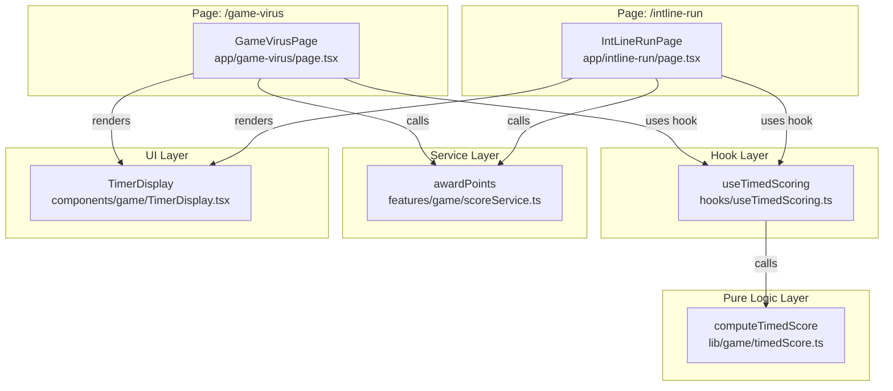

# Design Document — Game Timed Scoring

## Overview

Fitur ini menambahkan timer berbasis soal dan sistem poin berdasarkan kecepatan jawaban ke dua game di linechip: **Game Virus** (`/game-virus`) dan **Game Garis Bilangan** (`/intline-run`). Poin yang diberikan berkurang seiring bertambahnya waktu, memberikan insentif kepada pemain untuk menjawab lebih cepat. Timer tidak mengakhiri soal — pemain tetap bisa menjawab setelah 90 detik, namun hanya mendapat poin minimum.

Desain ini memperkenalkan tiga artefak baru:

1. **`computeTimedScore`** — pure function untuk kalkulasi poin
2. **`useTimedScoring`** — React hook untuk manajemen lifecycle timer
3. **`TimerDisplay`** — stateless presentational component untuk menampilkan waktu dan label kecepatan

Serta satu modifikasi pada artefak yang sudah ada:

4. **`awardPoints`** di `features/game/scoreService.ts` — penambahan parameter `pts` opsional

---

## Architecture



### Prinsip Desain

- **Pure core, effectful shell**: `computeTimedScore` tidak punya state atau efek samping, sehingga mudah diuji secara exhaustive dengan property-based testing.
- **Hook sebagai single source of truth timer**: kedua page menggunakan `useTimedScoring` yang sama — tidak ada duplikasi logika `setInterval`.
- **Backward compatibility scoreService**: `awardPoints` diperluas dengan parameter opsional; semua caller lama tanpa parameter tetap berfungsi.
- **Stateless display**: `TimerDisplay` hanya menerima `elapsedTime` dan merender output — tidak ada `useEffect` atau `setInterval` di dalamnya.

---

## Components and Interfaces

### 1. `computeTimedScore` — `lib/game/timedScore.ts` (modul baru)

Pure function. Tidak ada dependency eksternal.

```typescript
export const MIN_POINTS = 5;
export const BASE_POINTS = 10;
export const MAX_POINTS = 50;    // poin maksimum selama grace period
export const BONUS_WINDOW = 90;  // detik — setelah ini, nilai = MIN_POINTS
export const GRACE_PERIOD = 5;   // detik — nilai tetap MAX_POINTS selama rentang ini

/**
 * Menghitung Timed_Score berdasarkan elapsed time.
 * - t ≤ GRACE_PERIOD (5 dtk): MAX_POINTS (50)
 * - t ∈ (5, 89]: interpolasi linear turun ke MIN_POINTS+1 (6)
 * - t ≥ BONUS_WINDOW (90): MIN_POINTS (5)
 * Input negatif, NaN, atau Infinity diperlakukan sebagai MIN_POINTS (tidak throw).
 */
export function computeTimedScore(elapsedTime: number): number
```

### 2. `useTimedScoring` — `hooks/useTimedScoring.ts` (hook baru)

```typescript
export interface UseTimedScoringReturn {
  elapsedTime: number;      // reactive state, integer >= 0
  startTimer: () => void;   // reset ke 0, mulai interval
  stopTimer: () => void;    // bekukan elapsedTime, hapus interval
  getScore: () => number;   // computeTimedScore(elapsedTime)
}

export function useTimedScoring(): UseTimedScoringReturn
```

### 3. `TimerDisplay` — `components/game/TimerDisplay.tsx` (komponen baru)

```typescript
export interface TimerDisplayProps {
  elapsedTime: number;    // integer >= 0
  className?: string;     // opsional, untuk penyesuaian layout
}

export default function TimerDisplay({ elapsedTime, className }: TimerDisplayProps): JSX.Element
```

### 4. `awardPoints` — `features/game/scoreService.ts` (dimodifikasi)

Signature lama: `awardPoints(uid: string | null | undefined): number`

Signature baru:
```typescript
export function awardPoints(uid: string | null | undefined, pts?: number): number
```

- `pts` opsional, default `POINTS_PER_CORRECT` (10)
- Jika `pts <= 0`: tidak menulis ke Firestore, return 0
- Jika `pts` bukan integer: di-floor ke integer terdekat

---

## Data Models

### SpeedTier (label kecepatan untuk TimerDisplay)

Bukan tipe formal, tetapi representasi internal:

| Rentang `elapsedTime` | Label             | Warna CSS          |
|----------------------|-------------------|--------------------|
| 0–29 detik           | "Sangat Cepat 🔥" | `text-success`     |
| 30–59 detik          | "Cepat ⚡"        | `text-intblue`     |
| 60–89 detik          | "Masih Oke 👍"    | `text-amber-500`   |
| ≥ 90 detik           | "Waktu Habis ⏰"  | `text-error`       |

### Formula `computeTimedScore`

Scoring menggunakan grace period 5 detik diikuti interpolasi linear ke nilai minimum:

```typescript
export function computeTimedScore(elapsedTime: number): number {
  if (!Number.isFinite(elapsedTime) || elapsedTime < 0) return MIN_POINTS;
  const t = Math.floor(elapsedTime);
  if (t <= GRACE_PERIOD) return MAX_POINTS;          // grace period: t ≤ 5 → 50
  if (t >= BONUS_WINDOW) return MIN_POINTS;           // plateau minimum: t ≥ 90 → 5
  // linear decay [6, 89] → [47, 6]
  return Math.max(MIN_POINTS + 1, Math.round(50 - ((t - 5) / 84) * 44));
}
```

Konstanta: `MIN_POINTS = 5`, `MAX_POINTS = 50`, `BONUS_WINDOW = 90`, `GRACE_PERIOD = 5`.

Tabel sampel:

| t (detik) | Timed_Score |
|----------:|------------:|
|         0 |          50 |
|         5 |          50 |
|        10 |          47 |
|        20 |          42 |
|        30 |          36 |
|        45 |          29 |
|        60 |          21 |
|        75 |          13 |
|        89 |           6 |
|        90 |           5 |
|       120 |           5 |
|       200 |           5 |

### State `useTimedScoring`

```
{
  elapsedTime: number,   // integer >= 0, reactive
  intervalRef: RefObject<ReturnType<typeof setInterval> | null>
}
```

`intervalRef` adalah `useRef` — bukan state — agar `clearInterval` tidak memicu re-render.

---

## Correctness Properties

*A property is a characteristic or behavior that should hold true across all valid executions of a system — essentially, a formal statement about what the system should do. Properties serve as the bridge between human-readable specifications and machine-verifiable correctness guarantees.*

### Property 1: Monotone non-increasing output

*For any* two elapsed times `t1` dan `t2` di mana `t1 < t2` dan keduanya ≥ 0, `computeTimedScore(t1) >= computeTimedScore(t2)`.

**Validates: Requirements 1.3, 1.7**

---

### Property 2: Output selalu integer dalam [5, 50]

*For any* elapsed time ≥ 0 (termasuk nilai batas seperti 0, 5, 89, 90, 999), `computeTimedScore` mengembalikan bilangan bulat dengan nilai dalam rentang `[5, 50]`.

**Validates: Requirements 1.1, 1.5, 1.6**

---

### Property 3: Plateau minimum di ≥ 90 detik

*For any* elapsed time `t ≥ 90`, `computeTimedScore(t) === 5`.

**Validates: Requirements 1.4**

---

### Property 11: Grace period — nilai maksimum di ≤ 5 detik

*For any* elapsed time `t ∈ [0, 5]`, `computeTimedScore(t) === 50`.

**Validates: Requirements 1.2**

---

### Property 4: startTimer selalu mereset elapsedTime ke 0

*For any* state hook (apakah timer sedang berjalan atau berhenti, dengan elapsed time berapapun), setelah `startTimer()` dipanggil, `elapsedTime === 0`.

**Validates: Requirements 2.1, 2.6**

---

### Property 5: getScore konsisten dengan computeTimedScore

*For any* nilai `elapsedTime` yang terjadi selama siklus hidup hook, `getScore()` harus mengembalikan nilai yang sama dengan `computeTimedScore(elapsedTime)`.

**Validates: Requirements 2.4**

---

### Property 6: TimerDisplay merender format MM:SS yang benar

*For any* `elapsedTime ≥ 0`, komponen `TimerDisplay` harus merender waktu dalam format `MM:SS` di mana nilai menit dan detik dihitung dengan benar dari `elapsedTime`.

**Validates: Requirements 5.1**

---

### Property 7: Label kecepatan sesuai rentang waktu

*For any* `elapsedTime` dalam rentang yang didefinisikan (0–29, 30–59, 60–89, ≥90), `TimerDisplay` harus menampilkan label kecepatan yang tepat dengan warna CSS yang sesuai.

**Validates: Requirements 5.2, 5.3, 5.4, 5.5**

---

### Property 8: aria-label elapsedTime terbaca oleh screen reader

*For any* `elapsedTime ≥ 0`, atribut `aria-label` pada elemen waktu harus berformat `"Waktu berlalu: X menit Y detik"` dengan nilai X dan Y yang benar.

**Validates: Requirements 7.1, 7.2**

---

### Property 9: awardPoints dengan pts valid menulis nilai persis ke Firestore

*For any* integer `pts ≥ 1`, `awardPoints(uid, pts)` harus mengirim `increment(pts)` ke Firestore (nilai yang diteruskan sama persis dengan pts yang diberikan).

**Validates: Requirements 6.3**

---

### Property 10: awardPoints dengan pts ≤ 0 tidak menulis ke Firestore dan return 0

*For any* nilai `pts ≤ 0`, `awardPoints(uid, pts)` tidak boleh memanggil Firestore dan harus mengembalikan 0.

**Validates: Requirements 6.5**

---

## Error Handling

### `computeTimedScore`

- Input negatif (`t < 0`): kembalikan `MIN_POINTS` (5), tidak throw
- Input non-integer (float): gunakan `Math.floor` untuk membulatkan ke bawah sebelum kalkulasi, kemudian kembalikan hasil integer
- Input `NaN` atau `Infinity`: kembalikan `MIN_POINTS` (5)

Rationale: fungsi ini dipanggil dari dalam React render cycle dan hook. Melempar exception di sana akan merusak render. Fallback ke `MIN_POINTS` adalah pilihan aman — pemain tetap mendapat poin.

### `useTimedScoring`

- `stopTimer()` saat timer tidak aktif (intervalRef null): no-op, tidak throw
- `getScore()` jika `computeTimedScore` melempar exception (seharusnya tidak terjadi): catch exception, return 0
- Cleanup `useEffect` di-return memastikan `clearInterval` dipanggil saat unmount

### `awardPoints` (scoreService)

- `pts` tidak diberikan (undefined): gunakan `POINTS_PER_CORRECT` (10) — backward compatible
- `pts === 0` atau negatif: jangan tulis ke Firestore, kembalikan 0
- Perilaku retry 3x dan localStorage queue tetap berlaku seperti sebelumnya

### `TimerDisplay`

- `elapsedTime` di luar range yang diharapkan (misal negatif, NaN): tampilkan `"00:00"` dan label default "Sangat Cepat 🔥"
- Input tidak valid: `aria-label` fallback `"Waktu tidak tersedia"`

---

## Integration: Game Virus (`/game-virus`)

### Perubahan pada `app/game-virus/page.tsx`

1. **Import hook dan komponen baru**:
   ```typescript
   import { useTimedScoring } from '@/hooks/useTimedScoring';
   import TimerDisplay from '@/components/game/TimerDisplay';
   ```

2. **Inisialisasi hook** di dalam `GameVirusPage`:
   ```typescript
   const { elapsedTime, startTimer, stopTimer, getScore } = useTimedScoring();
   ```

3. **`handleNewChipQuestion`** — panggil `startTimer()` setelah reset state:
   ```typescript
   // Di akhir handleNewChipQuestion, setelah semua reset:
   startTimer();
   ```
   Juga panggil `startTimer()` saat inisialisasi (`useState` initializer memanggil `generateChipQuestion`, tapi kita perlu start timer saat komponen mount). Gunakan `useEffect(() => { startTimer(); }, [])` — dipanggil sekali saat mount.

4. **`handleCheckChipAnswer`** — panggil `stopTimer()` sebelum `awardPoints`:
   ```typescript
   checkInProgressRef.current = true;
   const result = validateChipAnswer(answerInput, currentQuestion);
   setChipFeedback(result);
   if (result.correct) {
     stopTimer();  // ← baru
     const pts = awardPoints(user?.uid ?? null, getScore());  // ← pts dari hook
     setSessionScore((prev) => prev + pts);
     // ...
   }
   ```

5. **Tampilkan `TimerDisplay`** di dalam banner soal (`SOAL:` block):
   ```tsx
   {currentQuestion && (
     <div className="...">
       {/* ... soal display ... */}
       <TimerDisplay elapsedTime={elapsedTime} className="mt-2" />
     </div>
   )}
   ```

### Perilaku Timer di Game Virus

| Event                                | Timer Behavior          |
|--------------------------------------|-------------------------|
| Komponen mount (soal pertama)        | `startTimer()`          |
| `handleNewChipQuestion()` dipanggil  | `startTimer()` (reset)  |
| Jawaban benar                        | `stopTimer()`           |
| Jawaban salah                        | Timer tetap jalan       |
| `animating === true`                 | Timer tetap jalan       |
| Komponen unmount                     | Cleanup interval (hook) |

---

## Integration: Game Garis Bilangan (`/intline-run`)

### Perubahan pada `app/intline-run/page.tsx`

1. **Import**:
   ```typescript
   import { useTimedScoring } from '@/hooks/useTimedScoring';
   import TimerDisplay from '@/components/game/TimerDisplay';
   ```

2. **Inisialisasi hook**:
   ```typescript
   const { elapsedTime, startTimer, stopTimer, getScore } = useTimedScoring();
   ```

3. **`newQuestion`** — panggil `startTimer()` setelah reset. Karena `newQuestion` berasal dari `useGameLineState`, kita perlu membungkusnya:
   ```typescript
   const handleNewQuestion = () => {
     newQuestion();
     setArrowFeedback(null);
     startTimer();  // ← baru
   };
   ```
   Gunakan juga `useEffect(() => { startTimer(); }, [])` untuk soal pertama saat mount.

4. **`handleCheckAnswer`** — panggil `stopTimer()` pada jawaban benar:
   ```typescript
   const handleCheckAnswer = () => {
     const placementResult = validateArrowPlacement(arrows, currentQuestion);
     if (!placementResult.valid) {
       setArrowFeedback(placementResult.message ?? "Posisi panah tidak valid.");
       return; // timer tetap jalan
     }
     setArrowFeedback(null);
     const correct = checkAnswer();
     if (correct) {
       stopTimer();  // ← baru
       setSessionScore(prev => prev + awardPoints(user?.uid ?? null, getScore()));  // ← pts
       autoAdvanceRef.current = setTimeout(() => {
         handleNewQuestion();
       }, 2000);
     }
   };
   ```

5. **Tampilkan `TimerDisplay`** di dekat kartu soal:
   ```tsx
   <div className="bg-white rounded-2xl border border-border shadow-sm p-5">
     {/* Question display ... */}
     <TimerDisplay elapsedTime={elapsedTime} className="mt-3" />
   </div>
   ```

### Perilaku Timer di Game Line

| Event                                    | Timer Behavior          |
|------------------------------------------|-------------------------|
| Komponen mount (soal pertama)            | `startTimer()`          |
| `newQuestion()` / Soal Baru button       | `startTimer()` (reset)  |
| Jawaban benar                            | `stopTimer()`           |
| Jawaban salah                            | Timer tetap jalan       |
| Validasi penempatan panah gagal          | Timer tetap jalan       |
| Komponen unmount                         | Cleanup interval (hook) |

---

## Testing Strategy

### Unit Tests — `computeTimedScore`

File: `__tests__/game/timedScore.property.test.ts`

Gunakan **fast-check** (sudah tersedia di devDependencies).

- Property 1 (Monotone): Generate `t1, t2` di `[0, 999]` dengan `t1 < t2`, assert `score(t1) >= score(t2)` — 200 iterasi
- Property 2 (Bounds): Generate `t` di `[0, 999]`, assert `Number.isInteger(score)` dan `score >= 5` dan `score <= 50` — 200 iterasi
- Property 3 (Plateau): Generate `t` di `[90, 999]`, assert `score(t) === 5` — 200 iterasi
- Example: `score(0) === 50`, `score(5) === 50` (grace period), `score(10) === 47`, `score(89) === 6`, `score(90) === 5`

### Unit Tests — `TimerDisplay`

File: `__tests__/game/TimerDisplay.property.test.tsx`

Gunakan **fast-check** + `@testing-library/react`.

- Property 6 (MM:SS format): Generate `t` di `[0, 7200]`, render `<TimerDisplay elapsedTime={t} />`, extract teks waktu, assert regex `/^\d{2}:\d{2}$/` dan nilai menit/detik benar — 200 iterasi
- Property 7 (Speed label): Generate `t` di masing-masing range, assert label dan CSS class yang tepat — 200 iterasi per range
- Property 8 (aria-label): Generate `t`, assert `aria-label` matches pattern `"Waktu berlalu: X menit Y detik"` — 200 iterasi
- Example: className prop diteruskan ke root element

### Unit Tests — `awardPoints` (modifikasi)

File: `__tests__/game/scoreService.property.test.ts`

- Property 9 (pts valid): Mock Firestore, generate `pts` integer `[1, 50]`, assert `increment(pts)` dipanggil dengan nilai persis — 200 iterasi
- Property 10 (pts ≤ 0): Generate `pts` di `(-100, 0]`, assert Firestore tidak dipanggil dan return 0 — 200 iterasi
- Example: backward compat — `awardPoints(uid)` tanpa pts → `increment(10)` dipanggil

### Unit Tests — `useTimedScoring`

File: `__tests__/game/useTimedScoring.test.ts`

Gunakan `@testing-library/react` dengan `renderHook` + `act` + jest fake timers.

- Property 4 (reset): Advance timer 5s, call `startTimer()`, assert `elapsedTime === 0`
- Property 5 (getScore): Advance timer, assert `getScore() === computeTimedScore(elapsedTime)`
- Example: start, advance 3s, check `elapsedTime === 3`
- Example: start, advance 2s, stop, advance 2s more, check `elapsedTime === 2`
- Smoke: mount, start, unmount, no console errors / memory leak warnings

### Tag Format

Setiap property test harus diberi komentar referensi:

```
// Feature: game-timed-scoring, Property N: <property text>
```

Contoh:
```typescript
// Feature: game-timed-scoring, Property 1: For any t1 < t2 >= 0, computeTimedScore(t1) >= computeTimedScore(t2)
```

### Tidak Perlu PBT

Integrasi ke page component (`/game-virus`, `/intline-run`) diuji dengan **example-based integration tests** atau manual testing, karena melibatkan React component lifecycle, animasi, dan Firestore — bukan pure logic.
