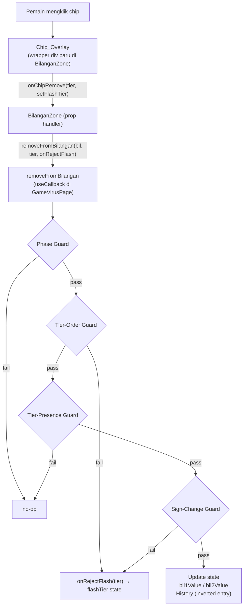

# Design Document — game-virus-chip-removal

## Overview

Fitur ini menambahkan kemampuan penghapusan chip individual pada halaman game Antibodi vs Kuman (`app/game-virus/page.tsx`). Sebelum fitur ini, pemain hanya bisa menambah chip satu per satu dan menggunakan tombol "Undo" untuk membatalkan chip terakhir. Dengan fitur ini, pemain bisa **mengklik langsung chip mana pun** di zona bilangan untuk menghapusnya — mengurangi nilai bilangan sebesar satu unit tier dari chip yang diklik.

Cakupan perubahan sepenuhnya terbatas pada `app/game-virus/page.tsx`. Komponen shared (`CharacterSVGs.tsx`, `CharacterChips`) tidak dimodifikasi.

---

## Architecture

Fitur ini diimplementasikan sebagai ekstensi organik di dalam file `app/game-virus/page.tsx` yang sudah ada, tanpa memperkenalkan file atau modul baru.



### Alur Data

- `bil1Value` / `bil2Value` — integer React state milik `GameVirusPage`
- `history: HistoryEntry[]` — array entri untuk fitur undo; penghapusan mencatat entri *inversi* agar `undoLast` bisa membalik operasi
- `flashTier: Tier | null` — state lokal di dalam `BilanganZone`, auto-cleared setelah 300ms

---

## Components and Interfaces

### `removeFromBilangan` (fungsi baru di `GameVirusPage`)

```typescript
const removeFromBilangan = useCallback(
  (bil: 1 | 2, tier: Tier, onRejectFlash?: (tier: Tier) => void) => void,
  [phase, resultValue, bil1Value, bil2Value]
)
```

Urutan guard (dieksekusi berurutan, berhenti di kegagalan pertama):

| # | Guard | Kondisi gagal | Aksi saat gagal |
|---|-------|--------------|-----------------|
| 1 | **Phase Guard** | `phase !== "idle"` atau `resultValue !== null` | return (no-op, tanpa flash) |
| 2 | **Tier-Order Guard** | Ada tier lebih kecil yang masih punya chip (`smallerTiers.some(t => Math.floor(absVal/t) % 10 > 0)`) | `onRejectFlash?.(tier)`, return |
| 3 | **Tier-Presence Guard** | `Math.floor(absVal / tier) % 10 === 0` | return (no-op, tanpa flash) |
| 4 | **Sign-Change Guard** | `absVal - tier < 0` | `onRejectFlash?.(tier)`, return |
| — | **Success path** | semua guard lolos | update state + push history |

**Success path detail:**
- `type = currentValue >= 0 ? "ab" : "ku"`
- `delta = type === "ab" ? tier : -tier`
- `bil1Value` atau `bil2Value` dikurangi `delta`
- History push: `{ type: undoType, tier, bil }` di mana `undoType = type === "ab" ? "ku" : "ab"` — entri inversi agar `undoLast` mengembalikan kondisi sebelumnya

### `BilanganZone` (komponen internal yang diperluas)

**Prop baru (opsional):**

```typescript
onChipRemove?: (tier: Tier, onRejectFlash: (t: Tier) => void) => void
```

**State lokal baru:**

```typescript
const [flashTier, setFlashTier] = useState<Tier | null>(null);
// useEffect: jika flashTier !== null, setTimeout 300ms → setFlashTier(null)
```

**Derived value:**

```typescript
const canRemove = onChipRemove !== undefined && phase === "idle" && resultValue === null;
```

**Dua mode render (berdasarkan kehadiran `onChipRemove`):**

#### Mode Chip_Overlay (ketika `onChipRemove` terdefinisi)

Menggantikan `<CharacterChips>` dengan loop dekomposisi lokal yang mencerminkan logika `CharacterChips`. Setiap chip dibungkus oleh sebuah `Chip_Overlay`:

```tsx
<div
  data-tier={t}
  onClick={canRemove ? () => onChipRemove(t, setFlashTier) : undefined}
  className={`group ${canRemove ? "cursor-pointer" : "pointer-events-none"} ${
    flashTier === t ? "ring-2 ring-red-500 animate-pulse rounded" : ""
  }`}
>
  {/* Karakter SVG */}
  <div className={`${sizeClass} ${
    canRemove ? "group-hover:opacity-60 group-hover:scale-95 transition-all duration-150" : ""
  }`}>
    {/* AntibodyCharacter atau VirusCharacter */}
  </div>
  {/* Indikator × */}
  {canRemove && (
    <span className="opacity-0 group-hover:opacity-100 transition-opacity duration-150 pointer-events-none">
      ×
    </span>
  )}
</div>
```

#### Mode Fallback (ketika `onChipRemove` tidak dioper)

Merender `<CharacterChips>` langsung — identik dengan perilaku sebelum fitur ini ada. Tidak ada perubahan visual.

### Page-level wiring

Kedua instance `<BilanganZone>` menerima:

```tsx
<BilanganZone
  bil={1}
  value={bil1Value}
  onChipRemove={(tier, onRejectFlash) => removeFromBilangan(1, tier, onRejectFlash)}
/>
<BilanganZone
  bil={2}
  value={bil2Value}
  onChipRemove={(tier, onRejectFlash) => removeFromBilangan(2, tier, onRejectFlash)}
/>
```

### Kompatibilitas Undo

`undoLast` tidak diubah sama sekali. Kompatibilitas dijamin melalui entri history inversi:

| Operasi penghapusan | Entri yang di-push ke history | Efek saat undo |
|--------------------|------------------------------|----------------|
| Hapus chip Ab (+tier) dari bil X | `{ type: "ku", tier, bil: X }` | `undoLast` menambahkan `+tier` → nilai naik |
| Hapus chip Ku (−tier) dari bil X | `{ type: "ab", tier, bil: X }` | `undoLast` mengurangi `+tier` → nilai turun |

---

## Data Models

### `HistoryEntry` (tidak berubah)

```typescript
interface HistoryEntry {
  type: "ab" | "ku";
  tier: Tier;           // 1 | 10 | 100 | 1000
  bil: 1 | 2;
}
```

Fitur ini menggunakan tipe yang sama untuk entri penghapusan, namun mengisi `type` dengan nilai **inversi** dari tipe chip yang dihapus, sehingga `undoLast` bekerja tanpa modifikasi.

### State `flashTier`

```typescript
type Tier = 1 | 10 | 100 | 1000;
// flashTier: Tier | null — lokal di BilanganZone
```

Diset ke tier yang mengalami rejection, lalu di-clear otomatis setelah 300ms. Dipakai untuk menerapkan kelas `ring-2 ring-red-500 animate-pulse rounded` pada chip_overlay yang bersangkutan.

---

## Correctness Properties

*A property is a characteristic or behavior that should hold true across all valid executions of a system — essentially, a formal statement about what the system should do. Properties serve as the bridge between human-readable specifications and machine-verifiable correctness guarantees.*

### Property 1: Tier removal reduces value by exactly one tier unit

*For any* bilangan value yang valid (bukan nol) dan tier yang representasinya ada di dalamnya (tier hadir secara right-to-left tanpa tier lebih kecil yang masih aktif), memanggil `removeFromBilangan` harus mengubah nilai bilangan sebesar tepat **−tier** (untuk zona positif) atau **+tier** (untuk zona negatif).

**Validates: Requirements 1.1, 1.2, 1.3**

---

### Property 2: Rejected removals leave state unchanged (atomicity)

*For any* kondisi yang memicu rejection — phase guard aktif, tier-order violation (ada tier lebih kecil yang masih aktif), tier-presence violation (tier tidak ada di bilangan), atau sign-change violation (absVal − tier < 0) — `removeFromBilangan` tidak boleh mengubah `bil1Value`, `bil2Value`, maupun `history`.

**Validates: Requirements 1.4, 1.5, 3.1, 3.2, 3.4**

---

### Property 3: History inversion enables correct undo

*For any* penghapusan yang berhasil dari zona ab (positif), entri yang di-push ke `history` harus memiliki `type = "ku"` dan tier yang sama; dan *for any* penghapusan dari zona ku (negatif), entri harus memiliki `type = "ab"` — sehingga menerapkan logika `undoLast` pada entri tersebut mengembalikan nilai bilangan ke kondisi sebelum penghapusan.

**Validates: Requirements 1.2, 1.3**

---

### Property 4: Fallback mode renders identically without onChipRemove

*For any* kombinasi nilai bilangan, phase, dan resultValue, jika `BilanganZone` di-render tanpa prop `onChipRemove`, markup yang dihasilkan harus tidak mengandung kelas atau elemen yang berkaitan dengan fitur chip-removal (tidak ada `group-hover:opacity-60`, tidak ada `ring-red-500`, tidak ada elemen `×`).

**Validates: Requirements 4.3, 4.4**

---

## Error Handling

### Flash visual (rejection feedback)

Ketika `removeFromBilangan` memanggil `onRejectFlash(tier)`, `BilanganZone` melakukan:
1. Menyetel `flashTier = tier` → wrapper chip mendapat `ring-2 ring-red-500 animate-pulse rounded`
2. `useEffect` dengan `setTimeout(300ms)` → `setFlashTier(null)` — efek flash hilang otomatis

Flash hanya terjadi untuk rejection **tier-order** dan **sign-change**. Rejection karena phase guard atau tier-presence tidak menghasilkan flash (phase guard tidak relevan secara visual; tier-presence artinya chip tersebut secara logis tidak ada).

### State atomicity

Semua guard dievaluasi *sebelum* mutasi state apapun. Tidak ada partial update — setiap kegagalan guard menghasilkan `return` langsung sebelum `setState` dipanggil.

### Tier-order enforcement (right-to-left)

Implementasi menggunakan:

```typescript
const smallerTiers = ([1, 10, 100] as Tier[]).filter(t => t < tier);
const hasSmaller = smallerTiers.some(t => Math.floor(absVal / t) % 10 > 0);
if (hasSmaller) { onRejectFlash?.(tier); return; }
```

Ini memastikan chip selalu dihapus dari tier terkecil yang aktif terlebih dahulu, menjaga konsistensi representasi bilangan.

---

## Testing Strategy

### Pendekatan dual testing

Fitur ini menggabinasikan **property-based tests** (untuk logika fungsi murni `removeFromBilangan`) dan **unit tests** (untuk perilaku rendering `BilanganZone`).

### Property-Based Tests — `removeFromBilangan`

Library: **fast-check** (sudah digunakan di proyek ini)

File: `__tests__/game-virus/removeFromBilangan.property.test.ts`

Setiap property dijalankan minimum **100 iterasi**. Karena `removeFromBilangan` adalah pure logic (menerima state lewat closure dan hanya bergantung pada parameter + state), ia bisa ditest dengan mocking state sederhana.

| Property | Tag | Iterasi |
|----------|-----|---------|
| Property 1: tier removal reduces value by exactly one tier unit | `Feature: game-virus-chip-removal, Property 1` | ≥ 100 |
| Property 2: rejected removals leave state unchanged | `Feature: game-virus-chip-removal, Property 2` | ≥ 100 |
| Property 3: history inversion enables correct undo | `Feature: game-virus-chip-removal, Property 3` | ≥ 100 |

Strategi generator untuk Property 1:
- Generate `value` ∈ non-zero integer (dengan tanda positif atau negatif)
- Derive tier yang valid (hadir dan paling kecil yang aktif)
- Verifikasi `newValue = oldValue ∓ tier`

Strategi generator untuk Property 2:
- Generate berbagai kondisi rejection (phase != idle, tier lebih besar dari absVal, tier tidak ada, ada tier lebih kecil yang aktif)
- Verifikasi state identik sebelum dan sesudah

Strategi generator untuk Property 3:
- Generate nilai ab-zone valid + tier valid → verifikasi `history[last].type === "ku"`
- Generate nilai ku-zone valid + tier valid → verifikasi `history[last].type === "ab"`

### Unit Tests — `BilanganZone`

File: `__tests__/game-virus/BilanganZone.unit.test.tsx`

Menggunakan `renderToStaticMarkup` atau React Testing Library. Berfokus pada:

| Skenario | Requirement |
|----------|-------------|
| Tanpa `onChipRemove`: tidak ada kelas hover di markup | Req 4.4 |
| Dengan `onChipRemove` + canRemove=true: ada `group-hover:opacity-60` | Req 2.1 |
| Dengan phase != idle: ada `pointer-events-none` pada chip | Req 1.4, 2.2 |
| value = 0: tidak ada chip yang dirender | Req 3.3 |
| `onChipRemove` tidak dipanggil saat phase guard aktif | Req 4.3 |
| Flash class aktif ketika `flashTier` === tier | Req 3.1 |

### Tidak menggunakan PBT untuk

- Rendering CSS / visual feedback (snapshot / unit tests lebih tepat)
- Komponen shared `CharacterChips` (sudah dicakup test suite yang ada)
- Phase guard UI behavior (example-based test lebih cukup)
