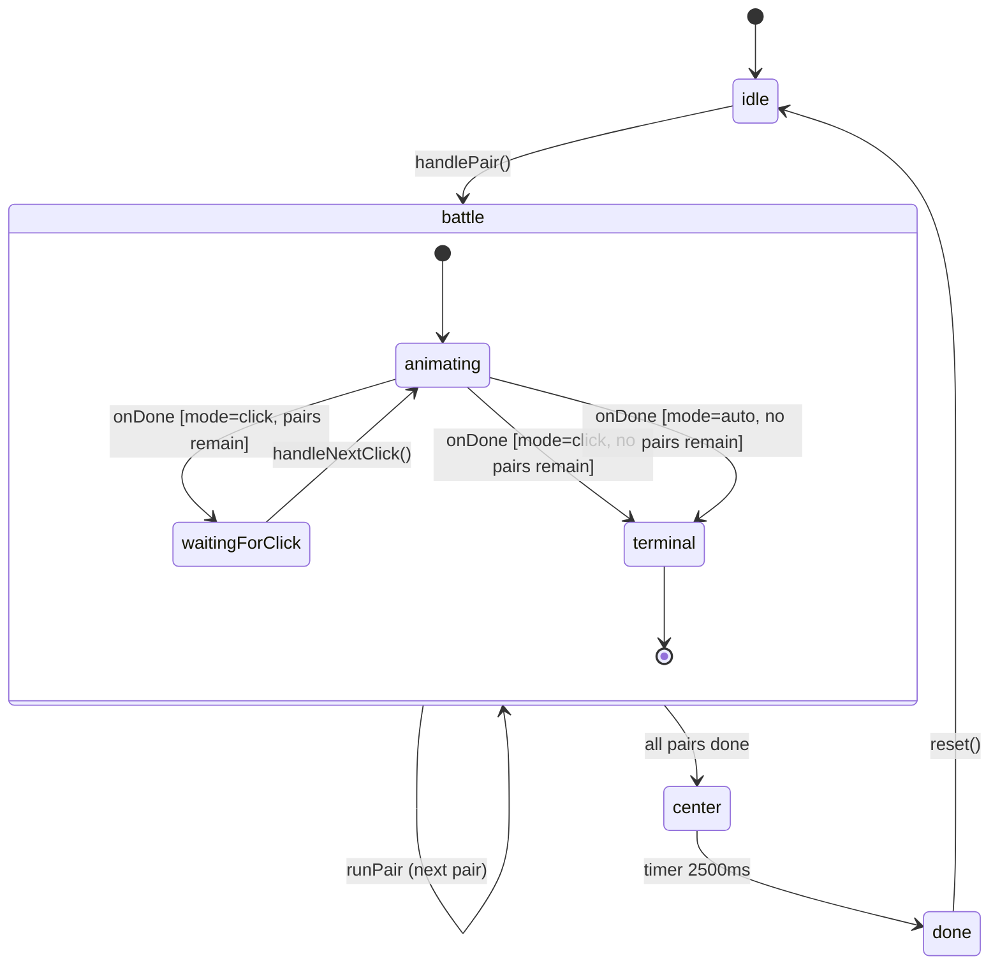

# Design Document — model-chip-animation-mode

## Overview

Fitur ini memodifikasi halaman `app/model-chip/page.tsx` agar mendukung dua mode animasi:

- **Mode Otomatis** — animasi berjalan sendiri menggunakan rantai `setTimeout` yang sudah ada; tidak ada perubahan alur dari sisi pengguna.
- **Mode Klik** — setiap pasangan reaksi dimulai hanya setelah pengguna menekan tombol "Lanjut ▶"; animasi `PairReactionStage` tetap berjalan penuh untuk tiap pasangan, hanya perpindahan antar pasangan yang dikendalikan pengguna.

Kedua mode memiliki `Speed_Control` (0.5×, 1×, 2×) selama `VizPhase === "battle"`. Pilihan mode disimpan di `sessionStorage` agar tetap diingat selama sesi browser yang sama.

Seluruh perubahan bersifat **lokalisasi** — hanya `app/model-chip/page.tsx` yang dimodifikasi. Tidak ada komponen baru yang dibuat; tidak ada API `PairReactionStage` yang berubah.

---

## Architecture

```
app/
  model-chip/
    page.tsx        ← satu-satunya file yang dimodifikasi

components/
  game/
    PairReactionStage.tsx   ← tidak diubah; hanya onDone, speed, runKey yang dipakai
```

**Alur data utama — Mode Otomatis (tidak berubah secara substansial):**

```
handlePair()
  → setAnimMode("auto")      [dari state]
  → setVizPhase("battle")
  → runPair(groups, 0, 0, new Map())
      PairReactionStage onDone → setTimeout(100ms) → runPair(next)
      ...
      all pairs done → setVizPhase("center") → setTimeout → setVizPhase("done")
```

**Alur data utama — Mode Klik:**

```
handlePair()
  → setAnimMode("click")
  → setVizPhase("battle")
  → runPair(groups, 0, 0, new Map())          [mulai pair pertama langsung]
      PairReactionStage onDone
        → setWaitingForClick(true)             [enable Tombol_Lanjut]
        (tunggu user click)
      handleNextClick()
        → setWaitingForClick(false)            [disable Tombol_Lanjut]
        → runPair(groups, tIdx, pIdx+1, neu)   [mulai pair berikutnya]
      ...
      last pair onDone
        → setWaitingForClick(false)
        → setTimeout(2000ms) → setVizPhase("center")
        → setTimeout(2500ms) → setVizPhase("done")
```



---

## Components and Interfaces

### State baru di `page.tsx`

```ts
// Mode animasi — persisted ke sessionStorage
const [animMode, setAnimMode] = useState<"auto" | "click">(() => {
  try {
    const saved = sessionStorage.getItem("modelChipAnimMode");
    return saved === "click" ? "click" : "auto";
  } catch {
    return "auto";
  }
});

// Mode Klik: true = PairReactionStage selesai, menunggu klik user
const [waitingForClick, setWaitingForClick] = useState(false);
```

### `AnimationMode_Selector`

Dirender sebagai elemen `<div role="group" aria-label="Pilih mode animasi">` berisi dua tombol. Hanya aktif saat `vizPhase === "idle"`.

```
Props (inline / closure dari page.tsx):
  animMode: "auto" | "click"
  vizPhase: VizPhase
  onChange(mode: "auto" | "click"): void
```

Penanda visual pilihan aktif: latar `bg-intblue`, teks putih, border 2px. Pilihan tidak aktif: latar transparan, teks `slate-400`.

### `Tombol_Lanjut`

```
Dirender jika: animMode === "click" && vizPhase === "battle"
disabled jika: !waitingForClick
aria-label: "Mulai animasi pasangan berikutnya"
teks: "Lanjut ▶"
```

Opacity 40% saat disabled (via `disabled:opacity-40`).

### `Speed_Control`

Sudah ada di kode saat ini. Refactor agar tampil bilamana `vizPhase === "battle"` (bukan hanya saat `isAnimating` dalam mode otomatis). Tidak ada perubahan struktur tombol.

### `runPair` — Refactor

```ts
function runPair(
  groups: TierGroup[],
  tIdx: number,
  pIdx: number,
  neu: Map<1 | 10 | 100 | 1000, number>
) {
  if (tIdx >= groups.length) {
    // semua tier selesai → center
    setVizPhase("center");
    const t1 = setTimeout(() => setCenterExiting(true), 2000);
    const t2 = setTimeout(() => setVizPhase("done"), 2500);
    timers.current.push(t1, t2);
    return;
  }
  const group = groups[tIdx];
  if (pIdx >= group.count) {
    runPair(groups, tIdx + 1, 0, neu);
    return;
  }

  setTierIdx(tIdx);
  setPairInTier(pIdx);
  setStepPhase("approach");
  setWaitingForClick(false);   // ← baru: pastikan tombol terkunci saat animasi berjalan

  // onDone dipanggil oleh PairReactionStage saat satu siklus selesai
  // Fungsi ini di-capture saat render via ref agar tidak stale
}
```

**`onDone` callback** sekarang di-dispatch berdasarkan mode:

```ts
// Di-render ke PairReactionStage:
onDone={() => {
  const next = new Map(neu);
  next.set(group.tier, (next.get(group.tier) ?? 0) + 1);
  setNeutralised(next);

  if (animModeRef.current === "auto") {
    const tClear = setTimeout(() => {
      runPair(groups, tIdx, pIdx + 1, next);
    }, 100);
    timers.current.push(tClear);
  } else {
    // Mode Klik: simpan "next" ke ref, enable tombol
    pendingNextRef.current = { groups, tIdx, pIdx: pIdx + 1, neu: next };
    setWaitingForClick(true);
  }
}}
```

**`handleNextClick`** (Mode Klik):

```ts
const handleNextClick = () => {
  if (!waitingForClick || !pendingNextRef.current) return;
  setWaitingForClick(false);
  const { groups, tIdx, pIdx, neu } = pendingNextRef.current;
  pendingNextRef.current = null;
  runPair(groups, tIdx, pIdx, neu);
};
```

### Ref tambahan

```ts
const animModeRef = useRef<"auto" | "click">("auto");
// selalu sinkron dengan animMode state, sama pola dengan animSpeedRef
animModeRef.current = animMode;

const pendingNextRef = useRef<{
  groups: TierGroup[];
  tIdx: number;
  pIdx: number;
  neu: Map<1 | 10 | 100 | 1000, number>;
} | null>(null);
```

---

## Data Models

### `sessionStorage` key

| Key | Value | Default |
|-----|-------|---------|
| `"modelChipAnimMode"` | `"auto"` \| `"click"` | `"auto"` |

Read pada inisialisasi state (lazy initializer `useState`). Write setiap kali `animMode` berubah via `useEffect`:

```ts
useEffect(() => {
  try { sessionStorage.setItem("modelChipAnimMode", animMode); } catch {}
}, [animMode]);
```

### State Machine Summary

| State | Tipe | Nilai Awal |
|-------|------|-----------|
| `animMode` | `"auto" \| "click"` | dari sessionStorage / `"auto"` |
| `waitingForClick` | `boolean` | `false` |
| `animModeRef` | `Ref<"auto" \| "click">` | `"auto"` |
| `pendingNextRef` | `Ref<PendingNext \| null>` | `null` |

State yang sudah ada (`vizPhase`, `animSpeed`, `animSpeedRef`, `tierGroups`, `tierIdx`, `pairInTier`, `stepPhase`, `neutralised`, `timers`) tidak berubah semantiknya.

### Relasi Logika UI

```
vizPhase = "idle"
  → AnimationMode_Selector: aktif
  → Tombol_Lanjut: tersembunyi
  → Speed_Control: tersembunyi

vizPhase = "battle"
  → AnimationMode_Selector: nonaktif (mode terkunci)
  → Speed_Control: selalu tampil
  → Tombol_Lanjut: tampil iff animMode === "click"
      disabled iff !waitingForClick

vizPhase = "center" | "done"
  → AnimationMode_Selector: nonaktif
  → Speed_Control: tersembunyi
  → Tombol_Lanjut: tersembunyi
```

---

## Correctness Properties

*A property is a characteristic or behavior that should hold true across all valid executions of a system — essentially, a formal statement about what the system should do. Properties serve as the bridge between human-readable specifications and machine-verifiable correctness guarantees.*

### Property 1: sessionStorage round-trip

*For any* animMode value (`"auto"` or `"click"`), writing the value to `sessionStorage` under key `"modelChipAnimMode"` and then reading it back should return the same value.

**Validates: Requirements 1.3**

---

### Property 2: Tombol_Lanjut tersembunyi di luar (Mode_Klik ∩ battle)

*For any* combination of `animMode` and `vizPhase` where `animMode !== "click"` OR `vizPhase !== "battle"`, the `Tombol_Lanjut` element should not be present in the rendered output.

**Validates: Requirements 5.3**

---

### Property 3: Speed_Control tidak tampil di luar battle

*For any* `vizPhase` that is not `"battle"`, the `Speed_Control` element should not be present in the rendered output.

**Validates: Requirements 4.6, 2.6**

---

### Property 4: animSpeed update konsisten ke state dan ref

*For any* speed value dari himpunan `{0.5, 1, 2}`, setelah pengguna memilih kecepatan tersebut, nilai `animSpeed` state dan `animSpeedRef.current` harus sama dengan nilai yang dipilih.

**Validates: Requirements 4.4**

---

### Property 5: PairReactionStage key berubah saat animSpeed berubah

*For any* dua nilai kecepatan berbeda `s1 ≠ s2` dari himpunan `{0.5, 1, 2}`, `key` yang digenerate untuk `PairReactionStage` dengan `s1` harus berbeda dari `key` yang digenerate dengan `s2` (sehingga React unmount dan remount komponen).

**Validates: Requirements 4.5**

---

### Property 6: onDone di Mode_Klik mengaktifkan Tombol_Lanjut

*For any* (tierIdx, pairInTier) yang valid di mana masih ada pasangan berikutnya, setelah `onDone callback` diterima dalam Mode_Klik, `waitingForClick` harus bernilai `true` (Tombol_Lanjut aktif/enabled).

**Validates: Requirements 3.3**

---

### Property 7: runPair di Mode_Klik menonaktifkan Tombol_Lanjut saat dimulai

*For any* pemanggilan `runPair` dalam Mode_Klik (baik pair pertama maupun setelah klik "Lanjut"), `waitingForClick` harus bernilai `false` selama siklus `PairReactionStage` sedang berjalan.

**Validates: Requirements 3.2, 3.4**

---

## Error Handling

### sessionStorage tidak tersedia

`sessionStorage` bisa melempar exception (mode private browser, storage penuh, security policy). Semua akses dibungkus `try/catch`:

```ts
// Read (lazy initializer)
try {
  const saved = sessionStorage.getItem("modelChipAnimMode");
  return saved === "click" ? "click" : "auto";
} catch {
  return "auto"; // fallback ke Mode Otomatis
}

// Write (useEffect)
useEffect(() => {
  try { sessionStorage.setItem("modelChipAnimMode", animMode); } catch {}
}, [animMode]);
```

### Race condition Mode Klik ↔ reset

Jika pengguna menekan "Ulangi" saat `waitingForClick === true` (tombol "Lanjut" aktif), fungsi `reset()` yang sudah ada sudah memanggil `clearTimers()` dan mereset semua state. Perlu tambahkan reset untuk state baru:

```ts
const reset = () => {
  clearTimers();
  // state lama...
  setWaitingForClick(false);     // ← tambah
  pendingNextRef.current = null; // ← tambah
  // ...
};
```

### `handleNextClick` dengan pendingNextRef null

Guard check dilakukan sebelum aksi:

```ts
if (!waitingForClick || !pendingNextRef.current) return;
```

### Speed change saat Mode Klik menunggu

Saat `waitingForClick === true`, pengguna bisa mengubah kecepatan. Ini valid — kecepatan baru akan berlaku pada PairReactionStage berikutnya yang dimulai setelah "Lanjut" ditekan. Tidak ada penanganan khusus yang diperlukan karena `animSpeed` state akan sudah terupdate saat `runPair` berikutnya merender `PairReactionStage`.

---

## Testing Strategy

### Unit Tests (example-based)

Menggunakan Jest + ts-jest (sudah tersedia di proyek).

**`AnimationMode_Selector` rendering:**
- Renders dua pilihan saat `vizPhase === "idle"` (Req 1.1)
- Pilihan aktif memiliki penanda visual berbeda (Req 1.2)
- Selector nonaktif saat `vizPhase !== "idle"` (Req 1.5)
- Label teks bahasa Indonesia 1–3 kata (Req 5.1)
- Memiliki `role="group"` dan `aria-label="Pilih mode animasi"` (Req 5.5)

**`Tombol_Lanjut`:**
- Tampil saat `animMode === "click" && vizPhase === "battle"` (Req 5.2)
- Memiliki atribut `aria-label` yang benar (Req 5.4)
- `disabled` saat `!waitingForClick`, opacity ≤ 40% (Req 3.2, 5.6)
- Aktif (tidak disabled) setelah `onDone` diterima dan masih ada pasangan (Req 3.3)

**`Speed_Control`:**
- Tampil saat `vizPhase === "battle"` di kedua mode (Req 4.1)
- Tidak tampil saat `vizPhase === "idle"` atau `"done"` (Req 4.6)
- Tiga tombol: 0.5, 1, 2 (Req 4.2)
- Pilihan aktif bergaya intblue/putih (Req 4.3)

**State machine transitions:**
- Mode Otomatis: setelah last pair `onDone`, state bergerak ke `center` lalu `done` (Req 2.5)
- Mode Klik: setelah last pair `onDone`, state bergerak ke `center` lalu `done` tanpa klik (Req 3.5)
- Mode Klik: `handleNextClick` memulai pair berikutnya dan disable tombol (Req 3.4)

### Property-Based Tests (fast-check)

Menggunakan `fast-check` (sudah ada di `devDependencies`). Minimum 100 iterasi per property.

**Property 1 — sessionStorage round-trip:**
```
// Feature: model-chip-animation-mode, Property 1: sessionStorage round-trip
fc.assert(fc.property(
  fc.constantFrom("auto", "click"),
  (mode) => {
    sessionStorage.setItem("modelChipAnimMode", mode);
    const read = sessionStorage.getItem("modelChipAnimMode");
    return read === mode;
  }
));
```

**Property 2 — Tombol_Lanjut tersembunyi di luar (click ∩ battle):**
```
// Feature: model-chip-animation-mode, Property 2: Tombol_Lanjut tersembunyi di luar (click ∩ battle)
fc.assert(fc.property(
  fc.record({
    animMode: fc.constantFrom("auto", "click"),
    vizPhase: fc.constantFrom("idle", "battle", "center", "done"),
  }).filter(({ animMode, vizPhase }) => !(animMode === "click" && vizPhase === "battle")),
  ({ animMode, vizPhase }) => {
    // render halaman dengan state tersebut, verifikasi Tombol_Lanjut tidak ada
  }
));
```

**Property 3 — Speed_Control tidak tampil di luar battle:**
```
// Feature: model-chip-animation-mode, Property 3: Speed_Control tidak tampil di luar battle
fc.assert(fc.property(
  fc.constantFrom("idle", "center", "done"),
  (vizPhase) => {
    // render dengan vizPhase tersebut, verifikasi Speed_Control tidak ada
  }
));
```

**Property 4 — animSpeed update konsisten:**
```
// Feature: model-chip-animation-mode, Property 4: animSpeed update konsisten ke state dan ref
fc.assert(fc.property(
  fc.constantFrom(0.5, 1, 2),
  (speed) => {
    // memanggil speed setter, verifikasi state dan ref.current keduanya === speed
  }
));
```

**Property 5 — PairReactionStage key berubah saat animSpeed berubah:**
```
// Feature: model-chip-animation-mode, Property 5: PairReactionStage key berubah saat animSpeed berubah
fc.assert(fc.property(
  fc.tuple(fc.constantFrom(0.5, 1, 2), fc.constantFrom(0.5, 1, 2))
    .filter(([s1, s2]) => s1 !== s2),
  fc.integer({ min: 0, max: 10 }),   // tierIdx
  fc.integer({ min: 0, max: 100 }),  // pairInTier
  ([s1, s2], tierIdx, pairInTier) => {
    const key1 = `pr-${tierIdx}-${pairInTier}-${s1}`;
    const key2 = `pr-${tierIdx}-${pairInTier}-${s2}`;
    return key1 !== key2;
  }
));
```

**Property 6 — onDone di Mode_Klik mengaktifkan Tombol_Lanjut:**
```
// Feature: model-chip-animation-mode, Property 6: onDone di Mode_Klik mengaktifkan Tombol_Lanjut
fc.assert(fc.property(
  fc.integer({ min: 0, max: 3 }), // tierIdx
  fc.integer({ min: 0, max: 8 }), // pairInTier dalam tier
  (tierIdx, pairInTier) => {
    // setup state Mode_Klik dengan pair valid, trigger onDone
    // verifikasi waitingForClick === true
  }
));
```

**Property 7 — runPair menonaktifkan Tombol_Lanjut saat dimulai:**
```
// Feature: model-chip-animation-mode, Property 7: runPair di Mode_Klik menonaktifkan Tombol_Lanjut saat dimulai
fc.assert(fc.property(
  fc.integer({ min: 0, max: 3 }),
  fc.integer({ min: 0, max: 8 }),
  (tierIdx, pairInTier) => {
    // start dari state waitingForClick=true, panggil handleNextClick
    // segera setelah, verifikasi waitingForClick === false
  }
));
```

Setiap property test dikonfigurasi dengan `{ numRuns: 100 }` minimum.
