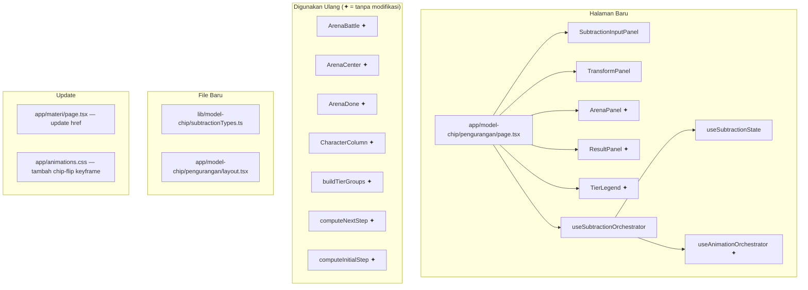
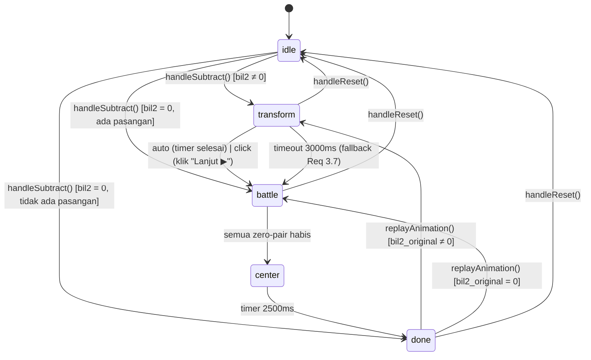
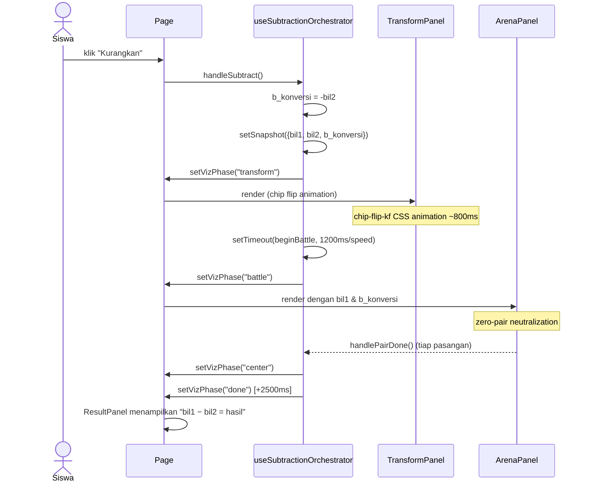

# Design Document — Model Chip Pengurangan

## Overview

Modul **Model Chip Pengurangan** (`/model-chip/pengurangan`) mengajarkan konsep
`a − b = a + (−b)` menggunakan visualisasi chip antibodi 🔵 vs kuman 🔴 yang
sudah ada di modul penjumlahan. Pendekatan desainnya adalah **ekstensi minimal**:
semua komponen arena, karakter, dan logika tier digunakan ulang tanpa modifikasi;
yang baru hanya lapisan tipis di atasnya — konversi pengurang, fase transformasi,
dan panel input yang menampilkan operator `−`.

### Konsep Inti

```
a − b  ≡  a + (−b)
```

1. Pengguna memasukkan `bil1` (minuend) dan `bil2` (pengurang).
2. Setelah menekan "Kurangkan", sistem menghitung `b_konversi = −bil2`.
3. Fase **transform** menampilkan animasi visual chip yang "berubah jenis".
4. Fase **battle** dilanjutkan dengan `bil1` vs `b_konversi` menggunakan
   seluruh infrastruktur zero-pair yang ada.

---

## Architecture

### Diagram Komponen



### Prinsip Desain

- **Zero modification** pada semua komponen arena dan hook orchestrator yang ada.
- `useSubtractionOrchestrator` adalah **wrapper** di atas `useAnimationOrchestrator` — ia
  menambahkan logika konversi dan fase `"transform"` sebelum mendelegasikan battle ke hook lama.
- `SubtractionInputPanel` adalah **adaptasi** dari `InputPanel` yang mengganti operator, label,
  dan nama tombol. Ia tidak berbagi kode dengan `InputPanel` (tidak ada props drilling
  lintas komponen) untuk menjaga keduanya tetap bisa berkembang independen.
- `TransformPanel` adalah komponen **baru sepenuhnya** — ia hanya aktif selama fase `"transform"`.

---

## Components and Interfaces

### `SubtractionInputPanel`

Panel input yang menampilkan operator `−`, label "Pengurang" untuk bil2, dan tombol "Kurangkan ⚡".
Struktur dan perilaku identik dengan `InputPanel` kecuali:
- Operator ditampilkan sebagai `−` bukan `+`.
- Label bil2 berisi teks "Pengurang".
- Tombol aksi utama berteks "Kurangkan ⚡".
- Tombol "Putar ulang ↺" memulai ulang dari fase `"transform"` (jika bil2 ≠ 0) atau `"done"` langsung.
- Tombol "Lanjut ▶" juga muncul selama fase `"transform"` dalam mode `"click"`.

```typescript
export interface SubtractionInputPanelProps {
  bil1: number;
  bil2: number;
  animMode: AnimMode;
  animSpeed: number;
  vizPhase: VizPhaseSub;
  snapshot: SubtractionSnapshot | null;
  waitingForClick: boolean;
  onBil1Change: (val: string) => void;
  onBil2Change: (val: string) => void;
  onSubtract: () => void;        // sebelumnya onPair
  onReset: () => void;
  onReplay: () => void;
  onAnimModeChange: (m: AnimMode) => void;
  onSpeedChange: (s: number) => void;
  onNextClick: () => void;       // untuk mode "click" di fase "transform"
}
```

**Logika disabled/readOnly:**
- Input fields: `readOnly` jika `vizPhase !== "idle"`.
- Tombol "Kurangkan": `disabled` jika `bil1 === 0 && bil2 === 0`.
- Tombol "Input Kembali 🔄": tampil saat `isDone || (snapshot !== null && !isAnimating && vizPhase !== "idle")`, selalu enabled.
- Tombol "Putar ulang ↺": tampil saat `snapshot !== null`.
- Kontrol kecepatan: tampil saat `vizPhase === "battle"`.
- Tombol "Lanjut ▶": tampil saat `animMode === "click" && (vizPhase === "transform" || vizPhase === "battle")`, `disabled` jika `!waitingForClick`.
- `aria-live="polite"` dengan teks `"Animasi berjalan..."` ditampilkan saat `isAnimating` (fase `"transform"`, `"battle"`, atau `"center"`).

**Aksesibilitas:**
- `aria-label` pada input bil1: `"Minuend: masukkan bilangan bulat antara -9999 dan 9999"`.
- `aria-label` pada input bil2: `"Pengurang: masukkan bilangan bulat antara -9999 dan 9999"`.

---

### `TransformPanel`

Panel animasi yang menampilkan chip bil2 "berubah jenis" saat fase `"transform"` aktif.

```typescript
export interface TransformPanelProps {
  bil2: number;              // nilai asli sebelum konversi (dari snapshot)
  b_konversi: number;        // -bil2 (nilai setelah konversi)
  isExiting: boolean;        // true saat animasi keluar sebelum berganti ke "battle"
}
```

**Tampilan:**
- Container dengan `aria-label` dalam format: `"Ubah {abs(bil2)} chip {tipeSumber} menjadi {tipeTujuan}"`.
  - Jika `bil2 > 0`: `"Ubah {bil2} chip antibodi menjadi kuman"`
  - Jika `bil2 < 0`: `"Ubah {abs(bil2)} chip kuman menjadi antibodi"`
- Label teks di bawah chip: `"+{N} → −{N}"` jika `bil2 > 0`, `"−{N} → +{N}"` jika `bil2 < 0`, di mana `N = abs(bil2)`.
- Chip menggunakan class `chip-flip` dari `animations.css` untuk animasi flip.
- Warna chip sebelum flip: biru (`bg-intblue`) jika `bil2 > 0`, pink (`bg-intpink`) jika `bil2 < 0`.
- Warna chip setelah flip: kebalikannya.
- Judul section: `"↔ Konversi Pengurang"`.
- Penjelasan singkat: `"a − b = a + (−b)"`.

**Lifecycle:**
- Hanya di-render saat `vizPhase === "transform"`.
- Komponen ini tidak mengontrol timing sendiri — ia hanya merender; orchestrator yang memanggil `onTransformDone` callback via `setTimeout`.

---

### `ResultPanel` (digunakan ulang, modifikasi props)

`ResultPanel` yang ada digunakan ulang. Namun karena persamaan yang ditampilkan adalah
`bil1 − bil2 = hasil` (bukan `bil1 + bil2`), page component perlu mengoper `eqBil2`
sebagai nilai **setelah konversi** dan menyesuaikan tampilan operator.

Pilihan desain: **buat `SubtractionResultPanel`** sebagai wrapper tipis yang mengubah operator
`+` menjadi `−` di baris persamaan — ini menghindari perubahan pada `ResultPanel` yang ada.

```typescript
// SubtractionResultPanel: wrapper yang mengganti "+" dengan "−" dalam equation display
// Menerima props yang sama dengan ResultPanel, tapi eqBil2 = bil2_original, bukan b_konversi
export interface SubtractionResultPanelProps extends ResultPanelProps {
  eqBil2Original: number;  // nilai bil2 sebelum konversi, untuk tampilan "bil1 − bil2 = hasil"
}
```

Alternatif yang lebih sederhana (direkomendasikan): operkan `eqBil2 = snapshot.bil2_original`
ke `ResultPanel` yang ada (bukan `b_konversi`) — persamaan yang ditampilkan secara visual akan
menunjukkan `+(-N)` atau `+(+N)` yang kurang ideal. Karena itu, pendekatan wrapper lebih baik.

> **Keputusan Desain:** Buat `SubtractionResultPanel.tsx` yang wraps `ResultPanel` dan
> mengganti hanya baris operator di equation string, sehingga menampilkan `bil1 − bil2 = hasil`.

---

## Data Models

### `VizPhaseSub`

```typescript
// lib/model-chip/subtractionTypes.ts

/** Fase visualisasi halaman pengurangan — perluasan VizPhase dengan "transform" */
export type VizPhaseSub = "idle" | "transform" | "battle" | "center" | "done";

/** Snapshot nilai saat animasi dimulai — termasuk bil2 asli dan nilai konversinya */
export interface SubtractionSnapshot {
  bil1: number;
  bil2_original: number;    // nilai yang dimasukkan pengguna (sebelum konversi)
  bil2_converted: number;   // −bil2_original (nilai yang digunakan dalam battle)
}
```

**Catatan:** `VizPhaseSub` adalah superset dari `VizPhase` dari `lib/model-chip/types.ts`.
Untuk meneruskan data ke `ArenaPanel` yang membutuhkan `VizPhase`, page component
melakukan narrowing: `vizPhase === "transform" ? "idle" : vizPhase as VizPhase`.
Ini memastikan ArenaPanel tidak pernah menerima nilai `"transform"` yang tidak dikenalinya.

### `SubtractionState`

```typescript
// hooks/model-chip/useSubtractionState.ts

export interface SubtractionState {
  bil1: number;
  bil2: number;
  setBil1: (v: number) => void;
  setBil2: (v: number) => void;
  vizPhase: VizPhaseSub;
  setVizPhase: (p: VizPhaseSub) => void;
  snapshot: SubtractionSnapshot | null;
  setSnapshot: (s: SubtractionSnapshot | null) => void;
}
```

### Derived Values di Page Component

```typescript
// Nilai untuk ArenaPanel (menggunakan b_konversi, bukan bil2 asli)
const bConverted = snapshot?.bil2_converted ?? 0;
const snapTotalPos = snapshot
  ? Math.max(0, snapshot.bil1) + Math.max(0, bConverted)
  : Math.max(0, bil1) + Math.max(0, -bil2);   // preview pre-snapshot

const snapTotalNeg = snapshot
  ? Math.max(0, -snapshot.bil1) + Math.max(0, -bConverted)
  : Math.max(0, -bil1) + Math.max(0, bil2);

const pairs = Math.min(snapTotalPos, snapTotalNeg);
const remaining = snapTotalPos - snapTotalNeg;  // ≡ bil1 − bil2
```

### Narrowing VizPhase untuk ArenaPanel

```typescript
// ArenaPanel hanya mengenal VizPhase (tanpa "transform")
const arenaPhaseProp: VizPhase =
  vizPhase === "transform" || vizPhase === "idle"
    ? "idle"           // sembunyikan arena selama transform/idle
    : vizPhase as VizPhase;
```

---

## Hook Design

### `useSubtractionState`

```typescript
// hooks/model-chip/useSubtractionState.ts
"use client";

import { useState } from "react";
import type { VizPhaseSub, SubtractionSnapshot } from "@/lib/model-chip/subtractionTypes";

export function useSubtractionState(): SubtractionState {
  const [bil1, setBil1] = useState<number>(0);
  const [bil2, setBil2] = useState<number>(0);
  const [vizPhase, setVizPhase] = useState<VizPhaseSub>("idle");
  const [snapshot, setSnapshot] = useState<SubtractionSnapshot | null>(null);
  return { bil1, bil2, setBil1, setBil2, vizPhase, setVizPhase, snapshot, setSnapshot };
}
```

### `useSubtractionOrchestrator`

Hook ini adalah **komposisi** — ia membuat instance `useModelChipState`-like object
yang dibungkus agar kompatibel dengan `useAnimationOrchestrator`, lalu menambahkan
logika konversi dan fase transform di atasnya.

```typescript
// hooks/model-chip/useSubtractionOrchestrator.ts
"use client";

export interface SubtractionOrchestratorReturn {
  // Re-export semua dari useAnimationOrchestrator
  tierGroups: TierGroup[];
  tierIdx: number;
  pairInTier: number;
  stepPhase: StepPhase;
  neutralised: Map<1 | 10 | 100 | 1000, number>;
  animSpeed: number;
  setAnimSpeed: (s: number) => void;
  animMode: AnimMode;
  setAnimMode: (m: AnimMode) => void;
  waitingForClick: boolean;
  centerExiting: boolean;

  // Tambahan untuk subtraction
  transformExiting: boolean;    // true saat animasi keluar TransformPanel
  handleSubtract: () => void;   // ganti handlePair
  handleNextClick: () => void;  // digunakan untuk transform (click mode) dan battle
  replayAnimation: () => void;
  handleReset: () => void;
  handlePairDone: (neu: Map<1 | 10 | 100 | 1000, number>) => void;
}
```

**Alur `handleSubtract()`:**

```
1. Validasi: bil1 === 0 && bil2 === 0 → return (tombol disabled)
2. resetAnimState()
3. Hitung b_konversi = -bil2
4. Simpan snapshot: { bil1, bil2_original: bil2, bil2_converted: b_konversi }
5. Panggil state.setSnapshot(snapshot) dan state.setBil1/setBil2 (jangan ubah input)
6. IF bil2 !== 0:
     state.setVizPhase("transform")
     ELSE IF animMode === "auto":
       setTimeout(() => beginBattle(snapshot), transformDuration / animSpeed)
     ELSE (click mode):
       setWaitingForClick(true)   ← pengguna harus klik "Lanjut ▶"
   ELSE (bil2 === 0):
     // a - 0 = a, tidak ada battle jika bil1 tidak punya lawan
     beginBattle(snapshot)        ← akan langsung selesai jika tidak ada pasangan
7. beginBattle(snapshot):
     tp = max(0, bil1) + max(0, b_konversi)
     tn = max(0, -bil1) + max(0, -b_konversi)
     IF tp === 0 || tn === 0: state.setVizPhase("done")
     ELSE: startBattle(buildTierGroups(min(tp, tn)))
```

**Alur `handleNextClick()` (untuk transform + battle):**

```
IF vizPhase === "transform" && waitingForClick:
  setWaitingForClick(false)
  setTransformExiting(true)
  setTimeout(() => beginBattle(snapshot), exitDuration)
ELSE (delegasikan ke logika battle yang ada)
```

**Durasi animasi transform:**
- `1×`: 1200ms total (800ms animasi chip + 400ms buffer)
- Durasi auto-advance: `1200 / animSpeed` ms, maksimum 3000ms sesuai Req 3.7.
- Jika `animSpeed` sangat lambat (0.5×): 2400ms — masih di bawah 3000ms.

**SessionStorage key:** `"subtractionChipAnimMode"` (terpisah dari modul penjumlahan).

**`replayAnimation()`:**
```
IF snapshot.bil2_original !== 0:
  resetAnimState()
  state.setVizPhase("transform")
  [lanjut seperti handleSubtract step 6]
ELSE:
  [langsung battle]
```

---

## Animation Flow

### State Machine Lengkap



### Sequence Diagram: Mode Auto, bil2 > 0



---

## CSS Animations

Keyframe baru `chip-flip-kf` ditambahkan di `app/animations.css` di bawah section
"Model Chip: Pair-meeting step animation":

```css
/* ── Model Chip: Transform phase (subtraction) ───────────────── */

/*
 * chip-flip-kf
 * Animasi flip kartu 3D untuk TransformPanel.
 * Chip berputar 180° di sumbu Y, mengganti warna di titik tengah (90°).
 * Durasi disarankan: 0.8s
 */
@keyframes chip-flip-kf {
  0%   { transform: rotateY(0deg)   scale(1);    }
  45%  { transform: rotateY(90deg)  scale(0.9);  }
  55%  { transform: rotateY(90deg)  scale(0.9);  }
  100% { transform: rotateY(180deg) scale(1);    }
}

/*
 * chip-flip-exit-kf
 * TransformPanel memudar keluar sebelum ArenaPanel masuk.
 */
@keyframes chip-flip-exit-kf {
  from { opacity: 1; transform: translateY(0);   }
  to   { opacity: 0; transform: translateY(-8px); }
}
```

Kelas utilitas yang ditambahkan di `@layer utilities`:

```css
.chip-flip {
  animation: chip-flip-kf 0.8s cubic-bezier(0.4, 0, 0.2, 1) forwards;
}

.chip-flip-exit {
  animation: chip-flip-exit-kf 0.3s ease-in forwards;
}
```

**Implementasi warna flip di `TransformPanel`:**
Karena `rotateY(90deg)` menyembunyikan chip sepenuhnya, komponen menggunakan dua
elemen berlapis (`before`/`after`) atau swap class di `animationiteration`:

```typescript
// Pendekatan sederhana: dua div berlapis, div pertama menghilang di 45%, div kedua muncul di 55%
// Keduanya menggunakan chip-flip-kf tapi dengan style yang berbeda
const frontStyle = "bg-intblue";   // jika bil2 > 0
const backStyle  = "bg-intpink";   // setelah flip

// <div className="chip-flip" style={{ backfaceVisibility: "hidden" }}>...</div>
// <div className="chip-flip [rotate-y-180]" ...>...</div>
```

**Constraint:** Tidak ada package animasi eksternal — semua efek menggunakan Tailwind
dan keyframe di `animations.css` sesuai Req 10.3.

---

## Routing

```
app/
└── model-chip/
    ├── layout.tsx              (existing — metadata untuk penjumlahan)
    ├── page.tsx                (existing — halaman penjumlahan)
    └── pengurangan/
        ├── layout.tsx          (NEW — metadata pengurangan)
        └── page.tsx            (NEW — halaman utama pengurangan)
```

### `app/model-chip/pengurangan/layout.tsx`

```typescript
import type { Metadata } from "next";

export const metadata: Metadata = {
  title: "Model Chip Pengurangan",
  description:
    "Visualisasi pengurangan bilangan bulat dengan model chip. " +
    "Pelajari konsep a − b = a + (−b) melalui animasi chip antibodi dan kuman.",
};

export default function Layout({ children }: { children: React.ReactNode }) {
  return <>{children}</>;
}
```

### `app/model-chip/pengurangan/page.tsx` — Struktur

```typescript
"use client";
// Imports: useSubtractionState, useSubtractionOrchestrator, semua komponen

export default function SubtractionPage() {
  const state  = useSubtractionState();
  const orch   = useSubtractionOrchestrator({ state });

  const { bil1, bil2, vizPhase, snapshot } = state;
  const bConverted = snapshot?.bil2_converted ?? 0;

  // Derived values untuk ArenaPanel
  const snapTotalPos = ...;
  const snapTotalNeg = ...;
  const pairs       = Math.min(snapTotalPos, snapTotalNeg);
  const remaining   = snapTotalPos - snapTotalNeg;

  // Narrowing: ArenaPanel tidak mengenal "transform"
  const arenaPhase: VizPhase = vizPhase === "transform" ? "idle" : vizPhase as VizPhase;

  // ArenaPanel snapshot: gunakan bConverted sebagai bil2
  const arenaSnapshot = snapshot
    ? { bil1: snapshot.bil1, bil2: snapshot.bil2_converted }
    : null;

  return (
    <div className="min-h-screen bg-surface py-10">
      <div className="max-w-5xl mx-auto px-4">
        {/* Header dengan back button ke /materi */}
        {/* Info banner (Req 9.1): Antibodi 🔵, Kuman 🔴, pengurang selalu dibalik */}
        <TierLegend />
        <SubtractionInputPanel ... />
        {vizPhase === "transform" && snapshot && (
          <TransformPanel
            bil2={snapshot.bil2_original}
            b_konversi={snapshot.bil2_converted}
            isExiting={orch.transformExiting}
          />
        )}
        {arenaSnapshot !== null && vizPhase !== "idle" && vizPhase !== "transform" && (
          <ArenaPanel
            snapshot={arenaSnapshot}
            vizPhase={arenaPhase}
            ...
          />
        )}
        <SubtractionResultPanel
          eqBil1={snapshot?.bil1 ?? bil1}
          eqBil2Original={snapshot?.bil2_original ?? bil2}
          remaining={remaining}
          vizPhase={vizPhase}
          pairs={pairs}
        />
      </div>
    </div>
  );
}
```

---

## Reuse Map

| Artifact | Status | Keterangan |
|---|---|---|
| `components/model-chip/ArenaPanel.tsx` | ✦ Reuse as-is | Snapshot dibungkus dengan `bil2_converted`; phase di-narrow ke `VizPhase` |
| `components/model-chip/ArenaBattle.tsx` | ✦ Reuse as-is | Tidak ada perubahan |
| `components/model-chip/ArenaCenter.tsx` | ✦ Reuse as-is | Tidak ada perubahan |
| `components/model-chip/ArenaDone.tsx` | ✦ Reuse as-is | Tidak ada perubahan |
| `components/model-chip/CharacterColumn.tsx` | ✦ Reuse as-is | Tidak ada perubahan |
| `components/model-chip/TierLegend.tsx` | ✦ Reuse as-is | Tidak ada perubahan |
| `components/model-chip/ResultPanel.tsx` | ✦ Reuse as-is | Dibungkus oleh `SubtractionResultPanel` |
| `hooks/model-chip/useAnimationOrchestrator.ts` | ✦ Reuse as-is | Diinstansiasi oleh `useSubtractionOrchestrator` |
| `lib/model-chip/tierUtils.ts` | ✦ Reuse as-is | `buildTierGroups` dipanggil sama persis |
| `lib/model-chip/stepMachine.ts` | ✦ Reuse as-is | `computeNextStep`, `computeInitialStep` |
| `lib/model-chip/inputPanelProps.ts` | ✦ Reuse as-is | Dipanggil oleh `SubtractionInputPanel` |
| `lib/model-chip/types.ts` | ✦ Reuse as-is | `VizPhase`, `AnimMode`, `TierGroup`, `StepPhase` |
| `app/animations.css` | ➕ Tambah keyframe | `chip-flip-kf`, `chip-flip-exit-kf` dan utility class |
| `app/materi/page.tsx` | ✏️ Update href | Link Model Chip di seksi Pengurangan: `/model-chip` → `/model-chip/pengurangan` |
| `lib/model-chip/subtractionTypes.ts` | 🆕 Baru | `VizPhaseSub`, `SubtractionSnapshot` |
| `hooks/model-chip/useSubtractionState.ts` | 🆕 Baru | State hook dengan `VizPhaseSub` |
| `hooks/model-chip/useSubtractionOrchestrator.ts` | 🆕 Baru | Wrapper orchestrator + logika transform |
| `components/model-chip/SubtractionInputPanel.tsx` | 🆕 Baru | Input panel dengan operator `−` |
| `components/model-chip/TransformPanel.tsx` | 🆕 Baru | Panel animasi flip chip pengurang |
| `components/model-chip/SubtractionResultPanel.tsx` | 🆕 Baru | Wrapper tipis ResultPanel dengan operator `−` |
| `app/model-chip/pengurangan/layout.tsx` | 🆕 Baru | Metadata halaman |
| `app/model-chip/pengurangan/page.tsx` | 🆕 Baru | Halaman utama pengurangan |

---

## Correctness Properties

*A property is a characteristic or behavior that should hold true across all valid executions of a system — essentially, a formal statement about what the system should do. Properties serve as the bridge between human-readable specifications and machine-verifiable correctness guarantees.*

Fitur ini melibatkan logika konversi bilangan (fungsi murni `b_konversi = -bil2`), kalkulasi
turunan (`snapTotalPos`, `snapTotalNeg`, `remaining`), dan state machine phase ordering — semua
hal yang bervariasi bermakna dengan input dan dapat diuji secara universal. PBT **applicable**.

---

### Property 1: Konversi Pengurang Adalah Negasi

*For any* bilangan bulat `bil2` dalam rentang `[-9999, 9999]`, nilai `b_konversi` yang dihitung
oleh `useSubtractionOrchestrator` setelah `handleSubtract()` dipanggil harus sama persis dengan
`-bil2`.

**Validates: Requirements 2.1, 2.2, 2.3, 2.4**

---

### Property 2: Round-Trip Matematika Pengurangan

*For any* pasangan bilangan bulat `(bil1, bil2)` yang valid, hasil kalkulasi `bil1 + b_konversi`
harus identik dengan `bil1 - bil2`.

**Validates: Requirements 2.6, 5.2**

---

### Property 3: Clamping Input ke Rentang Valid

*For any* nilai integer `x` yang dimasukkan ke `onBil1Change` atau `onBil2Change`, nilai yang
tersimpan di state harus selalu berada dalam rentang `[-9999, 9999]` — yaitu
`max(-9999, min(9999, x))`.

**Validates: Requirements 1.6**

---

### Property 4: Tombol Aktif Jika Salah Satu Bukan Nol

*For any* pasangan `(bil1, bil2)` di mana `bil1 !== 0` atau `bil2 !== 0`, tombol "Kurangkan"
harus dalam keadaan enabled (tidak `disabled`). Simetrisnya, jika dan hanya jika keduanya nol,
tombol harus disabled.

**Validates: Requirements 1.4, 1.5**

---

### Property 5: Input Terkunci Saat Bukan Idle

*For any* nilai `VizPhaseSub` yang bukan `"idle"`, kedua input numerik harus memiliki atribut
`readOnly` sehingga perubahan nilai tidak dapat dilakukan.

**Validates: Requirements 1.3**

---

### Property 6: Fase Transform Mendahului Battle (Jika bil2 ≠ 0)

*For any* nilai `bil2` yang tidak sama dengan nol, setelah `handleSubtract()` dipanggil, fase
yang pertama kali di-set harus `"transform"` — bukan langsung `"battle"` atau `"done"`.

**Validates: Requirements 3.1**

---

### Property 7: Label Transform Mencerminkan Konversi

*For any* nilai `bil2` yang tidak sama dengan nol, `TransformPanel` harus merender label teks
dalam format `"+{N} → −{N}"` jika `bil2 > 0`, atau `"−{N} → +{N}"` jika `bil2 < 0`,
di mana `N = abs(bil2)`.

**Validates: Requirements 3.3**

---

### Property 8: Snapshot Menyimpan Semua Nilai Relevan

*For any* pasangan input `(bil1, bil2)` yang mengakibatkan `handleSubtract()` dipanggil, snapshot
yang tersimpan harus memuat: `bil1` tidak berubah, `bil2_original = bil2`, dan
`bil2_converted = -bil2`.

**Validates: Requirements 2.5**

---

### Property 9: Warna Label Mencerminkan Tanda Nilai

*For any* bilangan bulat `v`, fungsi `inputPanelProps(v)` harus mengembalikan `titleColor`
`"text-intblue"` jika `v > 0`, `"text-intpink"` jika `v < 0`, dan `"text-slate-400"` jika `v === 0`.

**Validates: Requirements 1.7, 1.8**

---

### Property 10: Aria-Label Transform Panel Sesuai Format

*For any* nilai `bil2` yang tidak sama dengan nol, atribut `aria-label` pada container
`TransformPanel` harus mengikuti format `"Ubah {abs(bil2)} chip {tipeSumber} menjadi {tipeTujuan}"`,
di mana `tipeSumber` adalah `"antibodi"` jika `bil2 > 0` dan `"kuman"` jika `bil2 < 0`.

**Validates: Requirements 9.3**

---

## Error Handling

### Input di Luar Rentang

Handler `onBil1Change` dan `onBil2Change` menggunakan `parseInt` + `Math.max(-9999, Math.min(9999, raw))`.
Nilai `NaN` (input kosong atau teks) di-clamp ke `0`.

### bil2 = 0 (Tidak Ada Transformasi)

Ketika `bil2 = 0`, `b_konversi = 0`. Tidak ada fase transform. Sistem langsung menghitung
`snapTotalPos` dan `snapTotalNeg` dari `bil1` saja; jika keduanya tidak menghasilkan pasangan,
`vizPhase` langsung ke `"done"`.

### Timeout Animasi Transform (Req 3.7)

`useSubtractionOrchestrator` menggunakan `useRef` untuk menyimpan timer ID animasi transform.
Jika timer melebihi 3000ms, callback `beginBattle` tetap dipanggil (kondisi timeout).
Implementasi: satu `setTimeout` dengan durasi `min(transformDuration / animSpeed, 3000)`.

### SessionStorage Tidak Tersedia

Pembacaan/penulisan ke `sessionStorage` dibungkus dalam `try/catch`. Nilai default `"auto"`
digunakan jika terjadi error (SSR, private browsing). Sesuai Req 7.4.

### Render Kondisional ArenaPanel

`ArenaPanel` hanya dirender jika `arenaSnapshot !== null && vizPhase !== "idle" && vizPhase !== "transform"`.
Ini mencegah ArenaPanel menerima `vizPhase = "transform"` yang tidak valid.

---

## Testing Strategy

### Unit Tests

Fokus pada contoh spesifik dan kondisi edge:

- `SubtractionInputPanel`: operator `−` ditampilkan, tombol "Kurangkan" disabled saat `0,0`.
- `TransformPanel`: label `"+3 → −3"` dan `"−5 → +5"` ditampilkan dengan benar.
- `useSubtractionOrchestrator.handleSubtract()`: `bill2 = 0` langsung skip transform.
- Narrowing `VizPhaseSub → VizPhase`: `"transform"` di-narrow ke `"idle"` dengan benar.
- `app/model-chip/pengurangan/layout.tsx`: metadata berisi string `a − b = a + (−b)`.
- Routing: route `/model-chip/pengurangan` mengembalikan 200 dan merender `<h1>` yang benar.

### Property-Based Tests (fast-check)

Proyek sudah menggunakan `fast-check` (versi `^4.9.0` di `devDependencies`).
Setiap property test dikonfigurasi dengan minimum **100 iterasi** dan diberi tag komentar.

```typescript
// Contoh: Property 2 — Round-Trip
import * as fc from "fast-check";

test("Round-trip: bil1 + (-bil2) === bil1 - bil2", () => {
  // Feature: model-chip-subtraction, Property 2: Round-trip matematika pengurangan
  fc.assert(
    fc.property(
      fc.integer({ min: -9999, max: 9999 }),
      fc.integer({ min: -9999, max: 9999 }),
      (bil1, bil2) => {
        const b_konversi = -bil2;
        return bil1 + b_konversi === bil1 - bil2;
      }
    ),
    { numRuns: 100 }
  );
});
```

**Tag format untuk setiap property test:**
```
// Feature: model-chip-subtraction, Property {N}: {property_text}
```

| Property | Test File | fast-check Arbitrary |
|---|---|---|
| 1 – Konversi adalah negasi | `__tests__/model-chip/subtractionOrchestrator.property.test.ts` | `fc.integer({min:-9999,max:9999})` |
| 2 – Round-trip matematika | `__tests__/model-chip/subtractionOrchestrator.property.test.ts` | `fc.tuple(fc.integer(...), fc.integer(...))` |
| 3 – Clamping input | `__tests__/model-chip/subtractionState.property.test.ts` | `fc.integer({min:-100000,max:100000})` |
| 4 – Tombol aktif | `__tests__/model-chip/SubtractionInputPanel.property.test.tsx` | `fc.tuple(fc.integer(...), fc.integer(...))` |
| 5 – Input terkunci | `__tests__/model-chip/SubtractionInputPanel.property.test.tsx` | `fc.constantFrom("transform","battle","center","done")` |
| 6 – Phase transform mendahului battle | `__tests__/model-chip/subtractionOrchestrator.property.test.ts` | `fc.integer({min:-9999,max:9999}).filter(n=>n!==0)` |
| 7 – Label transform | `__tests__/model-chip/TransformPanel.property.test.tsx` | `fc.integer({min:-9999,max:9999}).filter(n=>n!==0)` |
| 8 – Snapshot lengkap | `__tests__/model-chip/subtractionOrchestrator.property.test.ts` | `fc.tuple(fc.integer(...), fc.integer(...))` |
| 9 – Warna label | `__tests__/model-chip/inputPanelProps.property.test.ts` | `fc.integer({min:-9999,max:9999})` |
| 10 – Aria-label format | `__tests__/model-chip/TransformPanel.property.test.tsx` | `fc.integer({min:-9999,max:9999}).filter(n=>n!==0)` |
