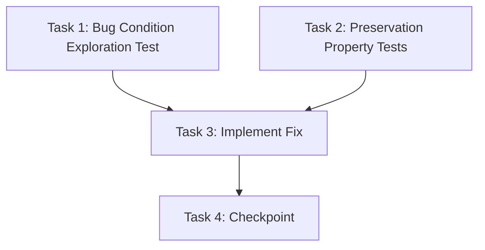

# Implementation Plan

## Overview

Fix the double `awardPoints()` invocation that occurs when Enter is pressed on the answer input in Game Virus. The bug fires `handleCheckChipAnswer` twice in the same render cycle — once from `onKeyDown` and once from a synthetic `click` event on the "Periksa" button. The fix adds an early-return guard, `e.preventDefault()` on Enter, and ensures `chipFeedback` is in the `useCallback` dependency array so the guard always reads fresh state.

## Task Dependency Graph



```json
{
  "waves": [
    {
      "wave": 1,
      "type": "parallel",
      "tasks": ["1", "2"]
    },
    {
      "wave": 2,
      "type": "sequential",
      "tasks": ["3"],
      "dependsOn": ["1", "2"]
    },
    {
      "wave": 3,
      "type": "sequential",
      "tasks": ["4"],
      "dependsOn": ["3"]
    }
  ]
}
```

## Tasks

- [x] 1. Write bug condition exploration test
  - **Property 1: Bug Condition** - Double Award on Enter Keypress
  - **CRITICAL**: This test MUST FAIL on unfixed code — failure confirms the bug exists
  - **DO NOT attempt to fix the test or the code when it fails**
  - **NOTE**: This test encodes the expected behavior — it will validate the fix when it passes after implementation
  - **GOAL**: Surface counterexamples that demonstrate double `awardPoints()` invocation when Enter is pressed
  - **Scoped PBT Approach**: Scope the property to the concrete failing scenario: Enter keydown on answer input with a correct answer while `chipFeedback` is `null`
  - Create `__tests__/game-virus/scoreDoubleAward.bug.test.ts`
  - Extract the core guard logic from `handleCheckChipAnswer` into a pure function `checkAnswerLogic(answerInput, chipFeedback, animating, question)` that returns `{ shouldAwardPoints: boolean }` — this is the unit under test
  - Bug condition (`isBugCondition`): `chipFeedback === null AND animating === false AND currentQuestion !== null AND answer is correct`
  - Simulate two calls in sequence with the SAME stale `chipFeedback` state (both calls see `chipFeedback = null`, as happens before React re-renders)
  - Assert that `awardPoints` is called **2 times** total on unfixed code (each call returns `POINTS_PER_CORRECT`, so total delta = 20) — test FAILS on unfixed code, which proves the bug
  - For the PBT sweep: generate random correct `(a, op, b)` question triples; for each, verify that double-calling the unfixed logic with stale `chipFeedback=null` produces two award calls — documents the bug is systematic, not isolated
  - Run: `npx jest __tests__/game-virus/scoreDoubleAward.bug.test.ts --run`
  - **EXPECTED OUTCOME**: Test FAILS (this is correct — it proves the bug exists)
  - Document counterexamples found, e.g. `"question {a:5, op:'+', b:3, answer:8}: double-call with chipFeedback=null → awardPoints called 2x, total delta = 20 instead of 10"`
  - Mark task complete when test is written, run, and the failure (double-award) is documented
  - _Requirements: 1.1, 1.2_

- [x] 2. Write preservation property tests (BEFORE implementing fix)
  - **Property 2: Preservation** - Non-Double-Fire Interactions Unchanged
  - **IMPORTANT**: Follow observation-first methodology
  - Create `__tests__/game-virus/scorePreservation.property.test.ts`
  - Observe on UNFIXED code: single `onClick` with correct answer → `awardPoints` called 1x, delta = 10 ✓
  - Observe on UNFIXED code: any answer (Enter or click) when answer is wrong → `awardPoints` never called, delta = 0 ✓
  - Observe on UNFIXED code: call when `chipFeedback.correct === true` AND same-render-cycle state IS updated (i.e. React has re-rendered) → `awardPoints` called 0x additional times ✓
  - Observe on UNFIXED code: user with `uid = null` → `awardPoints` returns `POINTS_PER_CORRECT` (10) with no Firestore write ✓
  - Write property-based tests capturing these four patterns:
    1. **Single-call preservation** — for any correct answer submitted via a single call to the answer-check logic, session score delta equals exactly `POINTS_PER_CORRECT` (10). Generate random valid questions and correct `answerInput` strings.
    2. **Wrong-answer preservation** — for any incorrect answer (Enter or click, any question), `awardPoints` is never called and session score delta is 0. Generate random questions and wrong answers.
    3. **Already-correct guard (post-render state)** — for any call when `chipFeedback.correct === true` (state fully updated after first answer), the logic early-returns before `validateChipAnswer` and no additional award is given. Generate random game states with `chipFeedback.correct = true`.
    4. **Unauthenticated user** — for any correct answer with `uid = null`, `awardPoints(null)` returns `POINTS_PER_CORRECT` and does not call Firestore. Verify using the real `awardPoints` from `features/game/scoreService` (no Firestore mock needed for the return-value check).
  - Run tests on UNFIXED code
  - **EXPECTED OUTCOME**: All four property tests PASS (confirms baseline behavior to preserve)
  - Mark task complete when all four tests are written, run, and passing on unfixed code
  - _Requirements: 3.1, 3.2, 3.3, 3.4, 3.5_

- [x] 3. Fix: prevent double awardPoints on Enter keypress in Game Virus

  - [x] 3.1 Add early-return guard in `handleCheckChipAnswer`
    - File: `app/game-virus/page.tsx`
    - In `handleCheckChipAnswer`, add `if (chipFeedback?.correct) return;` as the **first** line of the function body, before the `if (animating) return;` check
    - This blocks any re-entrant or stale-closure call where `chipFeedback.correct` is already `true`
    - _Bug_Condition: `isBugCondition` — `handleCheckChipAnswer` is called when `chipFeedback?.correct` is already `true` (stale closure path) OR when Enter fires a synthetic button click within the same render cycle_
    - _Expected_Behavior: `handleCheckChipAnswer` exits immediately without calling `awardPoints()` if `chipFeedback?.correct === true`_
    - _Preservation: all interactions where `chipFeedback` is `null` or `chipFeedback.correct === false` are unaffected — the guard only fires when correct feedback is already present_
    - _Requirements: 2.2, 2.1_

  - [x] 3.2 Add `e.preventDefault()` to the `onKeyDown` Enter handler on the answer input
    - File: `app/game-virus/page.tsx`
    - Locate the `onKeyDown` handler on the answer `<input>` element (inside the "Jawab Soal" section)
    - Change from: `if (e.key === "Enter") handleCheckChipAnswer();`
    - Change to: `if (e.key === "Enter") { e.preventDefault(); handleCheckChipAnswer(); }`
    - This prevents the browser from synthesising a `click` event on the "Periksa" button after Enter is pressed, eliminating the double-fire at the event-propagation level
    - _Bug_Condition: `isBugCondition` — Enter on input triggers `onKeyDown` + synthetic button click in same render cycle_
    - _Expected_Behavior: only one invocation of `handleCheckChipAnswer` per Enter keypress_
    - _Preservation: typing digits, Backspace, and all other keys are unaffected; mouse clicks on "Periksa" follow their own `onClick` path and are unaffected_
    - _Requirements: 2.1, 2.3_

  - [x] 3.3 Add `chipFeedback` to `useCallback` dependency array of `handleCheckChipAnswer`
    - File: `app/game-virus/page.tsx`
    - Locate the `useCallback` that wraps `handleCheckChipAnswer`
    - Add `chipFeedback` to the deps array: `[animating, currentQuestion, answerInput, user, handleNewChipQuestion, chipFeedback]`
    - This ensures the closure always captures the latest `chipFeedback` value so the guard in 3.1 reads the correct state on every render
    - _Bug_Condition: stale closure where `chipFeedback` inside the callback lags behind React state_
    - _Preservation: functional behaviour of the callback is unchanged; only the freshness of the captured `chipFeedback` reference improves_
    - _Requirements: 2.2_

  - [x] 3.4 Verify bug condition exploration test now passes
    - **Property 1: Expected Behavior** - Exactly One Award Per Correct Answer
    - **IMPORTANT**: Re-run the SAME test from task 1 — do NOT write a new test
    - The test from task 1 encoded the expected behavior (1 call, delta = 10); it previously FAILED to prove the bug
    - Run: `npx jest __tests__/game-virus/scoreDoubleAward.bug.test.ts --run`
    - **EXPECTED OUTCOME**: Test PASSES (confirms bug is fixed — `awardPoints` is now called exactly once per correct submission)
    - _Requirements: 2.1, 2.2, 2.3_

  - [x] 3.5 Verify preservation tests still pass
    - **Property 2: Preservation** - Non-Double-Fire Interactions Unchanged
    - **IMPORTANT**: Re-run the SAME tests from task 2 — do NOT write new tests
    - Run: `npx jest __tests__/game-virus/scorePreservation.property.test.ts --run`
    - **EXPECTED OUTCOME**: All four property tests PASS (confirms no regressions — single-click correct, wrong answers, already-correct guard, unauthenticated user all behave identically to pre-fix)
    - _Requirements: 3.1, 3.2, 3.3, 3.4, 3.5_

- [x] 4. Checkpoint — Ensure all tests pass
  - Run the full game-virus test suite: `npx jest __tests__/game-virus/ --run`
  - Confirm all tests pass: `scoreDoubleAward.bug.test.ts`, `scorePreservation.property.test.ts`, `BilanganZone.unit.test.tsx`, `chipHelpers.placement.test.ts`, `removeFromBilangan.property.test.ts`
  - If any pre-existing tests fail, diagnose and resolve before marking complete
  - Ensure all tests pass; ask the user if questions arise

## Notes

- Tasks 1 and 2 are independent and can be written in parallel — both must exist before starting Task 3.
- The exploration test (Task 1) is expected to **fail** on unfixed code; that failure is the proof of the bug.
- The preservation tests (Task 2) must **pass** on unfixed code before the fix is applied.
- Sub-tasks 3.4 and 3.5 re-run the same tests from Tasks 1 and 2 respectively — do not write new tests.
- All three fix sub-tasks (3.1, 3.2, 3.3) should be applied together before re-running tests.
